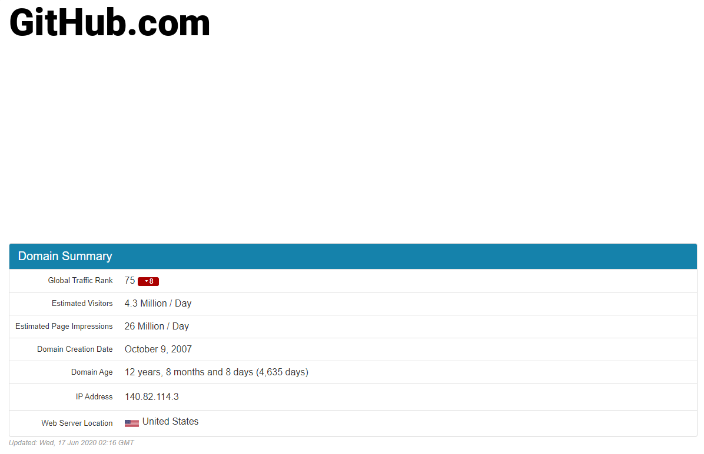
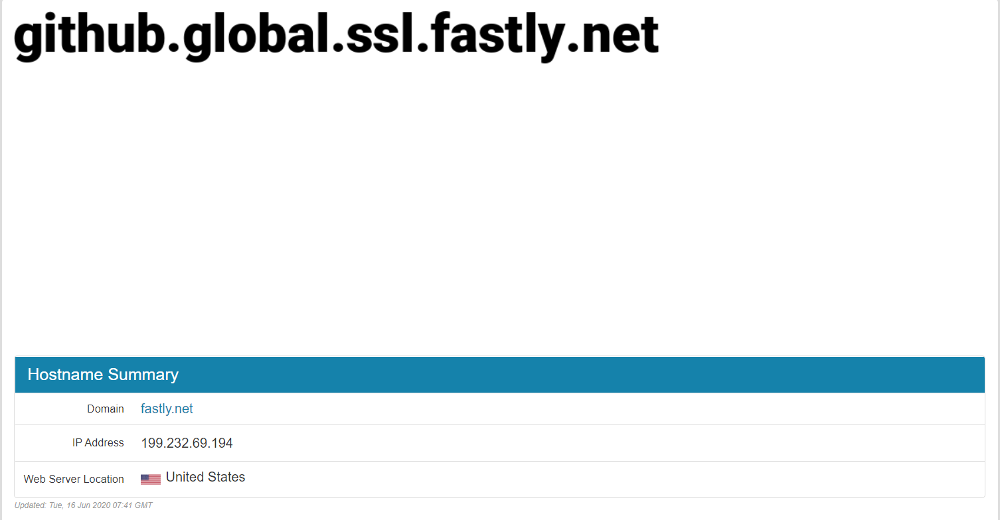

### GitHub 登录不上解决方案

#### 1. 通过域名查找 ip

 在 https://www.ipaddress.com/ 网站上查询 gitHub.com 对应的 IP 地址：

查询 github.global.ssl.fastly.net 对应的 IP 地址：

#### 2. 将 ip 和域名添加到本地 hosts 文件中

C:\Windows\System32\drivers\etc