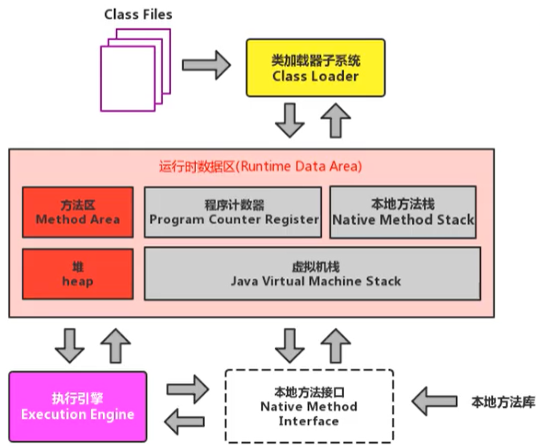
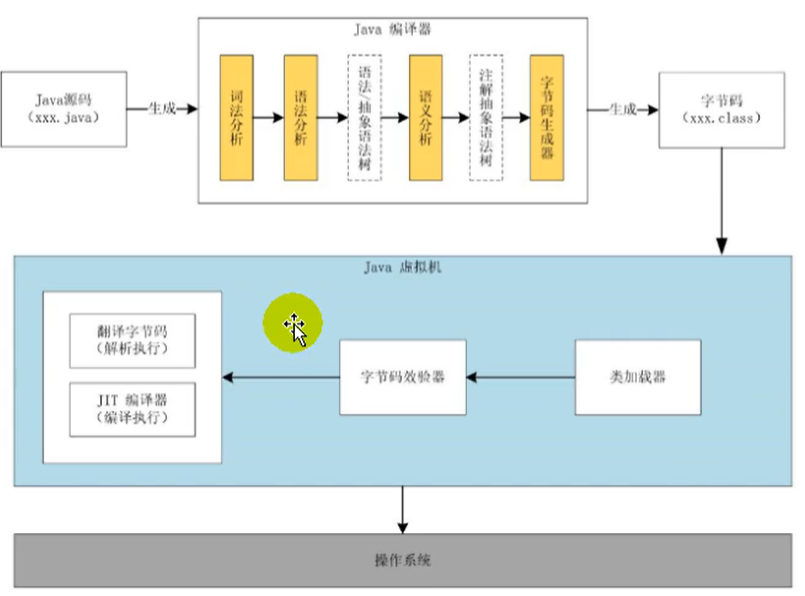

## JVM

### 虚拟机

所谓虚拟机（Virtual Machine），就是一台虚拟的计算机。它是一款软件，用来执行一系列虚拟计算机指令。大体上，虚拟机可以分为系统虚拟机和程序虚拟机。系统虚拟机，提供了一个可运行完整操作系统的软件平台。程序虚拟机，为执行单个计算机程序而设计。无论是系统虚拟机还是程序虚拟机，在上面运行的软件都被限制于虚拟机提供的资源中。

Java 虚拟机是整个 Java 平台的基石，是 Java 技术用以实现硬件无关与操作系统无关的关键部分，是 Java 语言生成出极小体积的编译代码的运行平台，是保障用户机器免于恶意代码损坏的屏障。

JVM 是跨语言的平台，不同的语言使用特定的编译器生成符合 Java 虚拟机规范的字节码文件，JVM 都能正常识别运行（JSR-292），例如 Kotlin、Scala 等。特点：

1.  一次编译，到处运行
2.  自动内存管理
3.  自动垃圾回收功能

### 字节码

Java 虚拟机与 Java 语言并没有必然的联系，它只与特定的二进制文件格式 — Class 文件格式所关联。Class 文件中包含了 Java 虚拟机指令集（或者称为字节码、Bytecodes）和符号表，还有一些其他辅助信息。

### 多语言混合编程

Java 平台上的多语言混合编程正成为主流，通过特定领域的语言去解决特定领域的问题是当前软件开发应对日趋复杂的项目需求的一个方向。各种语言之间的交互不存在任何困难，就像使用自己语言的原生 API 一样方便，因为它们最终都运行在一个虚拟机之上。

### 整体结构

### Java 代码执行流程

### JVM 架构模型

Java 编译器输入的指令流基本上是一种基于栈的指令集架构，另外一种则是基于寄存器的指令集架构。

基于栈式架构的特点：

1.  设计和实现更简单，适用于资源受限的系统
2. **避开了寄存器的分配难题：使用零地址指令方式分配**
3. 指令流中的指令大部分是零地址指令，其执行过程依赖于操作栈。**指令集更小，编译器容易实现**
4. **不需要硬件支持，可移植性更好，更好实现跨平台**

基于寄存器架构的特点：

1. 典型的应用是 x86 的二进制指令集：比如传统的 PC 以及 Android 的 Davlik 虚拟机
2. **指令集架构则完全依赖硬件，与硬件的耦合度高，可移植性差**
3. 性能优秀，执行更高效
4. 花费更少的指令去完成一项操作
5. 在大部分情况下，**基于寄存器架构的指令集往往都以一地址指令、二地址指令和三地址指令为主**

由于跨平台性的设计，Java 的指令都是根据栈来设计的。不同平台 CPU 架构不同，所以不能设计为基于寄存器的。**优点是跨平台，指令集小，编译器容易实现，缺点是性能下降，实现同样的功能需要更多的指令**。

### JVM 生命周期

1. 启动：Java 虚拟机的启动是通过引导类加载器（bootstrap class loader）创建一个初始类（initial class）来完成的，这个类是由虚拟机的具体实现指定的。
2. 运行：一个运行中的 Java 虚拟机有着一个清晰的任务 — 执行Java程序，程序开始执行时虚拟机才运行，程序结束时就停止。执行一个 Java 程序的时候，执行的是一个叫做 Java 虚拟机的进程。
3. 退出：有如下的几种情况：
   - 程序正常执行结束
   - 程序在执行过程中遇到了异常或错误而异常终止
   - 由于操作系统错误而导致 Java 虚拟机进程终止
   - 某线程调用 Runtime 类或 System 类的 `exit()` 方法，或 Runtime 类的 `halt()` 方法，并且 Java 安全管理器也允许这次 `exit()` 或 `halt()` 操作
   - 除此之外，JNI（Java Native Interface）规范描述了用 JNI Invocation API 来加载或卸载 Java 虚拟机时，Java 虚拟机的退出情况

### JVM 发展历程

1. Sun Classic VM
   - 1996 年发布，是世界上第一款商用 Java 虚拟机，JDK 1.4 时完全被淘汰
   - 内部只提供解释器，没有即时编译器（即时编译器会把热点代码缓存起来），除非进行外挂，但外挂后解释器和编译器不能配合工作，因此效率比较低
   - 现在 HotSpot 内置了此虚拟机
2. Exact VM
   - Exact Memory Management：准确式内存管理，虚拟机可以知道内存中某个位置的数据具体是什么类型
   - 具备现代高性能虚拟机的维形：热点探测和编译器与解释器混合工作模式
3. HotSpot VM
   - 名称中的 HotSpot 指的就是它的热点代码探测技术
   - 通过计数器找到最具编译价值代码，触发即时编译或栈上替换
   - 通过编译器与解释器协同工作，在最优程序响应时间与最佳执行性能中取得平衡
4. JRockit
   - 专注于服务器端应用：它可以不太关注程序启动速度，因此 JRockit 内部不包含解析器实现，全部代码都靠即时编译器编译后执行
   - 大量的行业基准测试显示，JRockit JVM 是世界上最快的 JVM
   - 面向延迟敏感型应用的解决方案 JRockit Real Time 和 Mission Control 服务套件（一组以极低的开销来监控、管理和分析生产环境中的应用程序的工具）
5. J9
   - 目前，有影响力的三大商用虚拟机之一，也号称是世界上最快的 Java 虚拟机