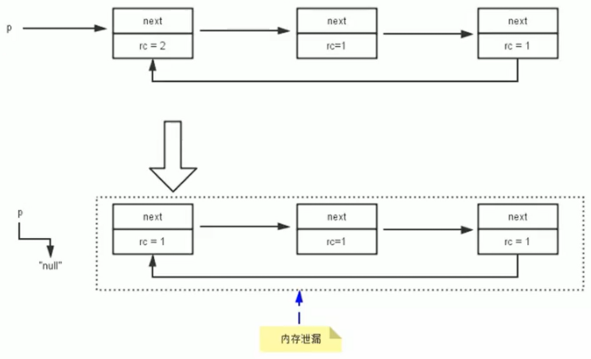
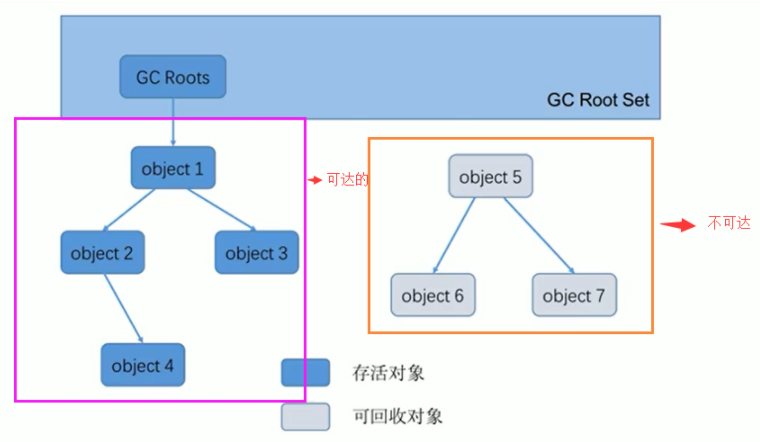
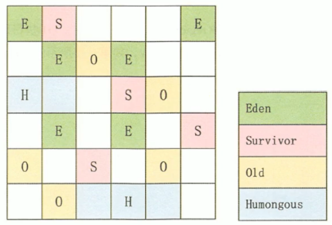

## 垃圾收集

垃圾是指在运行的程序中没有任何指针指向的对象，An object is considered garbage when it can no longer be reached from any pointer in the running program。垃圾收集，不是 Java 语言的伴生产物。早在 1960 年，诞生了第一门开始使用内存动态分配和垃圾收集技术的 Lisp 语言。

垃圾收集器可以对年轻代回收，也可以对老年代回收，甚至是全栈和方法区的回收，其中，Java 堆是垃圾收集器的工作重点。从次数上讲，频繁收集 Young 区，较少收集 Old 区，基本不收集 Perm 区（元空间）。

### 相关算法

#### 标记阶段

垃圾标记阶段：判断对象是否存活。在 GC 执行垃圾回收之前，首先需要区分出内存中哪些是存活对象，哪些是已经死亡的对象。判断对象存活一般有两种方式：引用计数算法和可达性分析算法。

##### 引用计数算法

引用计数算法（Reference Counting）比较简单，对每个对象保存一个整型的引用计数器属性，用于记录对象被引用的情况。

优点：实现简单，垃圾对象便于辨识；判定效率高，回收没有延迟性。

缺点：需要单独的字段存储计数器，增加了存储空间的开销；每次赋值都需要更新计数器，增加了时间开销；无法处理循环引用的情况，致命缺陷。

引用计数算法，是很多语言的资源回收选择，例如 Python，它同时支持引用计数（使用弱引用避免循环引用）和垃圾收集机制。

##### 可达性分析算法

GC Roots 根集合就是一组必须活跃的引用，可达性分析算法是以根对象集合（GC Roots）为起始点，按照从上至下的方式搜索被根对象集合所连接的目标对象是否可达。使用可达性分析算法后，内存中的存活对象都会被根对象集合直接或间接连接着，搜索所走过的路径称为引用链（Reference Chain）。

如果要使用可达性分析算法来判断内存是否可回收，那么分析工作必须在一个能保障一致性的快照中进行。这点不满足的话分析结果的准确性就无法保证。这点也是导致 GC 进行时必须 stop the world 的一个重要原因。即使是号称（几乎）不会发生停顿的 CMS 收集器中，枚举根节点时也是必须要停顿的。

**GC Roots 可以是哪些元素：**

1. 虚拟机栈中引用的对象，比如：各个线程被调用的方法中使用到的参数、局部变量等。
2. 本地方法栈内 JNI（通常说的本地方法）引用的对象。
3. 类静态属性引用的对象，比如：Java 类的引用类型静态变量。
4. 方法区中常量引用的对象，比如：字符串常量池（StringTable）里的引用。
5. 所有被同步锁 synchronized 持有的对象。
6. Java 虚拟机内部的引用。比如：基本数据类型对应的 Class 对象，一些常驻的异常对象（如：NullPointerException、OutofMemoryError），系统类加载器。
7. 反映 Java 虚拟机内部情况的 JMXBean、JVMTI 中注册的回调、本地代码缓存等。

除了堆空间外的一些结构，比如：虚拟机栈、本地方法栈、方法区、字符串常量池等地方对堆空间进行引用的，都可以作为 GC Roots 进行可达性分析。除了这些固定的 GC Roots 集合以外，根据用户所选用的垃圾收集器以及当前回收的内存区域不同，还可以有其他对象“临时性”地加入，共同构成完整 GC Roots 集合。比如：分代收集和局部回收（Partial GC）。 

如果只针对 Java 堆中的某一块区域进行垃圾回收（比如：典型的只针对新生代），这个区域的对象完全有可能被其他区域的对象所引用，这时候就需要一并将关联的区域对象也加入 GC Roots 集合中去考虑，才能保证可达性分析的准确性。

#### 清除阶段

当成功区分出内存中存活对象和死亡对象后，GC 接下来的任务就是执行垃圾回收，释放掉无用对象所占用的内存空间，以便有足够的可用内存空间为新对象分配内存。目前在 JVM 中比较常见的三种垃圾收集算法是：标记-清除算法（Mark-Sweep）、复制算法（Copying）和标记-压缩算法（Mark-Compact）。

##### 标记 - 清除算法

标记 - 清除算法是一种非常基础和常见的垃圾收集算法，该算法被 J.McCarthy 等人在 1960 年提出并应用于 Lisp 语言。

当堆中的有效内存空间（available memory）被耗尽的时候，就会停止整个程序，然后进行两项工作：

1. 标记：Collector 从引用根节点开始遍历，标记所有被引用的对象。
   - 一般是在对象的 Header 中记录为可达对象。
   - 注意：标记的是引用的对象，不是垃圾！
2. 清除：Collector 对堆内存从头到尾进行线性的遍历，如果发现某个对象在其 Header 中没有标记为可达对象，则将其回收。

这里所谓的清除并不是真的置空，而是把需要清除的对象地址保存在空闲地址列表里。下次有新对象需要加载时，判断垃圾的位置空间是否够，如果够，就覆盖原有的地址。

缺点：效率不算高；需要停止整个应用程序，用户体验较差；清理出来的空闲内存是不连续的，产生内存碎片，需要维护一个空闲列表。

##### 复制算法

为了解决标记 - 清除算法在垃圾收集效率方面的缺陷，M.L.Minsky 于 1963 年发表了著名的论文，该论文中描述的算法被人们称为复制（Copying）算法，它也被 M.L.Minsky 本人成功地引入到了 Lisp 语言的一个实现版本中。

将内存空间分为两块，每次只使用其中一块。在垃圾回收时将正在使用的内存中的存活对象复制到未被使用的内存块中，之后清除正在使用的内存块中的所有对象，交换两个内存的角色，最后完成垃圾回收。

优点：没有标记和清除过程，实现简单，运行高效；不会出现内存碎片。

缺点：需要两倍的内存空间；对于 G1 这种分拆成为大量 region 的 GC，复制而不是移动，意味着 GC 需要维护 region 之间对象引用关系，不管是内存占用还是时间开销都不小。

##### 标记-压缩算法

复制算法的高效性是建立在存活对象少、垃圾对象多的前提下的。这种情况在新生代经常发生，但是在老年代，更常见的情况是大部分对象都是存活对象。标记-清除算法可以应用在老年代中，但是该算法不仅执行效率低下，而且在执行完内存回收后还会产生内存碎片，所以 JVM 的设计者在此基础之上进行改进，标记-压缩（Mark-Compact）算法由此诞生。

标记-压缩算法的最终效果等同于标记-清除算法执行完成后，再进行一次内存碎片整理，因此，也可以把它称为标记-清除-压缩（Mark-Sweep-Compact）算法。

优点：消除了标记-清除算法当中，内存区域分散的缺点；消除了复制算法当中，内存减半的高额代价。

缺点：效率低于复制算法；可能需要调整对象引用的地址；需要停止整个应用程序。

|              | 标记清除           | 标记整理         | 复制                                  |
| ------------ | ------------------ | ---------------- | ------------------------------------- |
| **速率**     | 中等               | 最慢             | 最快                                  |
| **空间开销** | 少（但会堆积碎片） | 少（不堆积碎片） | 通常需要活对象的2倍空间（不堆积碎片） |
| **移动对象** | 否                 | 是               | 是                                    |

### 分代收集算法

前面所有这些算法中，并没有一种算法可以完全替代其他算法，它们都具有自己独特的优势和特点。分代收集算法应运而生。分代收集算法，是基于这样一个事实：不同的对象的生命周期是不一样的。因此，不同生命周期的对象可以采取不同的收集方式，以便提高回收效率。

在 HotSpot 中，基于分代的概念，GC 所使用的内存回收算法必须结合年轻代和老年代各自的特点。

年轻代：区域相对老年代较小，对象生命周期短、存活率低，回收频繁。复制算法的效率只和当前存活对象大小有关，因此很适用于年轻代的回收。而复制算法内存利用率不高的问题，通过 Hotspot 中的两个 survivor 区的设计得到缓解。

老年代：区域较大，对象生命周期长、存活率高，回收不及年轻代频繁。一般是由标记-清除或者是标记-清除与标记-整理的混合实现负责垃圾回收，Mark 阶段的开销与存活对象的数量成正比；Sweep 阶段的开销与所管理区域的大小成正相关；Compact 阶段的开销与存活对象的数据成正比。

### 增量收集算法和分区算法

#### 增量收集算法

如果垃圾回收时间过长，应用程序会被挂起很久，将严重影响用户体验或者系统的稳定性。为了解决这个问题，对实时垃圾收集算法的研究直接导致了增量收集（Incremental Collecting）算法的诞生。

如果一次性将所有的垃圾进行处理，需要造成系统长时间的停顿，那么就可以让垃圾收集线程和应用程序线程交替执行。每次垃圾收集线程只收集一小片区域的内存空间，接着切换到应用程序线程。依次反复，直到垃圾收集完成。

缺点：因为线程切换和上下文转换的消耗，会使垃圾回收的总体成本上升，造成系统吞吐量的下降。

#### 分区算法

一般来说，在相同条件下，堆空间越大，一次 GC 时所需要的时间就越长，有关 GC 产生的停顿也越长。为了更好地控制 GC 产生的停顿时间，将一块大的内存区域分割成多个小块，根据期望的停顿时间，每次合理地回收若干个小区间，而不是整个堆空间，从而减少一次 GC 所产生的停顿。

分代算法将按照对象的生命周期长短划分成两个部分，分区算法将整个堆空间划分成连续的不同小区间。每一个小区间都独立使用、回收。这种算法的好处是可以控制一次回收多少个小区间。

### 对象的 finalization 机制

Java 语言提供了对象终止（finalization）机制来允许开发人员提供对象被销毁之前的自定义处理逻辑，回收一个对象前，总是先调用这个对象的 finalize() 方法。f该方法允许在子类中被重写，通常在这个方法中进行一些资源释放和清理的工作，比如关闭文件、套接字和数据库连接等。

- 永远不要主动调用某个对象的 finalize() 方法，应该交给垃圾回收机制调用。理由包括下面三点：
  1. 在 finalize() 时可能会导致对象复活。
  2. finalize() 方法的执行时间是没有保障的，它完全由 GC 线程决定。极端情况下，若不发生GC，则 finalize() 方法将没有执行机会。
  3. 因为优先级比较低，即使主动调用该方法，也不会因此就直接进行回收。

- 一个糟糕的 finalize() 会严重影响 GC 的性能。
- 从功能上来说，finalize() 方法与 C++ 中的析构函数比较相似，但是 Java 采用的是基于垃圾回收器的自动内存管理机制，所以 finalize() 方法在本质上不同于 C++ 中的析构函数。

#### 对象的三种可能状态

由于 finalize() 方法的存在，虚拟机中的对象一般处于三种可能的状态：

1. 可触及的：从根节点开始，可以到达这个对象。
2. 可复活的：对象的所有引用都被释放，但是对象有可能在 finalize() 中复活。
3. 不可触及的：对象的 finalize() 被调用，并且没有复活，那么就会进入不可触及状态。不可触及的对象不可能被复活，因为 finalize() 只会被调用一次。

判定一个对象是否可回收，至少要经历两次标记过程：

如果 GC Roots 到对象没有引用链，则进行第一次标记。判断此对象是否有必要执行 finalize() 方法，如果对象没有重写 finalize() 方法，或者 finalize() 方法已经被虚拟机调用过，则虚拟机视为“没有必要执行”，该对象被判定为不可触及的；如果对象重写了 finalize() 方法，且还未执行过，那么会被插入到 F-Queue 队列中（由一个虚拟机自动创建的、低优先级的 Finalizer 线程触发其 finalize() 方法执行）。

finalize() 方法是对象逃脱死亡的最后机会，稍后 GC 会对 F-Queue 队列中的对象进行第二次标记。如果对象在 finalize() 方法中与引用链上的任何一个对象建立了联系，那么在第二次标记时，会被移出即将回收的集合。之后，对象会再次出现没有引用存在的情况。在这个情况下，finalize() 方法不会被再次调用，对象会直接变成不可触及的状态，也就是说，一个对象的 finalize() 方法只会被调用一次。

~~~java
public class CanReliveObj {
    // 类变量，属于 GC Root
    public static CanReliveObj obj;

    // 此方法只能被调用一次
    @Override
    protected void finalize() throws Throwable {
        super.finalize();
        System.out.println("调用当前类重写的 finalize() 方法");
        // 当前待回收的对象在 finalize() 方法中与引用链上的一个对象 obj 建立了联系
        obj = this;
    }

    public static void main(String[] args) {
        try {
            obj = new CanReliveObj();
            // 对象第一次成功拯救自己
            obj = null;
            // 调用垃圾回收器
            System.gc();
            System.out.println("第 1 次 gc");
            // 因为 Finalizer 线程优先级很低，暂停 2 秒，以等待它
            Thread.sleep(2000);
            if (obj == null) {
                System.out.println("obj is dead");
            } else {
                System.out.println("obj is still alive");
            }
            System.out.println("第 2 次 gc");
            obj = null;
            // finalize() 方法只能执行一次
            System.gc();
            Thread.sleep(2000);
            if (obj == null) {
                System.out.println("obj is dead");
            } else {
                System.out.println("obj is still alive");
            }
        } catch (InterruptedException e) {
            e.printStackTrace();
        }
    }
}
~~~

上面代码调用了 `System.gc()` 方法，会显式触发 Full GC，然而 `System.gc()` 附带一个免责声明，无法保证对垃圾收集器的调用（不能确保立即生效）。在一些特殊情况下，如我们正在编写一个性能基准，我们可以在运行之间调用该方法。

### 不可达对象回收行为

~~~java
public class LocalVarGC {
    
    // 执行 GC，引用未释放，survivor 区放不下对象，直接放入 old 区
    public void localvarGC1() {
        byte[] buffer = new byte[10 * 1024 * 1024];
        System.gc();
    }

    // 执行 GC，引用释放，回收该对象占用的空间
    public void localvarGC2() {
        byte[] buffer = new byte[10 * 1024 * 1024];
        buffer = null;
        System.gc();
    }

    // 执行 GC，虽然 buffer 声明在局部作用域中，但是在局部变量表中还占着一个 slot 槽，所以不会回收 
    public void localvarGC3() {
        {
            byte[] buffer = new byte[10 * 1024 * 1024];
        }
        System.gc();
    }

    // 执行 GC，作用域外定义的变量覆盖了 buffer 的 slot 槽，引用释放，进行回收 
    public void localvarGC4() {
        {
            byte[] buffer = new byte[10 * 1024 * 1024];
        }
        int value = 10;
        System.gc();
    }

    // 方法调用完后进行出栈，进行回收
    public void localvarGC5() {
        localvarGC1();
        System.gc();
    }
}
~~~

### 内存溢出与内存泄漏

#### 内存溢出

由于 GC 一直在发展，一般情况下，除非应用程序占用的内存增长速度非常快，造成垃圾回收已经跟不上内存消耗的速度，否则不太容易出现 OOM 的情况。Javadoc 中对 OOM 的解释是，没有空闲内存，并且垃圾收集器也无法提供更多内存。

原因：1. Java 虚拟机的堆内存设置不够。2. 代码中创建了大量大对象，并且长时间不能被垃圾收集器收集（存在被引用）。

通常在抛出 OOM 之前，垃圾收集器会被触发，尽其所能去清理出空间。当然，也不是在任何情况下垃圾收集器都会被触发，例如分配一个超大对象，JVM 可以判断出垃圾收集并不能解决这个问题，直接抛出 OOM。

#### 内存泄漏

严格来说，只有对象不会再被程序用到了，但是 GC 又不能回收他们的情况，才叫内存泄漏。但很多时候一些不太好的实践（或疏忽）会导致对象的生命周期变得很长甚至导致 OOM，也可以叫做宽泛意义上的内存泄漏。

尽管内存泄漏并不会立刻引起程序崩溃，但是一旦发生，程序中的可用内存就会被逐步蚕食，直至耗尽所有内存，最终出现 OOM 异常，导致程序崩溃。注意，这里的存储空间并不是指物理内存，而是指虚拟内存大小，这个虚拟内存大小取决于磁盘交换区设定的大小。

例如：单例的生命周期和应用程序是一样长的，在单例程序中，如果持有对外部对象的引用的话，那么这个外部对象是不能被回收的，则会导致内存泄漏的产生；一些资源未关闭导致内存泄漏，数据库连接、网络连接或者 IO 操作。

### 安全点和安全区域

#### 安全点

程序执行时，只有在特定的位置才能停顿下来开始 GC，这些位置称为安全点（Safe Point）。Safe Point的选择很重要，如果太少可能导致 GC 等待的时间太长，如果太频繁可能导致运行时的性能问题。然而大部分指令的执行时间都非常短暂，通常会根据是否具有让程序长时间执行的特征来选取。例如方法调用、循环跳转和异常跳转等。

中断实现方式：

1. 抢先式中断：首先中断所有线程。如果还有线程不在安全点，就恢复线程，让线程跑到安全点。目前没有虚拟机采用了。
2. 主动式中断：设置一个中断标志，各个线程运行到 Safe Point 的时候主动轮询这个标志，如果中断标志为真，则将自己进行中断挂起。有轮询的机制。

#### 安全区域

Safe Point 机制保证了程序执行时，在不太长的时间内就可进入 GC。但是，程序“不执行”的时候呢，例如线程处于 Sleep 状态或 Blocked 状态，这时候线程无法响应 JVM 的中断请求，运行到安全点去中断挂起，JVM 也不太可能等待线程被唤醒。对于这种情况，就需要安全区域（Safe Region）来解决。

安全区域是指在一段代码片段中，对象的引用关系不会发生变化，在这个区域中的任何位置开始 GC 都是安全的。我们也可以把 Safe Region 看做是被扩展了的Safe Point。

当线程运行到 Safe Region 的代码时，会标识已经进入了 Safe Region，如果这段时间内发生 GC，JVM 会忽略标识为 Safe Region 状态的线程。当线程即将离开 Safe Region 时，会检查 JVM 是否已经完成 GC，如果完成了，则继续运行，否则线程必须等待直到收到可以安全离开 Safe Region 的信号为止。

### 引用

在 JDK2 之后，Java 对引用的概念进行了扩充，将引用分为：强引用（Strong Reference）、软引用（Soft Reference）、弱引用（Weak Reference）、虚引用（Phantom Reference）。这 4 种引用强度依次逐渐减弱。除强引用外，其他 3 种引用均可以在 Java.lang.ref 包中找到。Reference 子类中只有终结器引用是包内可见的，其他 3 种引用类型均为 public，可以在应用程序中直接使用。

#### 强引用

强引用（Strong Reference）：最传统的“引用”的定义，是指在程序代码之中普遍存在的引用赋值，即类似 `object obj = new Object()` 这种引用关系。在任何情况下，只要强引用关系还存在，垃圾收集器就永远不会回收掉被引用的对象。相对的，软引用、弱引用和虚引用的对象是软可触及、弱可触及和虚可触及的，在一定条件下，都是可以被回收的。所以，强引用是造成 Java 内存泄漏的主要原因之一。

#### 软引用

软引用（Soft Reference）：在系统将要发生内存溢出之前，将会把这些对象列入回收范围之中进行第二次回收。如果这次回收后还没有足够的内存，才会抛出内存溢出异常。

软引用是用来描述一些还有用，但非必需的对象。常用来实现内存敏感的缓存。比如：高速缓存，如果还有空闲内存，就可以暂时保留缓存，当内存不足时清理掉，这样就保证了使用缓存的同时，不会耗尽内存。

垃圾回收器在某个时刻决定回收软可达的对象的时候，会清理软引用，并可选地把引用存放到一个引用队列（Reference Queue）。

~~~java
public class SoftReferenceTest {
    public static class User {
        public int id;
        public String name;

        public User(int id, String name) {
            this.id = id;
            this.name = name;
        }

        @Override
        public String toString() {
            return "[id=" + id + ", name=" + name + "] ";
        }
    }

    public static void main(String[] args) {
        // 创建对象，建立软引用
        SoftReference<User> userSoftRef = new SoftReference<User>(new User(1, "songhk"));

        // 从软引用中重新获得强引用对象
        System.out.println(userSoftRef.get());

        // 垃圾回收之后,由于堆空间内存足够，不会回收软引用的可达对象。
        System.gc();
        System.out.println("After GC:");
        System.out.println(userSoftRef.get());

        try {
            // 让系统认为内存资源紧张、不够
            byte[] b = new byte[1024 * 1024 * 7];
        } catch (Throwable e) {
            e.printStackTrace();
        } finally {
            // 在内存不够，报OOM之前，垃圾回收器会回收软引用的可达对象。
            System.out.println(userSoftRef.get());
        }
    }
}
~~~

#### 弱引用

弱引用（Weak Reference）：被弱引用关联的对象只能生存到下一次垃圾收集之前。当垃圾收集器工作时，无论内存空间是否足够，都会回收掉被弱引用关联的对象。但是，由于垃圾回收器的线程通常优先级很低，因此，并不一定能很快地发现持有弱引用的对象。在这种情况下，弱引用对象可以存在较长的时间。

弱引用和软引用一样，在构造弱引用时，也可以指定一个引用队列，当弱引用对象被回收时，就会加入指定的引用队列，通过这个队列可以跟踪对象的回收情况。

例如：WeakHashMap，Entry 类继承了 WeakReference 类。

~~~java
public class WeakReferenceTest {
    public static class User {
        public User(int id, String name) {
            this.id = id;
            this.name = name;
        }

        public int id;
        public String name;

        @Override
        public String toString() {
            return "[id=" + id + ", name=" + name + "] ";
        }
    }

    public static void main(String[] args) {
        // 构造弱引用
        WeakReference<User> userWeakRef = new WeakReference<User>(new User(1, "songhk"));

        System.out.println(userWeakRef.get());

        System.gc();
        // 不管当前内存空间足够与否，都会回收它的内存
        System.out.println("After GC:");
        
        System.out.println(userWeakRef.get());
    }
}
~~~

#### 虚引用

虚引用（Phantom Reference）：一个对象是否有虚引用的存在，完全不会对其生存时间构成影响，并且无法通过虚引用来获得一个对象的实例。为一个对象设置虚引用关联的唯一目的就是能在这个对象被收集器回收时收到一个系统通知。

虚引用必须和引用队列一起使用。虚引用在创建时必须提供一个引用队列作为参数。当垃圾回收器准备回收一个对象时，如果发现它还有虚引用，就会在回收对象后，将这个虚引用加入引用队列，以通知应用程序对象的回收情况。

~~~java
public class PhantomReferenceTest {
    // 声明当前类对象
    public static PhantomReferenceTest obj;
    // 引用队列
    public static ReferenceQueue<PhantomReferenceTest> phantomQueue = null;

    public static class CheckRefQueue extends Thread {
        @Override
        public void run() {
            while (true) {
                if (phantomQueue != null) {
                    PhantomReference<PhantomReferenceTest> objt = null;
                    try {
                        objt = (PhantomReference<PhantomReferenceTest>) phantomQueue.remove();
                    } catch (InterruptedException e) {
                        e.printStackTrace();
                    }
                    if (objt != null) {
                        System.out.println("追踪垃圾回收过程：PhantomReferenceTest 实例被 GC 了");
                    }
                }
            }
        }
    }

    @Override
    protected void finalize() throws Throwable {
        super.finalize();
        System.out.println("调用当前类的 finalize() 方法");
        obj = this;
    }

    public static void main(String[] args) {
        Thread t = new CheckRefQueue();
        // 设置为守护线程：当程序中没有非守护线程时，守护线程也就执行结束
        t.setDaemon(true);
        t.start();

        phantomQueue = new ReferenceQueue<PhantomReferenceTest>();
        obj = new PhantomReferenceTest();
        // 构造了 PhantomReferenceTest 对象的虚引用，并指定了引用队列
        PhantomReference<PhantomReferenceTest> phantomRef = new PhantomReference<PhantomReferenceTest>(obj, phantomQueue);

        try {
            // 不可获取虚引用中的对象，null
            System.out.println(phantomRef.get());

            // 将强引用去除
            obj = null;
            // 第一次进行 GC，由于对象可复活，GC 无法回收该对象
            System.gc();
            Thread.sleep(1000);
            if (obj == null) {
                System.out.println("obj 是 null");
            } else {
                System.out.println("obj 可用");
            }
            System.out.println("第 2 次 gc");
            obj = null;
            // 一旦将 obj 对象回收，就会将此虚引用存放到引用队列中
            System.gc(); 
            Thread.sleep(1000);
            if (obj == null) {
                System.out.println("obj 是 null");
            } else {
                System.out.println("obj 可用");
            }
        } catch (InterruptedException e) {
            e.printStackTrace();
        }
    }
}

null
调用当前类的 finalize() 方法
obj 可用
第 2 次 gc
追踪垃圾回收过程：PhantomReferenceTest 实例被 GC 了
obj 是 null
~~~

#### 终结器引用

终结器引用，用于实现对象的 finalize() 方法。无需手动编码，其内部配合引用队列使用。在 GC 时，终结器引用入队。由 Finalizer 线程通过终结器引用找到被引用对象并调用它的 `finalize()` 方法，第二次 GC 时才回收被引用的对象。

### GC 日志分析

内存分配与垃圾回收的参数列表

1. **-XX:+PrintGC：**输出 GC 日志。类似：**-verbose:gc**
2. **-XX:+PrintGCDetails：**输出 GC 的详细日志。
3. **-XX:+PrintGCTimestamps：**输出 GC 的时间戳（以基准时间的形式）。
4. **-XX:+PrintGCDatestamps：**输出 GC 的时间戳（以日期的形式）。
5. **-XX:+PrintHeapAtGC：**在进行 GC 的前后打印出堆的信息。
6. **-Xloggc:../logs/gc.log：**日志文件的输出路径。

