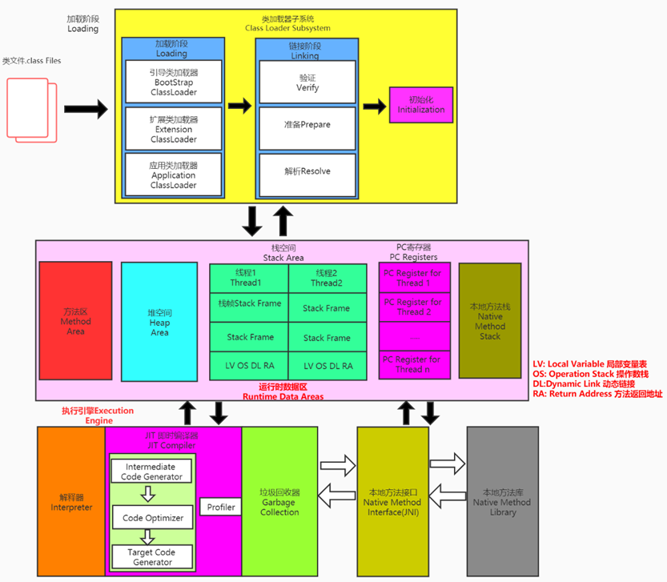
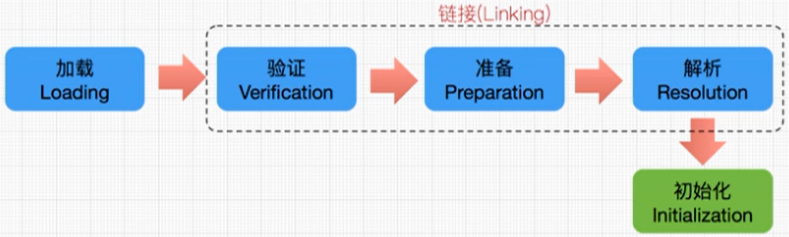
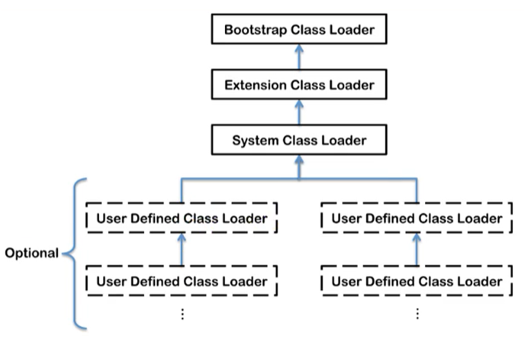
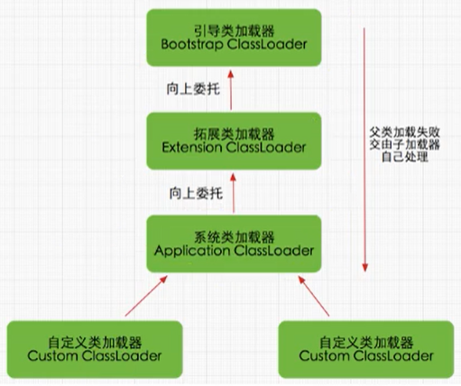

## 类加载子系统

### 作用

1. **类加载器子系统负责从文件系统或者网络中加载 class 文件**，class 文件在文件开头有特定的文件标识。
2. ClassLoader 只负责 class 文件的加载，至于它是否可以运行，则由 Execution Engine 决定。
3. 加载的类信息存放于一块称为方法区的内存空间。除了类的信息外，方法区中还会存放运行时常量池信息，可能还包括字符串字面量和数字常量（这部分常量信息是 class 文件中常量池部分的内存映射）。

### 加载

1. 通过一个类的全限定名获取定义此类的二进制字节流。
2. 将这个字节流所代表的静态存储结构转化为方法区的运行时数据结构。
3. **在内存中生成一个代表这个类的 java.lang.Class 对象**，作为方法区这个类的各种数据的访问入口。

### 验证

1. **目的在于确保 class 文件的字节流中包含信息符合当前虚拟机要求，保证被加载类的正确性，不会危害虚拟机自身安全。**
2. 主要包括四种验证，文件格式验证，元数据验证，字节码验证，符号引用验证。

### 准备

1. **为类变量分配内存并且设置该类变量的默认初始值，即零值。**
2. **这里不包含用 final 修饰的静态变量，因为 final 在编译的时候就会分配好了默认值，准备阶段会显式初始化**。
3. 这里不会为实例变量初始化，类变量会分配在方法区中，而实例变量是会随着对象一起分配到堆中。

### 解析

1. **将常量池内的符号引用转换为直接引用的过程。**（事实上，解析操作往往会伴随着 JVM 在执行完初始化之后再执行）
3. 符号引用就是一组符号来描述所引用的目标，与虚拟机实现的内存布局无关，引用的目标不一定加载到内存中。符号引用的字面量形式明确定义在《Java 虚拟机规范》的 class 文件格式中。直接引用就是直接指向目标的指针、相对偏移量或一个间接定位到目标的句柄，与虚拟机实现的内存布局相关，同一符号引用在不同虚拟机实例上翻译出来的直接引用一般不同。
4. 解析动作主要针对类或接口、字段、类方法、接口方法、方法类型等。

### 初始化

1. 初始化阶段就是执行类构造器方法 `<clinit>()` 的过程。
2. 此方法不需定义，是 Javac 编译器自动收集类中的所有类变量的赋值动作和静态代码块中的语句合并而来。
3. `<clinit>()` 方法中的指令按语句在源文件中出现的顺序执行。
4. `<clinit>()` 不同于类的构造器。（构造器是虚拟机视角下的 `<init>()`）
5. 若该类具有父类，JVM 会保证在子类的 `<clinit>()` 执行前，父类的 `<clinit>()` 已经执行完毕。
6. **虚拟机必须保证一个类的 `<clinit>()` 方法在多线程下被同步加锁。**

~~~java
public class ClinitTestFive {

    private static ClinitTestFive test;

    static {
        test = new ClinitTestFive();
    }

    private static final String name = "string_name";

    private String testName;

    private ClinitTestFive() {
        testName = name;
    }

    public static void main(String[] args) {
        System.out.println(test.testName); // 输出结果为: string_name
    }

}

public class ClinitTestFive {

    private static ClinitTestFive test;

    static {
        test = new ClinitTestFive();
    }

    private static final String name = new String("string_name"); 

    private String testName;

    private ClinitTestFive() {
        testName = name;
    }

    public static void main(String[] args) {
        System.out.println(test.testName); // 输出结果为: null
    }

}
~~~

### 类加载器

1. JVM 支持两种类型的类加载器。分别为引导类加载器（Bootstrap ClassLoader）和自定义类加载器（User-Defined ClassLoader）。
2. 从概念上来讲，自定义类加载器一般指的是程序中由开发人员自定义的一类类加载器，但是 Java 虚拟机规范却没有这么定义，而是**将所有派生于抽象类 ClassLoader 的类加载器都划分为自定义类加载器。**

这里的四者之间是包含关系，不是上层和下层，也不是子父类的继承关系。

~~~java
public class ClassLoaderTest {
    public static void main(String[] args) {

        // 获取系统类加载器
        ClassLoader systemClassLoader = ClassLoader.getSystemClassLoader();
        System.out.println(systemClassLoader); // sun.misc.Launcher$AppClassLoader@18b4aac2

        // 获取其上层：扩展类加载器
        ClassLoader extClassLoader = systemClassLoader.getParent();
        System.out.println(extClassLoader); // sun.misc.Launcher$ExtClassLoader@1540e19d

        // 获取其上层：获取不到引导类加载器
        ClassLoader bootstrapClassLoader = extClassLoader.getParent();
        System.out.println(bootstrapClassLoader); // null

        // 对于用户自定义类来说：默认使用系统类加载器进行加载
        ClassLoader classLoader = ClassLoaderTest.class.getClassLoader();
        System.out.println(classLoader); // sun.misc.Launcher$AppClassLoader@18b4aac2

        // String 类使用引导类加载器进行加载的 -> Java 的核心类库都是使用引导类加载器进行加载的
        ClassLoader classLoader1 = String.class.getClassLoader();
        System.out.println(classLoader1); // null

    }
}
~~~

#### 启动类加载器

1. 这个类加载使用 C / C++ 语言实现的，嵌套在 JVM 内部。
2. 它用来加载 Java 的核心库（JAVA_HOME/jre/lib/rt.jar、resources.jar 或 sun.boot.class.path 路径下的内容），用于提供 JVM 自身需要的类。
3. 并不继承自 java.lang.ClassLoader，没有父加载器。
4. 加载扩展类和应用程序类加载器，并指定为它们的父类加载器。
5. 出于安全考虑，Bootstrap 启动类加载器只加载包名为 java、javax、sun 等开头的类。

#### 扩展类加载器

1. Java 语言编写，由 sun.misc.Launcher$ExtClassLoader 实现。
2. 派生于 ClassLoader 类。
3. 从 java.ext.dirs 系统属性所指定的目录中加载类库，或从 JDK 的安装目录的 jre/lib/ext 子目录（扩展目录）下加载类库。如果用户创建的 Jar 放在此目录下，也会自动由扩展类加载器加载。

#### 系统类加载器

1. Java 语言编写，由 sun.misc.LaunchersAppClassLoader 实现。
2. 派生于 ClassLoader 类。
4. 它负责加载环境变量 Classpath 或系统属性 java.class.path 指定路径下的类库。
5. 该类加载是程序中默认的类加载器，一般来说，Java 应用的类都是由它来完成加载。
6. 通过 `ClassLoader.getSystemclassLoader()` 方法可以获取到该类加载器。

~~~java
public class ClassLoaderTest1 {
    public static void main(String[] args) {
        System.out.println("**********启动类加载器**************");
        // 获取 BootstrapClassLoader 能够加载的 api 的路径
        URL[] urLs = sun.misc.Launcher.getBootstrapClassPath().getURLs();
        for (URL element : urLs) {
            System.out.println(element.toExternalForm());
        }
        // 从上面的路径中随意选择一个类，查看类加载器
        ClassLoader classLoader = Provider.class.getClassLoader();
        System.out.println(classLoader); // null

        System.out.println("***********扩展类加载器*************");
        String extDirs = System.getProperty("java.ext.dirs");
        for (String path : extDirs.split(";")) {
            System.out.println(path);
        }

        // 从上面的路径中随意选择一个类，查看类加载器
        ClassLoader classLoader1 = CurveDB.class.getClassLoader();
        System.out.println(classLoader1); // sun.misc.Launcher$ExtClassLoader@1540e19d
    }
}
~~~

#### 用户自定义类加载器

在 Java 的日常应用程序开发中，类的加载几乎是由上述 3 种类加载器相互配合执行的。在必要时，我们还可以自定义类加载器，来定制类的加载方式。为什么还需要自定义类加载器：

1. 隔离加载类
2. 修改类加载的方式
3. 扩展加载源
4. 防止源码泄漏

如何自定义类加载器：

1. 开发人员可以通过继承抽象类 java.lang.ClassLoader 类的方式，实现自己的类加载器，以满足一些特殊的需求。
2. 在 JDK 1.2 之前，在自定义类加载器时，总会去继承 ClassLoader 类并重写 `loadClass()` 方法，从而实现自定义的类加载类。但是在 JDK 1.2 之后已不再建议用户去覆盖 `loadClass()` 方法，而是建议把自定义的类加载逻辑写在 `findclass()` 方法中。
3. 在编写自定义类加载器时，如果没有太过于复杂的需求，可以直接继承 URLClassLoader 类，这样就可以避免自己去编写 `findclass()` 方法及其获取字节码流的方法，使自定义类加载器编写更加简洁。

### 双亲委派机制

Java 虚拟机对 class 文件采用的是按需加载的方式，也就是说当需要使用该类时才会将它的 class 文件加载到内存生成 class 对象。加载 class 文件时，Java 虚拟机采用的是双亲委派模式，即把请求交由父类处理，它是一种任务委派模式：

1. 如果一个类加载器收到了类加载请求，它并不会自己先去加载，而是把这个请求委托给父类加载器去执行；
2. 如果父类加载器还存在其父类加载器，则进一步向上委托，依次递归，请求最终将到达顶层的启动类加载器；
3. 如果父类加载器可以完成类加载任务，就成功返回，倘若父类加载器无法完成此加载任务，子加载器才会尝试自己去加载，这就是双亲委派模式；
4. 父类加载器一层一层往下分配任务，如果子类加载器能加载，则加载此类，如果将加载任务分配至系统类加载器也无法加载此类，则抛出异常。

优势：

1. 避免类的重复加载。
2. 保护程序安全，防止核心 API 被随意篡改（沙箱安全机制）。

### 其他

在 JVM 中表示两个 class 对象是否为同一个类存在两个必要条件：

1. **类的完整类名必须一致，包括包名。**
2. **加载这个类的 ClassLoader（指 ClassLoader 实例对象）必须相同。**

对类加载器的引用：

1. JVM 必须知道一个类是由启动类加载器加载还是由用户类加载器加载。
2. 如果一个类型是由用户类加载器加载的，那么 JVM 会将这个类加载器的一个引用作为类型信息的一部分保存在方法区中。
3. 当解析一个类型到另一个类型的引用的时候，JVM 需要保证这两个类型的类加载器是相同的。

类的主动使用：

1. 创建类的实例
2. 访问某个类或接口的静态变量，或者对该静态变量赋值（**对类的静态常量的引用不会触发类的初始化过程**）
3. 调用类的静态方法
4. 反射（比如：Class.forName(“com.demo.Test”)）
5. 初始化一个类的子类
6. Java 虚拟机启动时被标明为启动类的类
7. JDK 7 开始提供的动态语言支持：java.lang.invoke.MethodHandle 实例的解析结果 REF_getStatic、REF putStatic、REF_invokeStatic 句柄对应的类没有初始化，则初始化