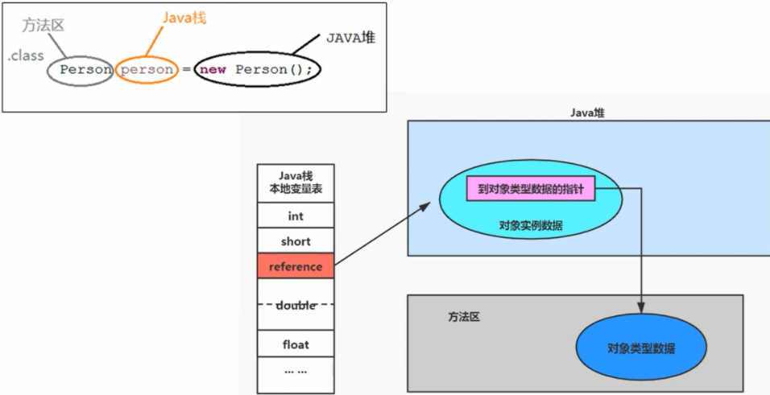

## 方法区

《Java 虚拟机规范》中明确说明：尽管所有的方法区在逻辑上是属于堆的一部分，但一些简单的实现可能不会选择去进行垃圾收集或者进行压缩。但对于 HotSpot JVM 而言，方法区还有一个别名叫做 Non-heap（非堆），目的就是要和堆分开。所以，方法区可以看作是一块独立于 Java 堆的内存空间。

栈、堆、方法区的交互关系：

### 特点

- 方法区在 JVM 启动时就会被创建，并且它的实际的物理内存空间和 Java 堆区一样都可以是不连续的，关闭 JVM 就会释放这个区域的内存。
- 多个线程同时加载统一个类时，只能有一个线程能加载该类，其他线程只能等待该线程加载完毕，然后直接使用该类，即**类只能加载一次。**
- 方法区的大小，跟堆空间一样，可以选择固定大小或者可扩展。
- 方法区的大小决定了系统可以保存多少个类，如果系统定义了太多的类，会导致方法区溢出，虚拟机同样会抛出内存溢出错误：java.lang.OutOfMemoryError: PermGen space 或者 java.lang,OutOfMemoryError: Metaspace，比如：
  - 加载大量的第三方 jar 包
  - Tomcat 部署的工程过多
  - 大量动态生成反射类

### 演进过程

《Java 虚拟机规范》对如何实现方法区，不做统一要求。在 JDK7 及以前，习惯上把方法区称为永久代。JDK8 开始，使用元空间取代了永久代。元空间的本质和永久代类似，都是对 JVM 规范中方法区的实现，不过最大的区别在于：元空间不在虚拟机设置的内存中，而是使用本地内存。BEA JRockit / IBM J9 中不存在永久代的概念。现在看来，当年使用永久代，不是好的 idea，导致 Java 程序更容易 OOM（超过 -XX:MaxPermSize 上限）。

|   JDK 版本    |                           演变细节                           |
| :-----------: | :----------------------------------------------------------: |
| JDK1.6 及以前 |   有永久代（permanent generation），静态变量存储在永久代上   |
|    JDK1.7     | 有永久代，但已经逐步 “去永久代”，**移除字符串常量池、静态变量，保存在堆中** |
|    JDK1.8     | 无永久代，类型信息，字段，方法，常量保存在本地内存的元空间，但字符串常量池、静态变量仍然在堆中 |

- 永久代被元空间替代的原因：

  官方的牵强解释：这是 JRockit 和 HotSpot 融合后的结果，因为 JRockit 没有永久代，所以他们不需要配置永久代。由于类的元数据分配在本地内存中，元空间的最大可分配空间就是系统可用内存空间，这项改动是很有必要的，原因主要有：

  1. 为永久代设置空间大小是很难确定的。
  2. 对永久代进行调优是很困难的（参看垃圾收集）。

- 字符串常量池 StringTable 调整位置：JDK7 中将 StringTable 放到了堆空间中。因为永久代默认比较小并且回收效率很低，在 Full GC 的时候才会执行永久代的垃圾回收。而 Full GC 是老年代的空间不足、永久代不足时才会触发。这就导致 StringTable 回收效率不高。**改放到堆里，能及时回收内存**。

-Xms200m -Xmx200m -XX:PermSize=300m -XX:MaxPermSize=300m -XX:+PrintGCDetails

### 大小设置

JDK7 之前版本设置永久代大小：**-XX:PermSize** 永久代初始分配空间，默认值是 20.75M，**-XX:MaxPermSize** 永久代最大可分配空间，32 位机器默认是 64M，64 位机器模式是 82M。

JDK8 版本设置元空间大小：

- **-XX:MetaspaceSize** 元空间初始分配空间，默认值是 21M（64 位），**-XX:MaxMetaspaceSize** 元空间最大可分配空间，默认值是 -1，即没有限制。
- **-XX:MetaspaceSize** 设置的值是初始的高水位线，一旦触及这个水位线，Full GC 将会被触发并卸载没用的类（即这些类对应的类加载器不再存活），**然后这个高水位线将会重置**，新的高水位线的值取决于 GC 后释放了多少元空间。如果释放的空间不足，那么在不超过最大值时，适当提高；如果释放空间过多，则适当降低。如果初始化的高水位线设置过低，上述调整情况会发生很多次。通过垃圾回收器的日志可以观察到 Full GC 多次调用。**为了避免频繁地 GC，建议将 -XX:MetaspaceSize 设置为一个相对较高的值**。

**如何解决 OOM：**

1. 要解决 OOM 异常或 Heap Space 的异常，一般的手段是首先通过内存映像分析工具对 dump 出来的堆转储快照进行分析，重点是确认内存中的对象是否是必要的，也就是要先分清楚到底是出现了内存泄漏（Memory Leak）还是内存溢出（Memory Overflow）。
2. **内存泄漏就是有大量的引用指向某些对象，但是这些对象以后不会使用了**，因为它们还和 GC Roots 有关联，所以导致以后这些对象也不会被回收。如果是内存泄漏，可进一步通过工具查看泄漏对象到 GC Roots  的引用链。于是就能**找到泄漏对象是通过怎样的路径与 GC Roots 相关联并导致垃圾收集器无法自动回收它们的**。掌握了泄漏对象的类型信息，以及 GC Roots 引用链的信息，就可以比较准确地定位出泄漏代码的位置。
3. 如果不存在内存泄漏，换句话说就是内存中的对象确实都还必须存活着，那就应当检查虚拟机的堆参数（-Xmx 与 -Xms），与机器物理内存对比看是否还可以调大，并从代码上检查是否存在某些对象生命周期过长、持有状态时间过长的情况，尝试减少程序运行期的内存消耗。

### 结构

《深入理解 Java 虚拟机》书中对方法区（Method Area）存储内容描述如下：它用于存储已被虚拟机**加载的类型信息、常量、静态变量、即时编译器编译后的代码缓存**等。

#### 类型信息

对每个加载的类型（类 class、接口 interface、枚举 enum、注解 annotation），JVM 必须在方法区中存储以下类型信息：

1. 这个类型的完整有效名称（全名 = 包名.类名）
2. 这个类型直接父类的完整有效名（对于 interface 或 java.lang.Object，都没有父类）
3. 这个类型的修饰符（public，abstract，final 的某个子集）
4. 这个类型直接接口的一个有序列表
5. 类信息中记录了哪个加载器加载了该类，同时类加载器也记录了它加载了哪些类

#### 域（Field）信息

JVM 必须在方法区中保存类型的所有域的相关信息以及域的声明顺序，这些信息包括：域名称、域类型、域修饰符（public，private，protected，static，final，volatile，transient 的某个子集）。

#### 方法信息

JVM 必须保存所有方法的以下信息，同域信息一样包括声明顺序：

1. 方法名称
2. 方法的返回类型（包括 void 返回类型），void 在 Java 中对应的类为 void.class
3. 方法参数的数量和类型（按顺序）
4. 方法的修饰符（public，private，protected，static，final，synchronized，native，abstract 的一个子集）
5. 方法的字节码（bytecodes）、操作数栈、局部变量表及大小（abstract 和 native 方法除外）
6. 异常表（abstract 和 native 方法除外），异常表记录每个异常处理的开始位置、结束位置、代码处理在程序计数器中的偏移地址、被捕获的异常类的常量池索引

### 运行时常量池

字节码文件内部包含了常量池。一个有效的字节码文件中除了包含类的版本信息、字段、方法以及接口等描述符信息外，还包含一项信息就是**常量池表**（**Constant Pool Table**），包括**各种字面量和对类型、域和方法的符号引用（数量值、字符串值、类引用、字段引用、方法引用）。**

- 一个 Java 源文件中的类、接口，编译后产生一个字节码文件。而 Java 中的字节码需要数据支持，通常这种数据会很大以至于不能直接存到字节码里，换另一种方式，可以存到常量池。
- 这个字节码包含了指向常量池的引用，在动态链接的时候会用到运行时常量池。

方法区包含了运行时常量池，**常量池表**在类加载后存放到运行时常量池中。

- JVM 为每个已加载的类型（类或接口）都维护一个常量池，池中的数据项像数组项一样，是通过索引访问的。

- 运行时常量池中包含多种不同的常量，包括编译期就已经明确的数值字面量，也包括到运行期解析后才能够获得的方法或者字段引用。**此时不再是常量池中的符号地址了，这里换为真实地址**。
- 运行时常量池相对于 Class 文件常量池的另一重要特征是：具备动态性。
- 运行时常量池类似于传统编程语言中的符号表（symbol table），但是它所包含的数据却比符号表要更加丰富一些。

**静态变量在 JDK6 存在永久代中，在 JDK7/8 存在于堆中，静态引用对应的对象实体始终都存在堆空间。**

~~~java
/**
 * 《深入理解 Java 虚拟机》中的案例：
 * staticObj、instanceObj、localObj 存放在哪里？
 * staticObj 随着 Test 的类型信息存放在方法区
 * instanceObj 随着 Test 的对象实例存放在 Java 堆
 * localObject 则是存放在 foo() 方法栈帧的局部变量表中
 */
public class StaticObjTest {
    static class Test {
        static ObjectHolder staticObj = new ObjectHolder();
        ObjectHolder instanceObj = new ObjectHolder();

        void foo() {
            ObjectHolder localObj = new ObjectHolder();
            System.out.println("done");
        }
    }

    private static class ObjectHolder {
    }

    public static void main(String[] args) {
        Test test = new StaticObjTest.Test();
        test.foo();
    }
}
~~~

### 垃圾收集

《Java 虚拟机规范》对方法区的约束是非常宽松的，提到过可以不要求虚拟机在方法区中实现垃圾收集，事实上也确实有未实现或未能完整实现方法区类型卸载的收集器存在（如 JDK11 时期的 ZGC 收集器）。

**方法区的垃圾收集主要回收两部分内容：常量池中废弃的常量和不再用的类型**，方法区的调优主要是为了降低 Full GC。**一般来说这个区域的回收效果比较难令人满意，尤其是类型的卸载，条件相当苛刻**。但是这部分区域的回收有时又确实是必要的。以前 Sun 公司的 Bug 列表中，曾出现过的若干个严重的 Bug 就是由于低版本的 HotSpot 虚拟机对此区域未完全回收而导致内存泄漏。

- 常量回收：字面量和符号引用

  - 字面量比较接近 Java 语言层次的常量概念，如文本字符串、被声明为 final 的常量值等
  - 符号引用则属于编译原理方面的概念，包括类和接口的全限定名、字段的名称和描述符、方法的名称和描述符

  HotSpot 虚拟机对常量池的回收策略是很明确的，只要常量池中的常量没有被任何地方引用，就可以被回收。

- 类型回收：定一个类型是否属于“不再被使用的类”的条件就比较苛刻了，需要同时满足下面三个条件：

  1. 该类所有的实例都已经被回收，也就是 Java 堆中不存在该类及其任何派生子类的实例。
  2. 加载该类的类加载器已经被回收，这个条件除非是经过精心设计的可替换类加载器的场景，如 OSGi、JSP 的重加载等，否则通常是很难达成的。
  3. 该类对应的 java.lang.Class 对象没有在任何地方被引用，无法在任何地方通过反射访问该类的方法。

  Java 虚拟机被允许对满足上述三个条件的无用类型进行回收，这里说的仅仅是“被允许”，而并不是和对象一样，没有引用了就必然会回收。关于是否要对类型进行回收，HotSpot 虚拟机提供了 -Xnoclassgc 参数进行控制，还可以使用 -verbose:class 以及 -XX:+TraceClass-Loading、-XX:+TraceClassUnLoading 查看类加载和卸载信息。

在大量使用反射、动态代理、CGLib 等字节码框架，动态生成 JSP 以及 OSGi 这类频繁自定义类加载器的场景中，通常都需要 Java 虚拟机具备类型卸载的能力，以保证不会对方法区造成过大的内存压力。
