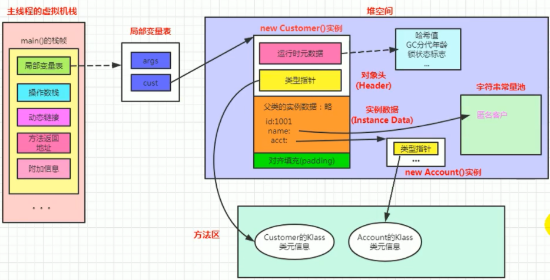
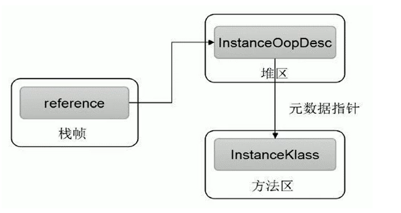
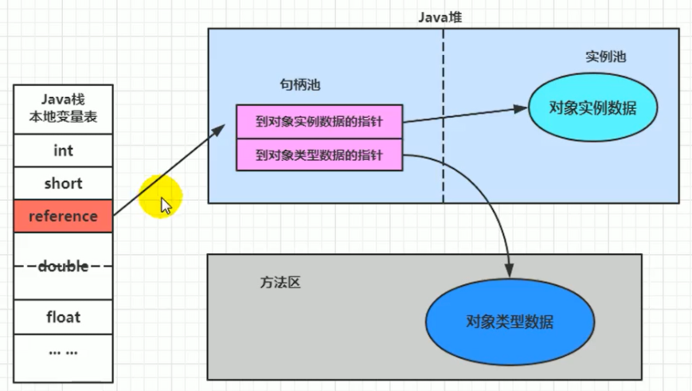
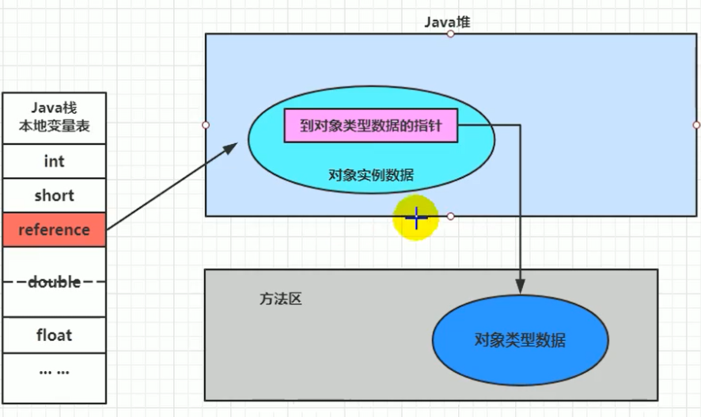

## 对象的实例化内存布局与访问定位

### 对象的创建方式

1. new：最常见的方式，单例类中调用 getInstance 的静态类方法，XXXFactory 的静态方法
2. Class 的 newInstance 方法：在 JDK9 里面被标记为过时的方法，因为只能调用空参构造器，并且权限必须为 public
3. Constructor 的 newInstance(Xxxx)：反射的方式，可以调用空参的或者带参的构造器
4. 使用 clone()：不调用任何的构造器，要求当前的类需要实现 Cloneable 接口中的 clone 方法
5. 使用序列化
6. 第三方库 cglib 中的 Objenesis

### 对象创建的步骤

1. 判断对象对应的类是否加载、链接、初始化

   虚拟机遇到一条 new 指令，首先去检查这个指令的参数能否在 Metaspace 的常量池中定位到一个类的符号引用，并且检查这个符号引用代表的类是否已经被加载，解析和初始化（即判断类元信息是否存在）。如果该类没有加载，那么在双亲委派模式下，使用当前类加载器以 ClassLoader + 包名 + 类名为 key 进行查找对应的 .class 文件，如果没有找到文件，则抛出 ClassNotFoundException 异常；如果找到，则进行类加载，并生成对应的 Class 对象。

2. 为对象分配内存

   首先计算对象占用空间的大小，接着在堆中划分一块内存给新对象。

   - 如果内存规整，采用指针碰撞分配（Bump the Pointer）内存。内存规整指的是使用过的内存空间是连续的，它与空闲的内存空间中间放着一个指针作为分界点的指示器。分配内存就仅仅是把指针往空闲内存那边挪动一段与对象大小相等的距离罢了。如果虚拟机的垃圾收集器选择的是 Serial，ParNew 这种基于压缩算法的，采用这种分配方式。收集整理算法清理过后的内存，一般都是连续的。
   - 如果内存不规整，采用的是空闲列表（Free List）分配内存。内存不规整指的是已使用的内存和未使用的内存相互交错，虚拟机维护了一个列表，记录哪些内存块是可用的，新分配的时候从列表中找到一块足够大的空间划分给对象实例，并更新列表上的内容。标记清除算法清理过后的堆内存，就会存在很多内存碎片。

3. 处理并发问题

   - 采用 CAS + 失败重试保证更新的原子性

   - 每个线程预先分配 TLAB，通过设置 -XX:+UseTLAB 参数来设置（区域加锁机制）

4. 初始化分配到的内存，所有属性设置默认值，保证对象实例字段在不赋值时可以直接使用。

5. 设置对象的对象头，将对象的所属类（即类的元数据信息）、对象的 HashCode 和对象的 GC 信息、锁信息等数据存储在对象的对象头中。这个过程的具体设置方式取决于 JVM 实现。

6. 执行 init 方法进行初始化，在 Java 程序的视角看来，初始化才正式开始。初始化成员变量，执行实例化代码块，调用类的构造方法，并把堆内对象的首地址赋值给引用变量。因此一般来说，new 指令之后会接着执行 init 方法，把对象进行初始化，这样一个真正可用的对象才算完成创建出来。

对象属性赋值的顺序：

1. 属性的默认值初始化
2. 显示初始化 / 代码块初始化（并列关系，谁先谁后看代码编写的顺序）
3. 构造器初始化

### 对象的内存布局

#### 对象头

对象头包含两部分，运行时元数据（Mark Word）和类型指针，如果对象是数组，还需要记录数组的长度：

1. 运行时元数据：哈希值（HashCode，可以看作是堆中对象的地址），GC 分代年龄，锁状态标志，线程持有的锁，偏向线程 ID，偏向时间戳。
2. 类型指针：指向的其实是方法区中存放的类元信息，确定该对象所属的类型。

#### 实例数据

它是对象真正存储的有效信息，包括程序代码中定义的各种类型的字段（包括从父类继承下来的和本身拥有的字段）。规则：

- 相同宽度的字段总是被分配在一起；
- 父类中定义的变量会出现在子类之前（父类在子类之前加载）；
- 如果 CompactFields 参数为 true（默认为true），子类的窄变量可能插入到父类变量的空隙。

#### 对齐填充

不是必须的，也没特别含义，仅仅起到占位符的作用。

### 对象的访问定位

**对象的两种访问方式：句柄访问和直接指针**

1. 句柄访问

   - 优点：reference 中存储稳定句柄地址，对象被移动（垃圾收集时移动对象很普遍）时只会改变句柄中实例数据指针即可，reference 本身不需要被修改

   - 缺点：在堆空间中开辟了一块空间作为句柄池，句柄池本身也会占用空间；通过两次指针访问才能访问到堆中的对象，效率低

2. 直接指针（HotSpot 采用）
   - 优点：直接指针是局部变量表中的引用，直接指向堆中的实例，在对象实例中有类型指针，指向的是方法区中的对象类型数据
   - 缺点：对象被移动（垃圾收集时移动对象很普遍）时需要修改 reference 的值

