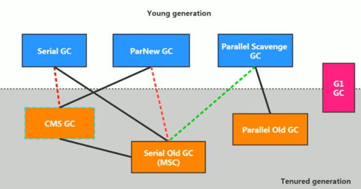
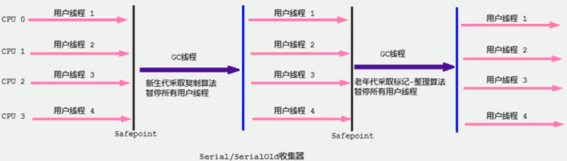
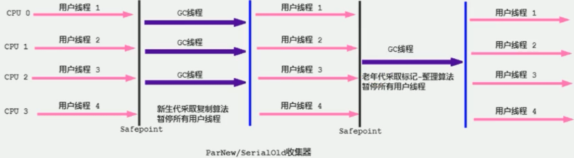
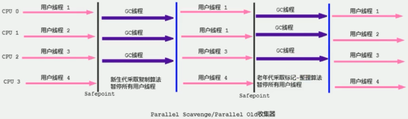
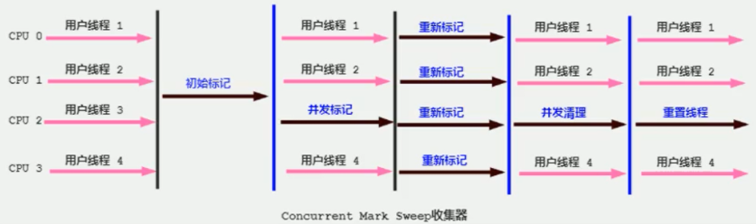
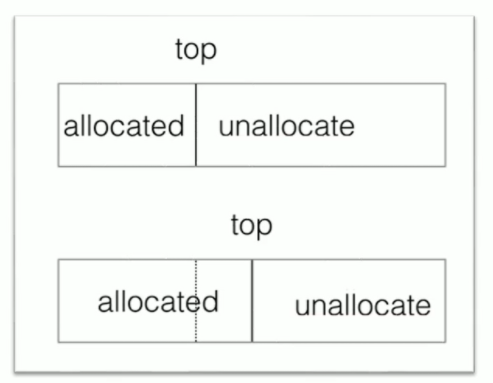
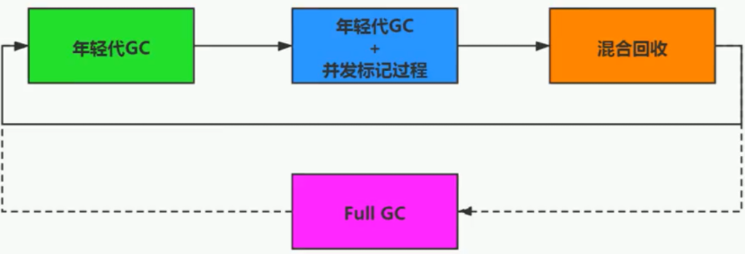
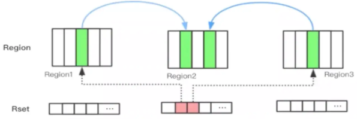
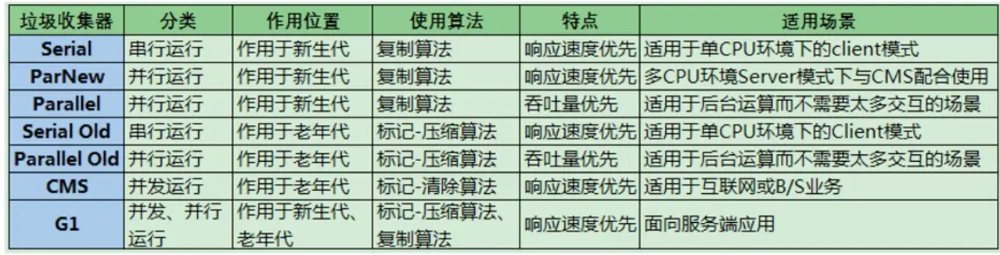

## 垃圾回收器

垃圾收集器没有在规范中进行过多的规定，可以由不同的厂商、不同版本的 JVM 来实现。从不同角度分析垃圾收集器，可以将 GC 分为不同的类型：

- 按线程数分（垃圾回收线程数），可以分为串行垃圾回收器和并行垃圾回收器。

- 按照工作模式分，可以分为并发式垃圾回收器和独占式垃圾回收器。

- 按碎片处理方式分，可分为压缩式垃圾回收器和非压缩式垃圾回收器。

评估 GC 的性能指标：

1. 吞吐量：运行用户代码的时间占总运行时间的比例（总运行时间 = 程序的运行时间 + 内存回收的时间）。
2. 垃圾收集开销：吞吐量的补数，垃圾收集所用时间与总运行时间的比例。
3. 暂停时间：执行垃圾收集时，程序的工作线程被暂停的时间。
4. 收集频率：相对于应用程序的执行，收集操作发生的频率。
5. 内存占用：Java 堆区所占的内存大小。
6. 快速：一个对象从诞生到被回收所经历的时间。

吞吐量、暂停时间、内存占用这三者共同构成一个“不可能三角”。三者总体的表现会随着技术进步而越来越好。一款优秀的收集器通常最多同时满足其中的两项。这三项里，暂停时间的重要性日益凸显。因为随着硬件发展，内存越来越大，硬件性能的提升也有助于降低收集器运行时对应用程序的影响，即提高了吞吐量。而内存的扩大，对延迟反而带来负面效果。

高吞吐量和低暂停时间是一对相互竞争的目标（矛盾）。

- 如果选择以吞吐量优先，那么必然需要降低内存回收的执行频率，但是这样会导致 GC 需要更长的暂停时间来执行内存回收。
- 如果选择以低延迟优先为原则，那么为了降低每次执行内存回收时的暂停时间，只能频繁地执行内存回收，但这又导致了年轻代内存的缩减和程序吞吐量的下降。

在设计（或使用）GC 算法时，我们必须确定我们的目标：一个 GC 算法只可能针对两个目标之一（即只专注于较大吞吐量或最小暂停时间），或尝试找到一个二者的折衷。现在标准：在最大吞吐量优先的情况下，降低停顿时间。

拓展：Java 不同版本新特性主要关注三个方面，语法层面（Lambda 表达式）、API 层面（Stream API、新的日期时间）、底层优化（JVM 优化、GC 的变化）。

### 发展史

1. 1999 年随 JDK 1.3.1 一起发布的是串行方式的 Serial GC，它是第一款GC。ParNew 垃圾收集器是 Serial 收集器的多线程版本。
2. 2002 年 2 月 26 日，Parallel GC 和 Concurrent Mark Sweep GC 跟随 JDK 1.4.2 一起发布。Parallel GC 在 JDK6 之后成为 HotSpot 默认 GC。
3. 2012 年，在 JDK 1.7u4 版本中，G1 可用。
4. 2017 年，JDK 9 中 G1 变成默认的垃圾收集器，以替代 CMS。
5. 2018 年 3 月，JDK 10 中 G1 垃圾回收器实现并行完整垃圾回收，改善最坏情况下的延迟。
6. 2018 年 9 月，JDK 11 发布。引入 Epsilon 垃圾回收器，又被称为 "No-Op（无操作）“ 回收器。同时引入 ZGC：可伸缩的低延迟垃圾回收器。
7. 2019 年 3 月，JDK 12 发布。增强 G1，自动返回未用堆内存给操作系统。同时，引入 Shenandoah GC：低停顿时间的GC。
8. 2019 年 9 月，JDK 13 发布。增强 ZGC，自动返回未用堆内存给操作系统。
9. 2020 年 3 月，JDK 14 发布。删除 CMS 垃圾回收器。扩展 ZGC 在 macOS 和 Windows 上的应用。

1. 其中 Serial Old 作为 CMS 出现 Concurrent Mode Failure 失败的后备预案。
2. （红色虚线）由于维护和兼容性测试的成本，在 JDK 8 时将 Serial + CMS、ParNew + Serial Old 这两个组合声明为废弃（JEP 173），并在 JDK 9 中完全弃用了这些组合（JEP 214）。
3. （绿色虚线）JDK 14 中，弃用 Parallel Scavenge 和 Serial Old 组合（JEP 366）。
4. （青色虚线）JDK 14 中，删除 CMS 垃圾回收器（JEP 363）。

可以使用 **-XX:+PrintCommandLineFlags** 查看命令行相关参数（包含使用的垃圾收集器）。

### Serial 回收器

Serial 回收器是最基本、历史最悠久的垃圾回收器，JDK 1.3 之前回收新生代唯一的选择，作为 HotSpot 中 Client 模式下的默认新生代垃圾回收器。采用复制算法、串行回收和 Stop the World 机制。Serial 回收器还提供用于执行老年代垃圾回收的 Serial Old 回收器，内存回收算法使用的是标记-压缩算法。

优势：简单而高效（与其他收集器的单线程比），对于限定单个 CPU 的环境来说，由于 Serial 回收器没有线程交互的开销，可以获得最高的单线程收集效率。

### ParNew 回收器

ParNew 回收器是 Serial 回收器的多线程版本，是很多 JVM 运行在 Server 模式下新生代的默认垃圾收集器。

### Parallel Scavenge 回收器

Parallel Scavenge 回收器也采用了复制算法、并行回收和 Stop the World 机制，并且提供了用于执行老年代垃圾回收的 Parallel Old 回收器。和 ParNew 回收器不同，Parallel Scavenge 回收器的目标则是达到一个可控制的吞吐量（Throughput），自适应调节策略也是一个重要区别。JDK 8 中，默认使用此垃圾回收器。

回收器参数设置：

1. **-XX:+UseParallelGC：** 手动指定使用 Parallel Scavenge 回收器。
2. **-XX:+UseParallelOldGC：** 手动指定使用 Parallel Old 回收器。

3. **-XX:ParallelGCThreads：**设置年轻代并行回收器的线程数。一般地，最好与 CPU 数量相等，以避免过多的线程数影响垃圾收集性能。
   - 在默认情况下，当 CPU 数量小于 8 个，ParallelGCThreads 的值等于 CPU 数量。
   - 当 CPU 数量大于 8 个，ParallelGCThreads 的值等于 3 + (5 * CPU_Count) / 8。

4. **-XX:MaxGCPauseMillis：** 设置最大停顿时间，单位是毫秒。为了尽可能地把停顿时间控制在指定时间以内，回收器在工作时会调整堆大小或者其他一些参数。
5. **-XX:GCTimeRatio：** 设置垃圾回收时间占总时间的比例，用于衡量吞吐量的大小。等于 1 / (N+1)， 取值范围（0，100）。默认值 99，也就是垃圾回收时间占比不超过 1。与上一个参数有一定矛盾性，STW 暂停时间越长，Radio 参数就容易超过设定的比例。
6. **-XX:+UseAdaptiveSizePolicy：** 设置自适应调节策略。在这种模式下，年轻代的大小、Eden 和 Survivor 的比例、晋升老年代的对象年龄等参数会被自动调整，达到在堆大小、吞吐量和停顿时间之间的平衡点。在手动调优比较困难的场合，可以直接使用这种自适应的方式，仅指定虚拟机的最大堆、目标的吞吐量（GCTimeRatio）和停顿时间（MaxGCPauseMillis），让虚拟机自己完成调优工作。

### CMS 回收器

CMS 回收器是 HotSpot 虚拟机中第一款真正意义上的并发收集器，它第一次实现了让垃圾收集线程与用户线程同时工作，有划时代意义。CMS 回收器的关注点是尽可能缩短垃圾回收时用户线程的停顿时间，采用标记-清除算法，并且也会 Stop-the-World。

CMS 整个过程比较复杂，整个过程分为 4 个主要阶段，即初始标记阶段、并发标记阶段、重新标记阶段和并发清除阶段。涉及 STW 的阶段主要是：初始标记和重新标记。

1. 初始标记（Initial-Mark）阶段：程序中所有的工作线程都将会出现短暂的暂停，这个阶段的主要任务仅仅只是标记出 GC Roots 能直接关联到的对象，一旦标记完成之后就会恢复之前被暂停的所有应用线程。由于直接关联对象比较小，所以这里的速度非常快。
2. 并发标记（Concurrent-Mark）阶段：从 GC Roots 的直接关联对象开始遍历整个对象图的过程，这个过程耗时较长但是不需要停顿用户线程，可以与垃圾收集线程一起并发运行。
3. 重新标记（Remark）阶段：由于在并发标记阶段中，程序的工作线程会和垃圾回收线程同时运行或者交叉运行，为了修正并发标记期间因用户程序继续运作而导致标记产生变动的那一部分对象的标记记录，这个阶段的停顿时间通常会比初始标记阶段稍长一些，并且也会导致 Stop the World 的发生，但也远比并发标记阶段的时间短。
4. 并发清除（Concurrent-Sweep）阶段：此阶段清理掉标记阶段判断的已经死亡的对象，释放内存空间。由于不需要移动存活对象，所以这个阶段也是可以与用户线程同时并发的。

由于在垃圾回收阶段用户线程没有中断，因此 CMS 回收器不能像其他回收器那样等到老年代几乎完全被填满了再进行收集，而是当堆内存使用率达到某一阈值时，便开始进行回收，以确保应用程序在 CMS 工作过程中依然有足够的空间支持应用程序运行。

要是 CMS 运行期间预留的内存无法满足程序需要，就会出现一次 Concurrent Mode Failure 失败，这时虚拟机将启动后备预案：临时启用 Serial old 收集器来重新进行老年代的垃圾收集，这样停顿时间就很长了。

CMS 采用的是标记-清除算法，这意味着每次执行完内存回收后，不可避免地将会产生一些内存碎片。那么在为新对象分配内存空间时，将无法使用指针碰撞（Bump the Pointer）技术，而只能够选择空闲列表（Free List）执行内存分配。不使用标记-整理算法是为了保证并发执行的用户线程资源不受影响。

缺点：产生内存碎片；对 CPU 资源非常敏感。在并发阶段，它虽然不会导致用户停顿，但是会因为占用了一部分线程而导致应用程序变慢，总吞吐量会降低；无法处理浮动垃圾，并发标记阶段如果产生新的垃圾对象，CMS 将无法对这些垃圾对象进行标记，最终会导致这些新产生的垃圾对象没有被及时回收，从而只能在下一次执行 GC 时释放这些内存空间。

回收器参数设置：

1. **-XX:+UseConcMarkSweepGC：**手动指定使用 CMS 回收器。开启该参数后会自动将 **-XX:+UseParNewGC** 打开。即：ParNew（Young 区）+ CMS（Old区）+ Serial Old（Old 区备选方案）的组合。

2. **-XX:CMSInitiatingOccupanyFraction：**设置堆内存使用率的阈值，一旦达到该阈值，便开始进行回收。

   - JDK 5 及以前版本的默认值为 68%，JDK 6 及以上版本默认值为 92%。

   - 如果内存增长缓慢，则可以设置一个稍大的值，大的阀值可以有效降低 CMS 的触发频率，减少老年代回收的次数可以较为明显地改善应用程序性能。

   - 如果内存使用率增长很快，则应该降低这个阈值，以避免频繁触发老年代串行收集器。因此通过该选项便可以有效降低 Full GC 的执行次数。

3. **-XX:+UseCMSCompactAtFullCollection：**用于指定在执行完 Full GC 后对内存空间进行压缩整理，以此避免内存碎片的产生。不过由于**内存压缩整理过程无法并发执行**，所带来的问题就是停顿时间变得更长了。

4. **-XX:CMSFullGCsBeforeCompaction：**设置在执行多少次 Full GC 后对内存空间进行压缩整理。

5. **-XX:ParallelCMSThreads：**设置 CMS 的线程数量。默认启动的线程数是 (ParallelGCThreads + 3) / 4，ParallelGCThreads 是年轻代并行收集器的线程数，可以当做是 CPU 最大支持的线程数。

### G1 回收器

G1是一款面向服务端应用的垃圾回收器，主要针对配备多核 CPU 及大容量内存的机器。适应现在不断扩大的内存和不断增加的处理器数量，进一步降低暂停时间，同时兼顾良好的吞吐量。官方给 G1 设定的目标是在延迟可控的情况下获得尽可能高的吞吐量，所以才担当起“全功能收集器”的重任与期望。

G1 是一个并行回收器，它把堆内存分割为很多不相关的区域（region）（物理上不连续的）。使用不同的 region 来表示 Eden 区、Survivor 0 区，Survivor 1 区，老年代等。G1 跟踪各个 region 里面的垃圾堆积的价值大小（回收所获得的空间大小以及回收所需时间的经验值），在后台维护一个优先列表，每次根据允许的收集时间，优先回收价值最大的 region，从而避免在整个堆中进行全区域的垃圾收集。

与其他回收器相比，G1 使用了全新的分区算法，其特点如下所示：

1. 并行与并发兼具
2. 分代收集，从堆的结构上看，G1 不要求整个年轻代或者老年代都是连续的，也不再坚持固定大小和固定数量，同时兼顾年轻代和老年代。

对于堆中的大对象，默认直接会被分配到老年代，但是如果它是一个短期存在的大对象就会对垃圾收集器造成负面影响。为了解决这个问题，G1 划分了一个Humongous 区，它用来专门存放大对象，如图中的 H 块。主要用于存储大对象，如果超过 0.5 个 region，就放到 H 区。如果一个 H 区装不下一个大对象，那么G1 会寻找连续的 H 区来存储。为了能找到连续的 H 区，有时候不得不启动 Full GC。G1 的大多数行为都把 H 区作为老年代的一部分来看待。

region 的内部结构：

1. 每个 region 都是通过指针碰撞来分配空间
2. 每个 region 都有 TLAB，提高对象分配的效率

空间整合：region 之间是复制算法，但整体上可看作是标记-压缩（Mark-Compact）算法，两种算法都可以避免内存碎片。这种特性有利于程序长时间运行，分配大对象时不会因为无法找到连续内存空间而提前触发下一次 GC。尤其是当堆非常大的时候，G1 的优势更加明显。

可预测的停顿时间模型：这是 G1 相对于 CMS 的另一大优势。G1 除了追求低停顿外，还能建立可预测的停顿时间模型，能让使用者明确指定在一个长度为 M 毫秒的时间片段内，消耗在垃圾收集上的时间不得超过 N 毫秒。由于分区的原因，G1 可以只选取部分区域进行内存回收，这样缩小了回收的范围，因此对于全局停顿情况的发生也能得到较好的控制。相比于 CMS，G1 未必能做到 CMS 在最好情况下的延时停顿，但是最差情况要好很多。

缺点：

1. 相较于 CMS，G1 还不具备全方位、压倒性优势。比如在用户程序运行过程中，G1 无论是为了垃圾收集产生的内存占用还是程序运行时的额外执行负载都要比 CMS 要高。
2. 从经验上来说，在小内存应用上 CMS 的表现大概率会优于 G1，而 G1 在大内存应用上则显示其优势。平衡点在 6 - 8 GB 之间。

回收器参数设置：

1. **-XX:+UseG1GC：**手动指定使用 G1 垃圾回收器。

2. **-XX:G1HeapRegionSize：**设置每个 region 的大小。值是 2 的幂，范围是 1MB 到 32MB 之间，目标是根据最小的堆大小划分出约 2048 个区域。默认是堆内存的 1/2000。**所有的 region大小相同，且在 JVM 生命周期内不会被改变。**

3. **-XX:MaxGCPauseMillis：**设置期望达到的最大 GC 停顿时间指标。G1 会尽力实现，但不保证达到，默认值是 200ms。

4. **-XX:+ParallelGCThread：**设置 STW 工作线程数的值，最多设置为 8。

5. **-XX:ConcGCThreads：**设置并发标记的线程数。将 n 设置为并行垃圾回收线程数（ParallelGcThreads）的 1/4 左右。

6. **-XX:InitiatingHeapOccupancyPercent：**设置触发并发 GC 周期的堆占用率阈值。超过此值，就触发 GC，默认值是 45。

在下面的情况，使用 G1 可能比 CMS 好：

- 超过 50% 的 Java 堆被活动数据占用；
- 对象分配频率或年代提升频率变化很大；
- GC 停顿时间过长（长于 0.5 至 1 秒）

HotSpot 垃圾回收器里，除了 G1 以外，其他的垃圾回收器均使用内置的 JVM 线程执行 GC 的多线程操作，而 G1 可以采用应用线程承担后台运行的 GC 工作，即当 JVM 的 GC 线程处理速度慢时，系统会调用应用程序线程帮助加速垃圾回收过程。

#### 回收流程

G1 的垃圾回收过程主要包括如下三个环节：

- 年轻代GC（Young GC）
- 老年代并发标记过程（Concurrent Marking）
- 混合回收（Mixed GC）
- 如果需要，单线程、独占式、高强度的 Full GC 还是继续存在的。它针对 GC 的评估失败提供了一种失败保护机制，即强力回收。

应用程序分配内存，当年轻代的 Eden 区用尽时开始年轻代回收过程，G1 的年轻代收集阶段是并行独占式回收的。当堆内存使用达到一定值（默认 45%）时，开始老年代并发标记过程，标记完成后马上开始混合回收过程。G1 不需要回收整个老年代，一次只需要扫描/回收一小部分老年代的 region 就可以了。同时，这个老年代 region 是和年轻代 region 一起被回收的。

**Remembered Set（记忆集）**

回收过程中存在一个对象被不同区域引用的问题，判断对象存活时，是否需要扫描整个 Java 堆才能保证准确。

无论 G1 还是其他分代回收器，JVM 都是使用 Remembered Set 来避免全局扫描。每个 region 都有一个对应的 Remembered Set，每次 Reference 类型数据写操作时，都会产生一个写屏障 Write Barrier 暂时中断操作。然后检查将要写入的对象是否和该引用类型数据在不同的 region（其他收集器：检查老年代对象是否引用了新生代对象），如果不同，通过 CardTable 把相关引用信息记录到引用指向对象的所在 region 对应的 Remembered Set 中。当进行垃圾收集时，在 GC 根节点的枚举范围加入 Remembered Set，就可以保证不进行全局扫描，也不会有遗漏。

#### 年轻代 GC

1. 第一阶段，扫描根
   - 根是指 static 变量指向的对象、正在执行的方法调用链条上的局部变量等。
   - 根引用连同 RSet 记录的外部引用作为扫描存活对象的入口。
2. 第二阶段，更新 RSet
   - 处理 dirty card queue 中的 card，更新 RSet。
   - 此阶段完成后，RSet 可以准确的反映老年代对所在的内存分段中对象的引用。
3. 第三阶段，处理 RSet
   - 识别被老年代对象指向的 Eden 中的对象，这些被指向的 Eden 中的对象被认为是存活的对象。
4. 第四阶段，复制对象。
5. 第五阶段，处理引用
   - 处理 Soft，Weak，Phantom，Final，JNI Weak 等引用。最终 Eden 空间的数据为空，GC 停止工作。目标内存中的对象都是连续存储的，没有碎片。

dirty card queue：

1. 对于应用程序的引用赋值语句 `Object obj = new Object()`，JVM 会在之前和之后执行特殊的操作以在 dirty card queue 中入队一个保存了对象引用信息的 card。
2. 那为什么不在引用赋值语句处直接更新 RSet 呢？这是为了性能的需要，RSet 的处理需要线程同步，开销会很大，使用队列性能会好很多。

#### 并发标记

1. 初始标记阶段：
   - 标记从根节点直接可达的对象。这个阶段是 STW 的，并且会触发一次年轻代 GC。
   - 由于该阶段是 STW 的，所以只扫描根节点可达的对象，以节省时间。
2. 根区域扫描（Root Region Scanning）：
   - G1 扫描 Survivor 区直接可达的老年代区域对象，并标记被引用的对象。
   - 这一过程必须在 Young GC 之前完成，因为 Young GC 会使用复制算法对 Survivor 区进行 GC。
3. 并发标记（Concurrent Marking）：
   1. 在整个堆中进行并发标记，此过程可能被 Young GC 中断。
   2. **在并发标记阶段，若发现区域对象中的所有对象都是垃圾，那这个区域会被立即回收**。
   3. 同时，会计算每个区域的对象活性（区域中存活对象的比例）。
4. 再次标记（Remark，STW）：
   - 由于应用程序持续进行，需要修正上一次的标记结果。
   - G1 中采用了比 CMS 更快的初始快照算法：Snapshot-At-The-Beginning（SATB）。
5. 独占清理（Cleanup，STW）：
   - 计算各个区域的存活对象和 GC 回收比例，并进行排序，识别可以混合回收的区域。
   - 这个阶段并不会实际上去做垃圾的收集。
6. 并发清理阶段：
   - 识别并清理完全空闲的区域。

#### 混合回收

并发标记结束以后，老年代中百分百为垃圾的内存分段被回收了，部分为垃圾的内存分段被计算了出来。默认情况下，这些老年代的内存分段会分 8 次（可以通过 **-XX:G1MixedGCCountTarget** 设置）被回收。

**-XX:G1MixedGCLiveThresholdPercent**，默认为 65%，意思是垃圾占内存分段比例要达到 65% 才会被回收。如果垃圾占比太低，意味着存活的对象占比高，在复制的时候会花费更多的时间。

混合回收并不一定要进行8次。有一个阈值 **-XX:G1HeapWastePercent**，默认值为 10%，意思是允许整个堆内存中有 10% 的空间被浪费。意味着如果发现可以回收的垃圾占堆内存的比例低于 10%，则不再进行混合回收。因为 GC 会花费很多的时间但是回收到的内存却很少。

#### Full GC

导致 G1 Full GC 的可能原因有两个：

1. 回收阶段（Evacuation）的时候没有足够的 to-space 来存放晋升的对象。
2. 并发处理过程完成之前空间耗尽。

#### 优化建议

1. 年轻代大小

   - 避免使用 -Xmn 或 -XX:NewRatio 等相关选项显式设置年轻代大小。
   - 固定年轻代的大小会覆盖暂停时间目标。

2. 暂停时间目标不要太过严苛

   - G1 GC 的吞吐量目标是 90% 的应用程序时间和 10% 的垃圾回收时间。
   - 评估G1 GC 的吞吐量时，暂停时间目标不要太严苛。目标太过严苛表示愿意承受更多的垃圾回收开销，而这些会直接影响到吞吐量。

   

