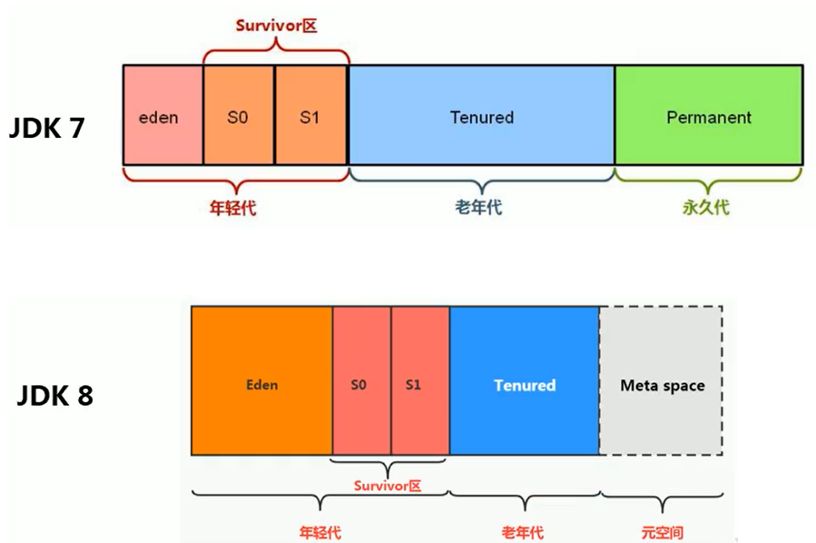
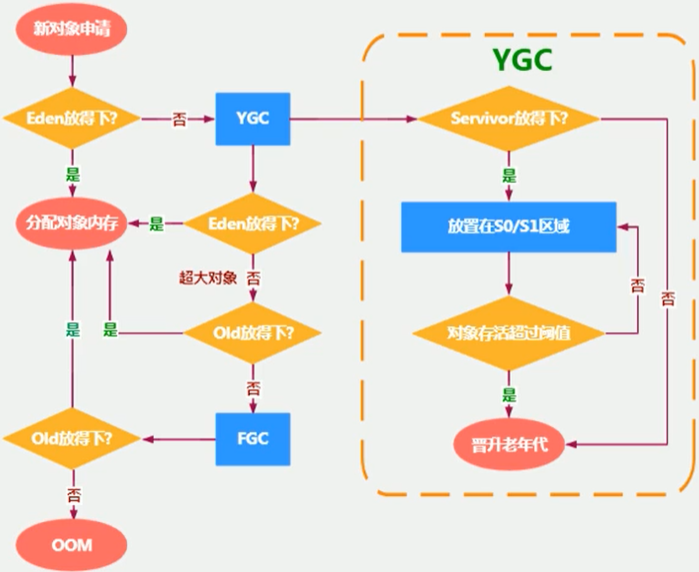

## 堆

一个 JVM 实例只存在一个堆内存，堆也是 Java 内存管理的核心区域。特点：

- 堆区**在 JVM 启动的时候即被创建**，其空间大小也就确定了。
- 堆是 JVM 管理的最大一块内存空间，并且**堆内存的大小是可以调节的**。所有的线程共享 Java 堆，在这里还可以划分**线程私有的缓冲区。**
- Java 虚拟机规范规定，**堆可以处于物理上不连续的内存空间中，但在逻辑上它应该被视为连续的。**
- Java 虚拟机规范中对 Java 堆的描述是：**所有的对象实例以及数组都应当在运行时分配在堆上。**从实际使用角度看，”几乎“所有的对象实例都在这里分配内存。因为还有一些对象是在栈上分配的（逃逸分析，标量替换）。
- 在方法结束后，堆中的对象不会马上被移除，仅仅在垃圾收集的时候才会被移除。堆是 GC（Garbage Collection，垃圾收集器）执行垃圾回收的重点区域。

### 分区

1. Java 7 及之前堆内存逻辑上分为三部分：新生区+老年区+永久区
   - Young / New Generation Space 新生区，又被划分为 Eden 区和 Survivor 区
   - Old / Tenure generation space 老年区
   - Permanent Space 永久区 Perm
2. Java 8 及之后堆内存逻辑上分为三部分：新生区+老年区+元空间
   - Young / New Generation Space 新生区，又被划分为 Eden 区和 Survivor 区
   - Old / Tenure generation space 老年区
   - Meta Space 元空间 Meta

**-Xms** 起始内存（默认物理内存大小 1/64） **-Xmx** 最大堆内存（默认物理内存大小 1/4），通常会将 -Xms 和 -Xmx 两个参数配置相同的值，其目的是为了能够在 Java 垃圾回收机制清理完堆区后不需要重新分隔计算堆区的大小，从而提高性能。

即使设置了 -Xms，通过 Runtime.getRuntime().totalMemory() 获取到的实际大小却小于设置的值，这是因为 JVM 认为幸存者 to 区并不存放对象（to 区一直为空），实际计算的空间不包括这一部分。

### 新生代与老年代

存储在 JVM 中的 Java 对象可以被划分为两类：一类是生命周期较短的瞬时对象，这类对象的创建和消亡都非常迅速；另外一类对象的生命周期却非常长，在某些极端的情况下还能够与 JVM 的生命周期保持一致。根据这一特点，Java 堆区进一步细分为**新生代**（Young Gen）和**老年代**（Old Gen），年轻代又可以划分为 Eden 区、Survivor0 区和 Survivor1 区（有时也叫做 from 区、to 区）。

配置新生代与老年代在堆结构的占比（一般不会调）：

1. 默认 **-XX:NewRatio**=2，表示新生代占 1，老年代占 2，新生代占整个堆的 1/3
2. 可以修改 **-XX:NewRatio**=4，表示新生代占 1，老年代占 4，新生代占整个堆的 1/5
3. 当发现在整个项目中，生命周期长的对象偏多，那么就可以通过调整老年代的大小来进行调优

Eden 区和 Survivor 区：

1. 在 HotSpot 中，Eden 区和另外两个 Survivor 区默认所占的比例是 8 : 1 : 1，可以通过选项 **-XX:SurvivorRatio** 调整这个空间比例。

2. 几乎所有的 Java 对象都是在 Eden 区创建的，绝大部分的对象都在新生代销毁了，新生代中 80% 的对象都是“朝生夕死”的（有些大的对象在 Eden 区无法存储时候，将直接进入老年代），新生区的对象默认生命周期超过 15 （可以通过选项 **-XX:MaxTenuringThreshold** 来设置），就会转移去老年区。
3. 可以使用 **-Xmn** 设置新生代最大内存大小，一般使用默认值。

### 对象分配过程

### GC 垃圾回收

分代收集：**分代的唯一理由就是优化GC性能**。在垃圾回收的过程中，容易出现 STW（Stop the World）的问题，而 Major GC 和 Full GC 出现 STW 的时间，是 Minor GC 的 10 倍以上。JVM 在进行 GC 时，并非每次都对上面三个内存区域一起回收的，大部分时候回收的都是新生代。针对 Hotspot VM 的实现，它里面的 GC 按照回收区域又分为两大种类型：一种是部分收集（Partial GC），一种是整堆收集（Full GC）。

部分收集：不完整收集整个 Java 堆。其中又分为：**新生代收集**（Minor GC / Young GC）、**老年代收集**（Major GC / Old GC，目前只有 CMS GC 会有单独收集老年代的行为）、混合收集（Mixed GC，收集整个新生代以及部分老年代）。

整堆收集：收集整个 Java 堆和方法区。

#### Minor GC

当新生代空间不足时，就会触发 Minor GC，这里的新生代指的是 Eden 区，Survivor 区满不会引发 GC。因为 Java 对象大多都具备朝生夕灭的特性，所以 Minor GC 非常频繁，一般回收速度也比较快。Minor GC 会引发 STW，暂停其它用户的线程，等垃圾回收结束，用户线程才恢复运行。

#### Major GC

出现了 Major GC，经常会由 Minor GC 触发。但非绝对的，在 Parallel Scavenge 收集器的收集策略里就有直接进行 Major GC 的策略选择过程。**Major GC 的速度一般会比 Minor GC 慢 10 倍以上**，STW 的时间更长，如果 Major GC 后，内存还不足，就报 OOM 了。

#### Full GC

Major GC 通常是跟 Full GC 是等价的，因为 HotSpot VM 的 GC 里，除了 CM S的 concurrent collection 之外，其它能收集老年代的 GC 都会同时收集整个 GC堆，触发 Full GC 执行的情况有如下五种：

1. 调用 System.gc() 时，系统建议执行 Full GC，但是不必然执行
2. 老年代空间不足
3. 方法区空间不足
4. **通过 Minor GC 后进入老年代的对象的平均大小大于老年代的可用内存**。当准备要触发一次 Minor GC 时，如果发现之前 Minor GC 的平均晋升大小比目前老年代剩余的空间大，则不会触发 Minor GC 而是转为触发 Full GC
5. 由 Eden 区、Survivor 0（From Space）区向 Survivor 1（To Space）区复制时，对象大小大于 To Space 可用内存，把该对象转存到老年代，并且老年代的可用内存小于该对象大小

### 内存分配策略

内存分配策略或对象提升（Promotion）规则：

1. **大对象直接分配到老年代**：开发中比较长的字符串或者数组，会直接存在老年代。但是因为新创建的对象都是朝生夕死的，所以这个大对象可能也很快被回收，但是因为老年代触发 Major GC 的次数比 Minor GC 要更少，因此可能回收起来就会比较慢。

2. **长期存活的对象分配到老年代**

3. 动态对象年龄判断：如果 Survivor 区中相同年龄的所有对象大小的总和大于 Survivor 空间的一半，年龄大于或等于该年龄的对象可以直接进入老年代，无须等到 MaxTenuringThreshold 中要求的年龄

4. 空间分配担保：**-XX:HandlePromotionFailure**，在发生 Minor GC 之前，虚拟机会检查老年代最大可用的连续空间是否大于新生代所有对象的总空间

   - 如果大于，则此次 Minor GC 是安全的
   - 如果小于，则虚拟机会查看 **-XX:HandlePromotionFailure** 设置值是否允担保失败：
     - 如果值为 true，那么会继续检查**老年代最大可用连续空间是否大于历次晋升到老年代的对象的平均大小。**
       - 如果大于，则尝试进行一次 Minor GC，但这次 Minor GC依然是有风险的
       - 如果小于，则进行一次 Full GC
     - 如果值为 false，则进行一次 Full GC

   在 JDK 6 Update 24 之后，HandlePromotionFailure 参数不会再影响到虚拟机的空间分配担保策略，之后的规则变为**只要老年代的连续空间大小大于新生代对象总大小或者历次晋升的平均大小就会进行 Minor GC ，否则将进行 Full GC**。

### TLAB

堆空间不一定都是共享的，因为有 TLAB（Thread Local Allocation Buffer，也就是**为每个线程分配了一个私有缓存区域**）。由于对象实例的创建在 JVM 中非常频繁，因此在并发环境下从堆区中划分内存空间是线程不安全的，为避免多个线程操作同一地址，需要使用加锁等机制，但会影响分配速度，使用私有空间就能避免这个问题。TLAB 包含在 Eden 空间内，**可以避免一系列的非线程安全问题，同时还能够提升内存分配的吞吐量**，因此我们可以将这种内存分配方式称之为**快速分配策略**。

尽管不是所有的对象实例都能够在 TLAB 中成功分配内存，但 **JVM 确实是将 TLAB 作为内存分配的首选**。在程序中，可以通过选项 **-XX:UseTLAB** 设置是否开启 TLAB 空间。默认情况下，TLAB 空间的内存非常小，仅占有整个 Eden 区的 1%，可以通过选项 **-XX:TLABWasteTargetPercent** 设置 TLAB 空间所占用 Eden 区的百分比大小。一旦对象在 TLAB 空间分配内存失败时，JVM 就会尝试着通过**使用加锁机制确保数据操作的原子性**，从而直接在 Eden 区中分配内存。

### 常用参数设置

1. **-XX:+PrintFlagsInitial**：查看所有的参数的默认初始值
2. **-XX:+PrintFlagsFinal**：查看所有的参数的最终值（可能会存在修改，不再是初始值）
3. **-Xms**：初始堆空间内存（默认为物理内存的 1/64）
4. **-Xmx**：最大堆空间内存（默认为物理内存的 1/4）
5. **-Xmn**：设置新生代的大小（初始值及最大值）
6. **-XX:NewRatio**：设置新生代与老年代在堆结构的占比
7. **-XX:SurvivorRatio**：设置新生代中 Eden 和 S0 / S1 空间的比例
8. **-XX:MaxTenuringThreshold**：设置新生代垃圾的最大年龄
9. **-XX:+PrintGCDetails**：输出详细的 GC 处理日志
10. **-XX:+PrintGC** 或 **-verbose:gc** ：打印 GC 简要信息
11. **-XX:HandlePromotionFalilure**：是否设置空间分配担保

### 逃逸分析

在《深入理解Java虚拟机》中关于Java堆内存有这样一段描述：随着 JIT 编译期的发展与逃逸分析技术逐渐成熟，**栈上分配、标量替换**优化技术将会导致一些微妙的变化，所有的对象都分配到堆上也渐渐变得不那么“绝对”了。

在 Java 虚拟机中，对象是在堆中分配内存的，这是一个普遍的常识。但是有一种特殊情况，那就是如果经过逃逸分析（Escape Analysis）后发现，一个对象并没有逃逸出方法的话，那么可能被优化成栈上分配。这样就无需在堆上分配内存，也无须进行垃圾回收了。这也是最常见的堆外存储技术。

此外，基于 Open JDK 深度定制的 TaoBao VM，其中创新的 GCIH（GC invisible heap）技术实现 off-heap，将生命周期较长的 Java 对象从堆中移至堆外，并且GC 不能管理 GCIH 内部的 Java 对象，以此达到降低 GC 的回收频率和提升 GC 的回收效率的目的。

**逃逸分析**：是一种可以有效减少 Java 程序中同步负载和内存堆分配压力的跨函数全局数据流分析算法，基本行为就是分析对象动态作用域，**当一个对象在方法中被定义后，对象只在方法内部使用，则认为没有发生逃逸，若它被外部方法所引用，则认为发生逃逸。**在 JDK 1.7 版本之后，HotSpot 中默认就已经开启了逃逸分析，早期版本可使用 -XX:+DoEscapeAnalysis 显式开启。

~~~java
public class EscapeAnalysis {

    public EscapeAnalysis obj;

    /**
     * 方法返回 EscapeAnalysis 对象，发生逃逸
     */
    public EscapeAnalysis getInstance(){
        return obj == null? new EscapeAnalysis() : obj;
    }

    /**
     * 为成员属性赋值，发生逃逸，如果当前的 obj 引用声明为 static 的仍然会发生逃逸
     */
    public void setObj(){
        this.obj = new EscapeAnalysis();
    }
   

    /**
     * 对象的作用域仅在当前方法中有效，没有发生逃逸
     */

    public void useEscapeAnalysis(){
        EscapeAnalysis e = new EscapeAnalysis();
    }

    /**
     * 引用成员变量的值，发生逃逸
     */
    public void useEscapeAnalysis1(){
        EscapeAnalysis e = getInstance();
        //getInstance().xxx() 同样会发生逃逸
    }
}
~~~

使用逃逸分析，编译器可以对代码做如下优化：

1. **栈上分配**：将堆分配转化为栈分配。分配完成后继续在调用栈内执行，最后线程结束，栈空间被回收，局部变量对象也被回收，无须进行垃圾回收。
2. **同步省略**：也叫锁消除，如果一个对象被发现只有一个线程被访问到，那么对于这个对象的操作可以不考虑同步（**在解释运行时发生**）。
3. **分离对象或标量替换**：标量（scalar）是指一个无法再分解成更小的数据的数据，那些还可以分解的数据叫做聚合量（Aggregate），Java 中的原始数据类型就是标量。有的对象可能不需要作为一个连续的内存结构存在也可以被访问到，那么对象的部分（或全部）可以不存储在内存，而是存储在CPU寄存器中，也就是说就会把这个对象拆解成若干个成员变量来代替。参数 **-XX:+ElimilnateAllocations**。**标量替换为栈上分配提供了很好的基础，关闭标量替换后就直接在堆上分配对象。**

~~~java
public static void main(String args[]) {
    alloc();
}
class Point {
    private int x;
    private int y;
}
private static void alloc() {
    Point point = new Point(1,2);
    System.out.println("point.x" + point.x + ";point.y" + point.y);
}

// 经过标量替换后，就会变成
private static void alloc() {
    int x = 1;
    int y = 2;
    System.out.println("point.x = " + x + "; point.y=" + y);
}
~~~

逃逸分析的不足：

关于逃逸分析的论文在 1999 年就已经发表了，但直到 JDK1.6 才有实现，而且这项技术到如今也并不十分成熟。其根本原因就是无法保证逃逸分析的性能消耗一定能高于他的消耗。虽然经过逃逸分析可以做标量替换、栈上分配、和锁消除。但是逃逸分析自身也是需要进行一系列复杂的分析的，这其实也是一个相对耗时的过程。一个极端的例子，就是经过逃逸分析之后，发现没有一个对象是不逃逸的。那这个逃逸分析的过程就白白浪费掉了。尽管这项技术并不十分成熟，但它也是即时编译器优化技术中一个十分重要的手段。一些观点认为通过逃逸分析，JVM 会在栈上分配那些不会逃逸的对象，这在理论上是可行的，但是取决于 JVM 设计者的选择。**Oracle Hotspot JVM 中就并未这么做**。