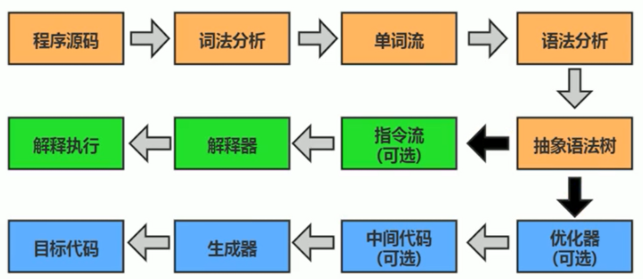
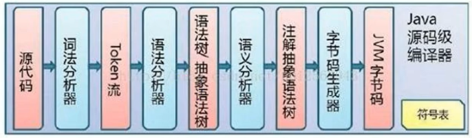
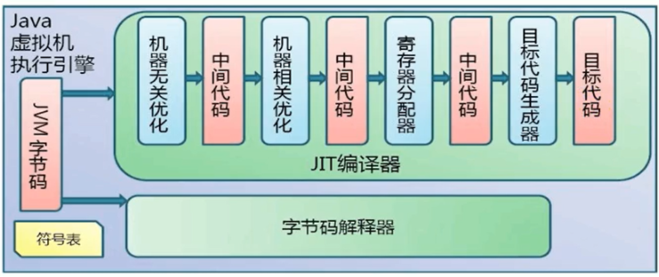
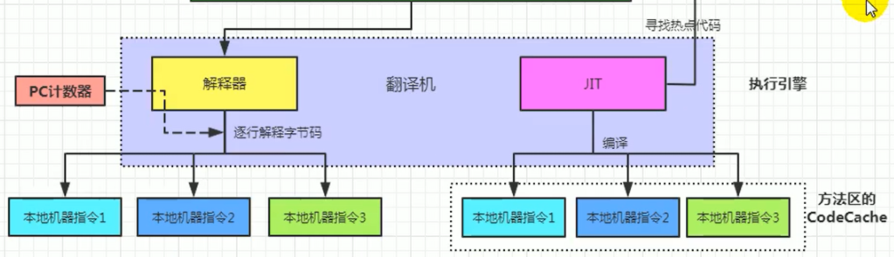
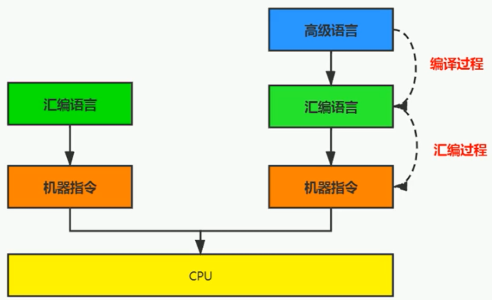
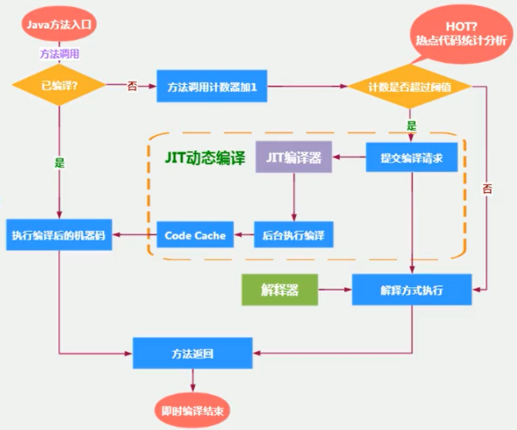
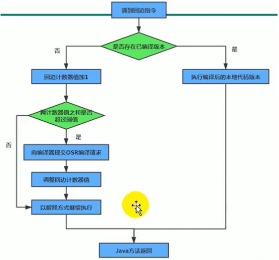

## 执行引擎

执行引擎是 Java 虚拟机核心的组成部分之一，它的任务就是将字节码指令解释/编译为对应平台上的本地机器指令。简单来说，JVM 中的执行引擎充当了将高级语言翻译为机器语言的译者。

### 编译和执行过程

前面橙色部分是编译生成生成字节码文件的过程（javac 指令），和 JVM 无关，后面绿色（解释执行）和蓝色（即时编译）才是 JVM 需要考虑的过程。

#### 解释器和编译器

**Java 是半编译半解释型语言：**JVM 在执行 Java 代码的时候，通常都会将解释执行与编译执行二者结合起来进行。将字节码翻译成本地代码后，就可以做一个缓存操作，存储在方法区的 JIT 代码缓存中。

##### 解释器

解释器（Interpreter）：当 Java 虚拟机启动时会根据预定义的规范对字节码采用逐行解释的方式执行，将每条字节码文件中的内容“翻译”为对应平台的本地机器指令执行。

JVM 设计者们的初衷仅仅只是单纯地为了满足 Java 程序实现跨平台特性，因此避免采用静态编译的方式直接生成本地机器指令，从而诞生了实现解释器在运行时采用逐行解释字节码执行程序的想法。

在 Java 的发展历史里，一共有两套解释执行器，即古老的字节码解释器、现在普遍使用的模板解释器：

- 字节码在执行时通过纯软件代码模拟字节码的执行，效率非常低下。
- 模板解释器将每一条字节码和一个模板函数相关联，模板函数中直接产生这条字节码执行时的机器码，从而很大程度上提高了解释器的性能。

在 HotSpot VM 中，解释器主要由 Interpreter 模块和 Code 模块构成。

- Interpreter 模块：实现了解释器的核心功能。
- Code 模块：用于管理 HotSpot VM 在运行时生成的本地机器指令。

##### JIT 编译器

JIT（Just In Time Compiler）编译器：就是虚拟机将源代码直接编译成和本地机器平台相关的机器语言。

解释器的执行效率比较低下，为了解决这个问题，JVM 平台支持一种叫作即时编译的技术。即时编译的目的是避免函数被解释执行，而是将整个函数体编译成为机器码，每次函数执行时，只执行编译后的机器码即可，这种方式可以使执行效率大幅度提升。

HotSpot VM 采用解释器与即时编译器并存的架构。在 Java 虚拟机运行时，解释器和即时编译器能够相互协作、各自取长补短，尽力去选择最合适的方式来权衡编译本地代码的时间和直接解释执行代码的时间。

当解释器与即时编译器共存，在 Java 虚拟器启动时，解释器可以首先发挥作用，而不必等待即时编译器全部编译完成后再执行，这样可以省去许多不必要的编译时间。随着时间的推移，编译器发挥作用（把代码编译成本地代码，需要一定的执行时间），把越来越多的代码编译成本地代码，获得更高的执行效率。同时，解释执行在编译器进行激进优化不成立的时候，作为编译器的“逃生门”。

-Xint：完全采用解释器模式执行程序；

-Xcomp：完全采用即时编译器模式执行程序。如果即时编译出现问题，解释器会介入执行

-Xmixed：采用解释器+即时编译器的混合模式共同执行程序。

#### 机器码 指令 汇编语言

机器码是由各种用二进制编码方式表示的机器指令。

指令就是把机器码中特定的 0 和 1 序列，简化成对应的指令（一般为英文简写，如 mov，inc 等），可读性稍好。

汇编语言中，用助记符（Mnemonics）代替机器指令的操作码，用地址符号（Symbol）或标号（Label）代替指令或操作数的地址。在不同的硬件平台，汇编语言对应着不同的机器语言指令集，通过汇编过程转换成机器指令。

### 编译器

Java 语言的“编译期”其实是一段“不确定”的操作过程：

1. 因为它可能是指前端编译器把 .java文件转变成 .class文件的过程
2. 也可能是指虚拟机的后端运行期编译器（JIT 编译器，Just In Time Compiler）把字节码转变成机器码的过程。
3. 还可能是指使用静态提前编译器（AOT 编译器，Ahead of Time Compiler）在程序运行之前，直接把 .java 文件编译成本地机器代码的过程。

典型的编译器：

1. 前端编译器：Sun 的 javac、Eclipse JDT 中的增量式编译器（ECJ）。
2. JIT 编译器：HotSpot VM 的C1、C2编译器。
3. AOT 编译器：GNU Compiler for the Java（GCJ）、Excelsior JET。

#### C1 和 C2

在 HotSpot VM 中内嵌有两个 JIT 编译器，分别为 Client Compiler 和 Server Compiler，简称为 C1 编译器和 C2 编译器。

1. -client：指定 Java 虚拟机运行在 Client 模式下，并使用 C1 编译器，C1 编译器会对字节码进行简单和可靠的优化，耗时短，以达到更快的编译速度。
2. -server：指定 Java 虚拟机运行在 Server 模式下，并使用 C2 编译器。C2 编译器进行耗时较长的优化以及激进优化，但优化的代码执行效率更高。（使用C++）

在不同的编译器上有不同的优化策略：

C1编译器上主要有方法内联，去虚拟化、元余消除：

- 方法内联：将引用的函数代码编译到引用点处，这样可以减少栈帧的生成，减少参数传递以及跳转过程
- 去虚拟化：对唯一的实现类进行内联
- 冗余消除：在运行期间把一些不会执行的代码折叠掉

C2 编译器的优化主要是在全局层面，逃逸分析是优化的基础。基于逃逸分析，有如下几种优化：

- 标量替换：用标量值代替聚合对象的属性值
- 栈上分配：对于未逃逸的对象分配对象在栈而不是堆
- 同步消除：清除同步操作，通常指 synchronized

**分层编译（Tiered Compilation）策略：**

1. 程序解释执行（不开启性能监控）可以触发 C1 编译器进行简单优化，也可以加上性能监控，C2 编译器会根据性能监控信息进行激进优化。
2. 不过在 Java7 版本之后，在程序中显式指定命令 -server 时，默认将会开启分层编译策略，由 C1 编译器和 C2 编译器相互协作共同来执行编译任务。

#### Graal 编译器

自 JDK10 起，HotSpot 又加入了一个全新的及时编译器：Graal 编译器，其编译效果短短几年时间就追平了 C2 编译器，未来可期。目前需要使用开关参数去激活才能使用 -XX:+UnlockExperimentalvMOptions -XX:+UseJVMCICompiler。

#### AOT 编译器

JDK9 引入了 AOT 编译器 jaotc，它借助了 Graal 编译器，将所输入的 Java 类文件转换为机器码，并存放至生成的动态共享库之中。最大的好处是不必等待即时编译器的预热，减少 Java 应用给人带来“第一次运行慢” 的不良体验。缺点在于：

1. 破坏了 Java “ 一次编译，到处运行”，必须为每个不同的硬件，OS 编译对应的发行包
2. 降低了 Java 链接过程的动态性，加载的代码在编译期就必须全部已知。

### 热点代码及探测技术

**热点代码**，那些需要被编译为本地代码的字节码。JIT编译器在运行时会针对那些频繁被调用的“热点代码”做出深度优化，将其直接编译为对应平台的本地机器指令，以此提升Java程序的执行性能。需要根据代码被调用执行的频率而定。

**热点探测技术**，目前 HotSpot VM 所采用的热点探测方式是基于计数器的热点探测。HotSpot VM 将会为每一个方法都建立 2 个不同类型的计数器，分别为方法调用计数器（Invocation Counter）和回边计数器（Back Edge Counter）：

- 方法调用计数器用于统计方法的调用次数，默认阀值在 Client 模式下是1500次，在 Server 模式下是10000次。超过这个阈值，就会触发 JIT 编译。可以通过虚拟机参数 -XX:CompileThreshold 来人为设定。

   **热度衰减：**如果不做任何设置，方法调用计数器统计的并不是方法被调用的绝对次数，而是一个相对的执行频率，即一段时间之内方法被调用的次数。当超过一定的时间限度，如果方法的调用次数仍然不足以让它提交给即时编译器编译，那这个方法的调用计数器就会被减少一半，这个过程称为方法调用计数器热度的衰减（Counter Decay），而这段时间就称为此方法统计的半衰周期（Counter Half Life Time）。

  JVM 进行热度衰减的动作是在虚拟机进行垃圾收集时顺便进行的，可以使用虚拟机参数 -XX:-UseCounterDecay 来关闭热度衰减。另外，可以使用 -XX:CounterHalfLifeTime 参数设置半衰周期的时间，单位是秒。

- 回边计数器则用于统计循环体执行的循环次数，在字节码中遇到控制流向后跳转的指令称为“回边”（Back Edge）

