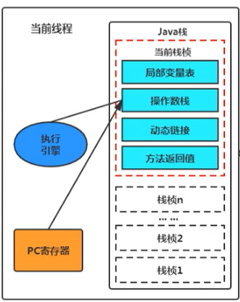

## 程序计数器

JVM 中的 PC 寄存器是对物理 PC 寄存器的一种抽象模拟，它是一块很小的内存空间，几乎可以忽略不记，也是运行速度最快的存储区域。生命周期与线程的生命周期保持一致。程序计数器会存储当前线程正在执行的 Java 方法的 JVM 指令地址，或者，如果是在执行 native 方法，则是未指定值（undefined）。执行引擎将指令解释为机器码交由 CPU 进行处理。**它是唯一一个在 Java 虚拟机规范中没有规定任何 OutOfMemoryError 情况的区域。**

线程是一个个的顺序执行流，CPU 需要不停的切换各个线程，切换回来以后，就得知道从哪开始继续执行。JVM 的字节码解释器就需要通过改变 PC 寄存器的值来明确下一条应该执行的指令。为了能够准确地记录各个线程正在执行的当前字节码指令地址，最好的办法是为每一个线程都分配一个PC 寄存器，这样一来各个线程之间便可以进行独立计算，从而不会出现相互干扰的情况。

