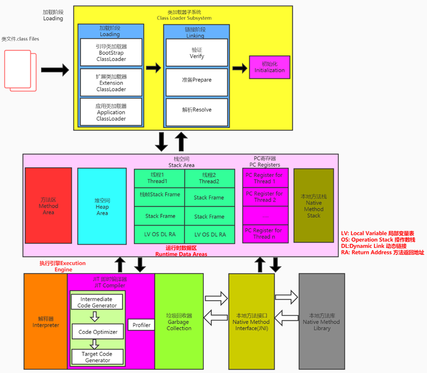

### 类加载子系统

#### 类加载子系统的作用

1. **类加载器子系统负责从文件系统或者网络中加载 class 文件**，class 文件在文件开头有特定的文件标识。
2. ClassLoader 只负责 class 文件的加载，至于它是否可以运行，则由 Execution Engine 决定。
3. 加载的类信息存放于一块称为方法区的内存空间。除了类的信息外，方法区中还会存放运行时常量池信息，可能还包括字符串字面量和数字常量（这部分常量信息是 class 文件中常量池部分的内存映射）。

#### 加载

1. 通过一个类的全限定名获取定义此类的二进制字节流。
2. 将这个字节流所代表的静态存储结构转化为方法区的运行时数据结构。
3. **在内存中生成一个代表这个类的 java.lang.Class 对象**，作为方法区这个类的各种数据的访问入口。

#### 验证

1. **目的在于确保 class 文件的字节流中包含信息符合当前虚拟机要求，保证被加载类的正确性，不会危害虚拟机自身安全。**
2. 主要包括四种验证，文件格式验证，元数据验证，字节码验证，符号引用验证。

#### 准备

1. **为类变量分配内存并且设置该类变量的默认初始值，即零值。**
2. 这里不包含用 final 修饰的静态变量，因为 final 在编译的时候就会分配好了默认值，准备阶段会显式初始化。
3. 这里不会为实例变量初始化，类变量会分配在方法区中，而实例变量是会随着对象一起分配到堆中。

#### 解析

1. **将常量池内的符号引用转换为直接引用的过程。**
2. 事实上，解析操作往往会伴随着 JVM 在执行完初始化之后再执行。
3. 符号引用就是一组符号来描述所引用的目标。符号引用的字面量形式明确定义在《java虚拟机规范》的 class 文件格式中。直接引用就是直接指向目标的指针、相对偏移量或一个间接定位到目标的句柄
4. 解析动作主要针对类或接口、字段、类方法、接口方法、方法类型等。