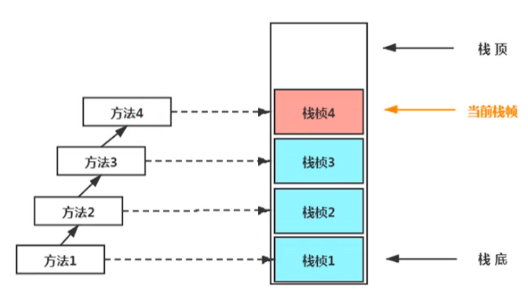
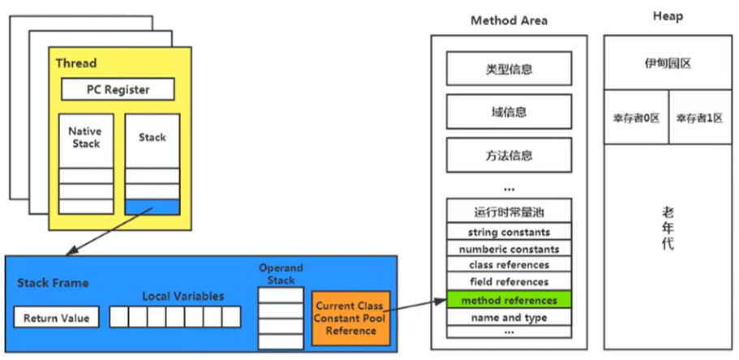

## 虚拟机栈

**栈是运行时的单位，而堆是存储的单位；栈解决程序的运行问题，即程序如何执行，堆解决的是数据存储的问题，即数据怎么放。**

Java 虚拟机栈（Java Virtual Machine Stack），早期也叫 Java 栈。每个线程在创建时都会创建一个虚拟机栈，其内部保存多个栈帧（Stack Frame），对应着一次次的 Java 方法调用。它是一种快速有效的分配存储方式，访问速度仅次于程序计数器。JVM 直接对虚拟机栈的操作只有两个，方法执行伴随着入栈，结束执行后出栈。对于栈来说不存在垃圾回收问题**（存在溢出的情况）**。

栈中可能出现的错误：

1. Java 虚拟机规范允许 Java 栈的大小是动态的或者是固定不变的。
2. 如果采用固定大小的 Java 虚拟机栈，那每一个线程的 Java 虚拟机栈容量可以在线程创建的时候独立选定。如果线程请求分配的栈容量超过 Java 虚拟机栈允许的最大容量，Java 虚拟机将会抛出一个 **StackOverflowError** 错误。
3. 如果 Java 虚拟机栈可以动态扩展，在尝试扩展的时候无法申请到足够的内存，或者在创建新的线程时没有足够的内存去创建对应的虚拟机栈，那 Java 虚拟机将会抛出一个 **OutOfMemoryError** 错误。

可以使用参数 **-Xss** 选项来设置线程的最大栈空间，栈的大小直接决定了函数调用的最大可达深度。

### 栈帧 

**栈帧**是一个内存区块，是一个数据集，保存着方法执行过程中的各种数据信息，栈帧的大小主要由局部变量表和操作数栈决定的：

1. 局部变量表（Local Variables）
2. 操作数栈（Operand Stack）（或表达式栈）
3. 动态链接（Dynamic Linking）（或指向运行时常量池的方法引用）
4. 方法返回地址（Return Address）（或方法正常退出或者异常退出的定义）
5. 一些附加信息

特点：

- 在一条活动线程中，一个时间点上，只会有一个活动的栈帧。即**只有当前正在执行的方法的栈帧（栈顶栈帧）是有效的。**
- 执行引擎运行的所有字节码指令只针对当前栈帧进行操作。
- **不同线程中所包含的栈帧是不允许存在相互引用的**，即不可能在一个栈帧之中引用另外一个线程的栈帧。
- Java 方法有两种返回函数的方式，都会导致栈帧被弹出：一种是**正常的函数返回**，使用 return 指令，另外一种是**抛出异常。**

#### 局部变量表

局部变量表（Local Variables），也被称之为局部变量数组或本地变量表，主要用于存储方法参数和定义在方法体内的局部变量，这些数据类型包括各类基本数据类型、对象引用（reference），以及 returnAddress 类型。

**局部变量表所需的容量大小是在编译期确定下来的**，并保存在方法的 Code 属性的 maximum local variables 数据项中，在方法运行期间不会改变局部变量表的大小。参数值的存放总是从局部变量数组索引  0  的位置开始，到数组长度 -1 的索引结束。最基本的存储单元是 **slot（变量槽）**：

1. 32 位以内的类型只占用一个 slot（包括 returnAddress 类型），64 位的类型占用两个 slot（long 和 double）。
2. byte、short、char 在存储前被转换为 int，boolean 也被转换为 int，0 表示 false，非 0 表示 true。
3. 当一个实例方法被调用的时候，它的方法参数和方法体内部定义的局部变量将会按照顺序被复制到局部变量表中的每一个 slot 上。
4. 如果当前帧是由**构造方法或者实例方法**创建的，那么该对象引用 this 将会存放在 index 为 0 的 slot 处，其余的参数按照参数表顺序继续排列。
5. slot 是可以重用的，如果一个局部变量过了其作用域，那么在其作用域之后申明新的局部变量就很有可能会复用过期局部变量的槽位，从而达到节省资源的目的。

**局部变量表中的变量是重要的垃圾回收节点，只要被局部变量表中直接或者间接引用的对象都不会被回收。**

#### 操作数栈

操作数栈（Operand Stack），每一个独立的栈帧除了包含局部变量表以外，还包含一个操作数栈，也可以称之为表达式栈。在方法执行过程中，根据字节码指令，往栈中写入数据或提取数据。**我们说 Java 虚拟机的解释引擎是基于栈的执行引擎，其中的栈指的就是操作数栈**。

每一个操作数栈都会拥有一个明确的栈深度用于存储数值，其所需的**最大深度在编译期就定义好了**，保存在方法的 Code 属性中的 maxstack 数据项中。主要用于保存计算过程的中间结果，同时作为计算过程中变量临时的存储空间。32 位以内的类型占用一个栈单位深度，64 位的类型占用两个栈单位深度。

如果被调用的方法带有返回值的话，其**返回值将会被压入当前栈帧的操作数栈中**，并更新程序计数器中下一条需要执行的字节码指令。

操作数栈中元素的数据类型必须与字节码指令的序列严格匹配，这由编译器在编译器期间进行验证，同时在类加载过程中的类检验阶段的数据流分析阶段要再次验证。

#### 栈顶缓存技术

栈顶缓存技术（Top Of Stack Cashing），基于栈式架构的虚拟机所使用的零地址指令更加紧凑，但完成一项操作的时候必然需要使用更多的入栈和出栈指令，这同时也就意味着将需要更多的指令分派（instruction dispatch）次数和内存读 / 写次数。由于操作数是存储在内存中的，因此频繁地执行内存读/写操作必然会影响执行速度。为了解决这个问题，HotSpot JVM 的设计者们提出了栈顶缓存（Tos，Top-of-Stack Cashing）技术，将栈顶元素全部缓存在物理 CPU 的寄存器中，以此降低对内存的读 / 写次数，提升执行引擎的执行效率。

#### 动态链接

动态链接（Dynamic Linking），指向运行时常量池的方法引用。在 Java 源文件被编译到字节码文件中时，所有的变量和方法引用都作为符号引用（Symbolic Reference）保存在class文件的常量池里。每一个栈帧内部都包含一个指向运行时常量池中该栈帧所属方法的引用，目的就是为了支持当前方法的代码能够实现动态链接（比如：invokedynamic 指令），动态链接的作用就是为了将这些符号引用转换为调用方法的直接引用。

为什么要用常量池：

1. 常量池的作用就是为了提供一些符号和常量，便于指令的识别。
2. 在不同的方法，都可能调用常量或者方法，所以只需要存储一份，记录其引用即可，节省了空间。

#### 解析与分派

静态链接：当一个字节码文件被装载进 JVM 内部时，**如果被调用的目标方法在编译期确定，且运行期保持不变时**，这种情况下将调用方法的符号引用转换为直接引用的过程称之为静态链接。

动态链接：**如果被调用的方法在编译期无法被确定下来**，也就是说，**只能够在程序运行期将调用的方法的符号转换为直接引用**，由于这种引用转换过程具备**动态性**，因此也被称之为动态链接。

静态链接和动态链接对应的方法的绑定机制为：早期绑定（Early Binding）和晚期绑定（Late Binding）。**绑定是一个字段、方法或者类在符号引用被替换为直接引用的过程**，这仅仅发生一次：

1. 早期绑定：早期绑定就是指被调用的目标方法如果在编译期可知，且运行期保持不变时，即可将这个方法与所属的类型进行绑定。

2. 晚期绑定：如果被调用的方法在编译期无法被确定下来，**只能够在程序运行期根据实际的类型绑定相关的方法**，这种绑定方式也就被称之为晚期绑定。

#### 虚方法与非虚方法

Java 中任何一个普通的方法其实都具备虚函数的特征，它们相当于 C++ 语言中的虚函数（C++ 中则需要使用关键字 virtual 来显式定义）。如果在 Java 程序中不希望某个方法拥有虚函数的特征时，则可以使用关键字 final 来标记这个方法。

虚方法与非虚方法的区别：

1. 如果方法在编译期就确定了具体的调用版本，并且这个版本在运行时是不可变的，这样的方法称为非虚方法。
2. 静态方法、私有方法、final 方法、实例构造器、父类方法都是非虚方法。
3. 其他方法称为虚方法。

#### 虚拟机中调用方法的指令

1. invokestatic：调用静态方法，解析阶段确定唯一方法版本。
2. invokespecial：调用 `<init>` 方法、私有及父类方法，解析阶段确定唯一方法版本。
3. invokevirtual：调用所有虚方法。
4. invokeinterface：调用接口方法。
5. invokedynamic：动态解析出需要调用的方法，然后执行。

区别：

1. 前四条指令固化在虚拟机内部，方法的调用执行不可人为干预。
2. 而 invokedynamic 指令则支持由用户确定方法版本。
3. 其中 invokestatic 指令和 invokespecial 指令调用的方法称为非虚方法，其余的（final 修饰的除外）称为虚方法。

关于 invokedynamic 指令：

1. JVM 字节码指令集一直比较稳定，一直到 Java 7 中才增加了一个 invokedynamic 指令，这是 Java 为了实现【动态类型语言】支持而做的一种改进。
2. 但是在 Java 7 中并没有提供直接生成 invokedynamic 指令的方法，需要借助 ASM 这种底层字节码工具来产生 invokedynamic 指令。直到 Java 8 的 Lambda表达式的出现，才有了直接的生成 invokedynamic 指令的方式。
3. Java 7 中增加的动态语言类型支持的本质是对 Java 虚拟机规范的修改，而不是对 Java 语言规则的修改，这一块相对来讲比较复杂。增加了虚拟机中的方法调用，最直接的受益者就是运行在 Java 平台的动态语言的编译器。

#### 动态语言和静态语言

动态类型语言和静态类型语言两者的区别就在于**对类型的检查是在编译期还是在运行期**。静态类型语言是判断变量自身的类型信息；动态类型语言是判断变量值的类型信息，变量没有类型信息，这是动态语言的一个重要特征。

#### 方法重写的本质

1. 找到操作数栈顶的第一个元素所执行的对象的**实际类型**，记作 C。
2. 如果在类型 C 中找到与常量中的描述符和简单名称都相符的方法，则进行访问权限校验
   - 如果通过则返回这个方法的直接引用，查找过程结束
   - 如果不通过，则返回 java.lang.IllegalAccessError 异常
3. 否则，**按照继承关系从下往上依次对 C 的各个父类进行第 2 步的搜索和验证过程**。
4. 如果始终没有找到合适的方法，则抛出 java.lang.AbstractMethodError 异常。

IllegalAccessError：程序试图访问或修改一个属性或调用一个方法，没有权限访问时抛出。一般的，这个会引起编译器异常。这个错误如果发生在运行时，就说明一个类发生了不兼容的改变，例如，你把应该有的 Jar 包从工程中拿走了，或者 Maven 中存在 Jar 包冲突。

#### 虚方法表

在面向对象的编程中，会很频繁的使用到**动态分派**，如果在每次动态分派的过程中都要重新在类的方法元数据中搜索合适的目标的话就可能**影响到执行效率**。因此，为了提高性能，**JVM 采用在类的方法区建立一个虚方法表**（virtual method table）来实现，非虚方法不会出现在表中，使用索引表来代替查找。每个类中都有一个虚方法表，表中存放着各个方法的实际入口。**虚方法表会在类加载的链接阶段被创建并开始初始化**，类的变量初始值准备完成之后，JVM 会把该类的虚方法表也初始化完毕。

### 方法返回地址

方法返回地址（return address），存放调用该方法的 pc 寄存器的值。一个方法的结束有两种方式：正常结束和出现未处理的异常，非正常退出。无论通过哪种方式退出，在方法退出后都返回到该方法被调用的位置。方法正常退出时，**调用者的pc计数器的值作为返回地址**，即调用该方法的指令的下一条指令的地址。而通过异常退出的，**返回地址要通过异常表来确定**，栈帧中一般不会保存这部分信息，通过异常完成出口退出的不会给他的上层调用者产生任何的返回值。

#### 正常退出

执行引擎遇到任意一个方法返回的字节码指令（return），会有返回值传递给上层的方法调用者，简称正常完成出口。一个方法在正常调用完成之后，究竟需要使用哪一个返回指令，还需要根据方法返回值的实际数据类型而定。在字节码指令中，返回指令包含：

1. ireturn：当返回值是 boolean，byte，char，short 和 int 类型时使用
2. lreturn：long 类型
3. freturn：float 类型
4. dreturn：double 类型
5. areturn：引用类型
6. return：返回值类型为 void 的方法、实例初始化方法、类和接口的初始化方法

#### 异常退出

在方法执行过程中遇到异常（Exception），并且这个异常没有在方法内进行处理，也就是只要在本方法的异常表中没有搜索到匹配的异常处理器，就会导致方法退出，简称异常完成出口。

方法执行过程中，抛出异常时的异常处理都存储在一个异常处理表中，方便在发生异常的时候找到处理异常的代码。

### 附加信息

栈帧中还允许携带与Java虚拟机实现相关的一些附加信息。例如：对程序调试提供支持的信息。
