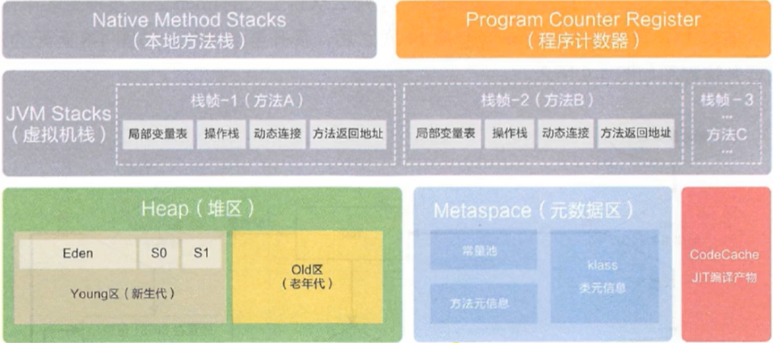

## 运行时数据区

线程独有：程序计数器、栈、本地方法栈，共享：堆、堆外内存（元空间、代码缓存）。

JVM 系统线程：

1. 这些后台线程不包括调用 public static void main(String []) 的 main 线程以及所有这个 main 线程自己创建的线程。
2. **虚拟机线程**：这种线程的操作是需要 JVM 达到安全点才会出现，这样堆才不会变化。这种线程的执行类型括 "stop-the-world" 的垃圾收集、线程栈收集、线程挂起以及偏向锁撤销。
3. **周期任务线程**：这种线程是时间周期事件的体现（比如中断），他们一般用于周期性操作的调度执行。
4. **GC 线程**：这种线程对在 JVM 里不同种类的垃圾收集行为提供了支持。
5. **编译线程**：这种线程在运行时会将字节码编译成到本地代码。
6. **信号调度线程**：这种线程接收信号并发送给 JVM，在它内部通过调用适当的方法进行处理。

| 运行时数据区 | 是否存在 Error | 是否存在 GC |
| ------------ | -------------- | ----------- |
| 程序计数器   | 否             | 否          |
| 虚拟机栈     | 是（SOF）      | 否          |
| 本地方法栈   | 是             | 否          |
| 方法区       | 是（OOM）      | 是          |
| 堆           | 是（OOM）      | 是          |
