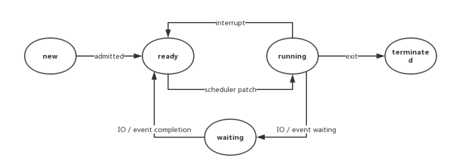
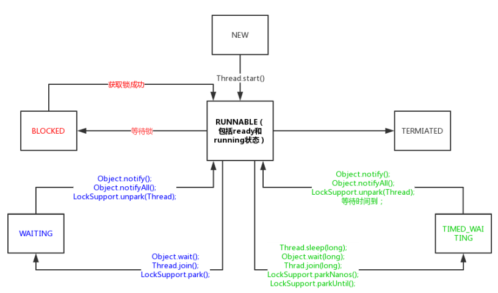

## 线程的状态

### 操作系统中的线程状态

在现在的操作系统中，线程被视为轻量级进程，所以线程的状态其实和进程的状态是⼀致的。操作系统线程主要有以下三个状态： 

- 就绪状态（ready）：线程正在等待使用 CPU，经调度程序调用之后可进入 running 状态。
- 执行状态（running）：线程正在使用 CPU。
- 等待状态（waiting）：线程等待某些事件的完成或者正在等待其他资源（如 I/O）。

### Java 线程的状态

~~~java
// Thread.State
public enum State {
    NEW,
    RUNNABLE,
    BLOCKED,
    WAITING,
    TIMED_WAITING,
    TERMINATED;
}
~~~

- NEW：线程此时尚未启动，指的是还没调用 Thread 实例的 `start()` 方法。

- RUNNABLE：运行状态，处于该状态的线程也有可能在等待其他系统资源（比如 I/O）。

- BLOCKED：阻塞状态，处于该状态的线程正等待锁的释放以进⼊同步区。

- WAITING：等待状态，处于该状态的线程变成 RUNNABLE 状态需要其他线程唤醒。调用如下 3 个方法会使线程进⼊等待状态
  - `Object.wait()`：使当前线程处于等待状态直到另⼀个线程唤醒它，调用该方法前线程必须持有对象的锁。线程调用 `wait()` 方法时**会释放当前的锁**。需要注意的是，其他线程调用 `notify()` 方法不⼀定会唤醒到之前调用 `wait()` 方法的线程。**`wait()` 必须放在同步块或同步方法中**；
  - `Thread.join()`：等待线程执行完毕，底层调用的是 Object 实例的 `wait()` 方法；
  - `LockSupport.park()`：除非获得调用许可，否则禁用当前线程进行线程调度。

- TIMED_WAITING：超时等待状态，线程等待⼀个具体的时间，时间到后会被⾃动唤醒。调用如下方法会使线程进⼊超时等待状态：
  - `Thread.sleep(long millis)`：使当前线程睡眠指定时间，**调用该方法不会释放锁**；
  - `Object.wait(long timeout)`：线程休眠指定时间，等待期间可以通过 `notify()` / `notifyAll()` 唤醒；
  - `Thread.join(long millis)`：等待当前线程最多执行 millis 毫秒，如果 millis 为 0，则会⼀直执行；
  - `LockSupport.parkNanos(long nanos)`： 除非获得调用许可，否则禁用当前线程进行线程调度指定时间；
  - `LockSupport.parkUntil(long deadline)`：同上，也是禁止线程进行调度指定时间。
- TERMINATED：终止状态，此时线程已执行完毕。

~~~java
public static void blockedTest() {
    Thread a = new Thread(new Runnable() {
        @Override
        public void run() {
            testMethod();
        }
    }, "a");
    Thread b = new Thread(new Runnable() {
        @Override
        public void run() {
            testMethod();
        }
    }, "b");
    a.start();
    b.start();
    System.out.println(a.getName() + ":" + a.getState());
    System.out.println(b.getName() + ":" + b.getState());
}

private static synchronized void testMethod() {
    try {
        Thread.sleep(2000L);
    } catch (InterruptedException e) {
        e.printStackTrace();
    }
}
~~~

上述代码不一定会输出 a:TIMED_WAITING b:BLOCKED，原因是在方法 `blockedTest()` 内还有⼀个 main 线程，并且启动线程后执行 `run()` 方法还是需要消耗⼀定时间的，main 线程有可能在两个线程开始竞争锁之前就打印出两个线程的状态。

### 线程中断

- `Thread.interrupt()`：中断线程。并不会立即停止线程，而是设置线程的中断状态为 true；
- `Thread.interrupted()`：测试当前线程是否被中断。线程的中断状态受该方法的影响，调用⼀次使线程中断状态设置为 true，连续调用两次会使得这个线程的中断状态重新转为 false；
- `Thread.isInterrupted()`：测试当前线程是否被中断。与上面方法不同的是调用这个方法并不会影响线程的中断状态。

在线程中断机制里，当其他线程通知需要被中断的线程后，线程中断的状态被设置为 true，但被要求中断的线程具体要怎么处理，完全由被中断线程自己决定，可以在合适的时候处理中断请求，也可以完全不处理继续执行下去。

