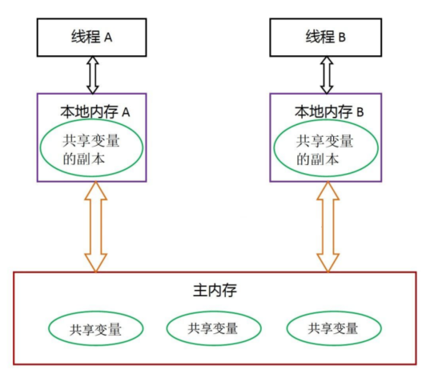

## Java 并发模型

### 常见的并发模型

|                  |                           如何通信                           |                           如何同步                           |
| :--------------: | :----------------------------------------------------------: | :----------------------------------------------------------: |
| 消息传递并发模型 | 线程之间没有公共状态，线程间的通信必须通过发送消息来显示进行 | 发送消息天然同步，因为发送消息总是在接收消息之前，因此同步是隐式的 |
| 共享内存并发模型 | 线程之间共享程序的公共状态，通过写 - 读内存中的公共状态进行隐式通信 |   必须显示指定某段代码需要在线程之间互斥执行，同步是显示的   |

在 Java 中，使用的是共享内存并发模型。

### Java 内存模型

根据 JMM 的规定，线程对共享变量的所有操作都必须在自己的本地内存中进行，不能直接从主内存中读取。JMM 通过控制主内存与每个线程的本地内存之间的交互，来保证内存可见性。

### 内存可见性

内存可见性，指的是线程之间的可见性。当⼀个线程修改了共享变量时，另⼀个线程可以读取到这个修改后的值。