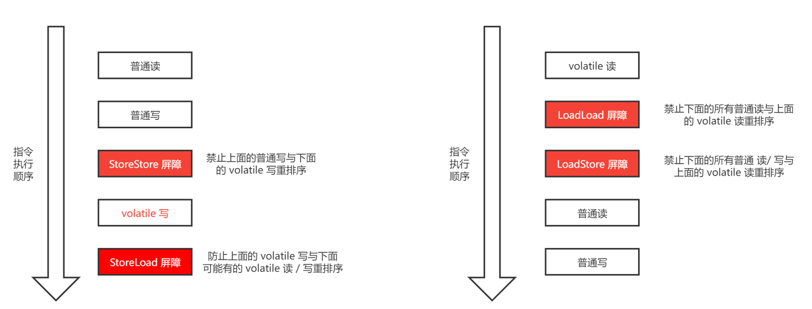

## volatile

在 Java 中，volatile 关键字主要有以下两个功能：

1. 保证变量的内存可见性。
2. 禁止 volatile 变量与普通变量重排序。

### 内存可见性

当一个线程对 volatile 变量进行写操作时，JMM 会立即把该线程本地内存中该变量的值刷新到主内存；当⼀个线程对 volatile 变量进行读操作时，**JMM 会立即把该线程本地内存置为无效**，从主内存中读取共享变量的值。

### 禁止重排序

JSR-133 之前允许 volatile 变量与普通变量重排序，volatile 的写 - 读就不能与锁的释放 - 获取具有相同的内存语义。为了提供⼀种比锁更轻量级的线程间的通信机制，JVM 使用内存屏障限制了这种重排序。

内存屏障有两个作用：

1. 阻止屏障两侧的指令重排序。
2. 强制把写缓冲区 / 高速缓存中的脏数据等写回主内存，或者让缓存中相应的数据失效。

为了保证正确的 volatile 内存语义，编译器选择了一个比较保守的 JMM 内存屏障插入策略：

- 在每个 volatile 写操作前插入⼀个 StoreStore 屏障；
- 在每个 volatile 写操作后插入⼀个 StoreLoad 屏障；
- 在每个 volatile 读操作后插入⼀个 LoadLoad 屏障；
- 在每个 volatile 读操作后再插入⼀个 LoadStore 屏障。

volatile 与普通变量的重排序规则：

1. 如果第⼀个操作是 volatile 读，那无论第⼆个操作是什么，都不能重排序；
2. 如果第⼆个操作是 volatile 写，那无论第⼀个操作是什么，都不能重排序；
3. 如果第⼀个操作是 volatile 写，第⼆个操作是 volatile 读，那么不能重排序。

### 用途

在保证内存可见性上，volatile 有着与锁相同的内存语义。在原子性上，volatile 仅仅保证对单个 volatile 变量的读 / 写具有子性，而锁可以保证整个临界区代码的执行具有原子性。所以在功能上，锁比 volatile 更强大；在性能上，volatile 更有优势。