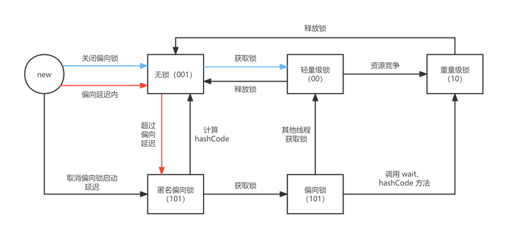
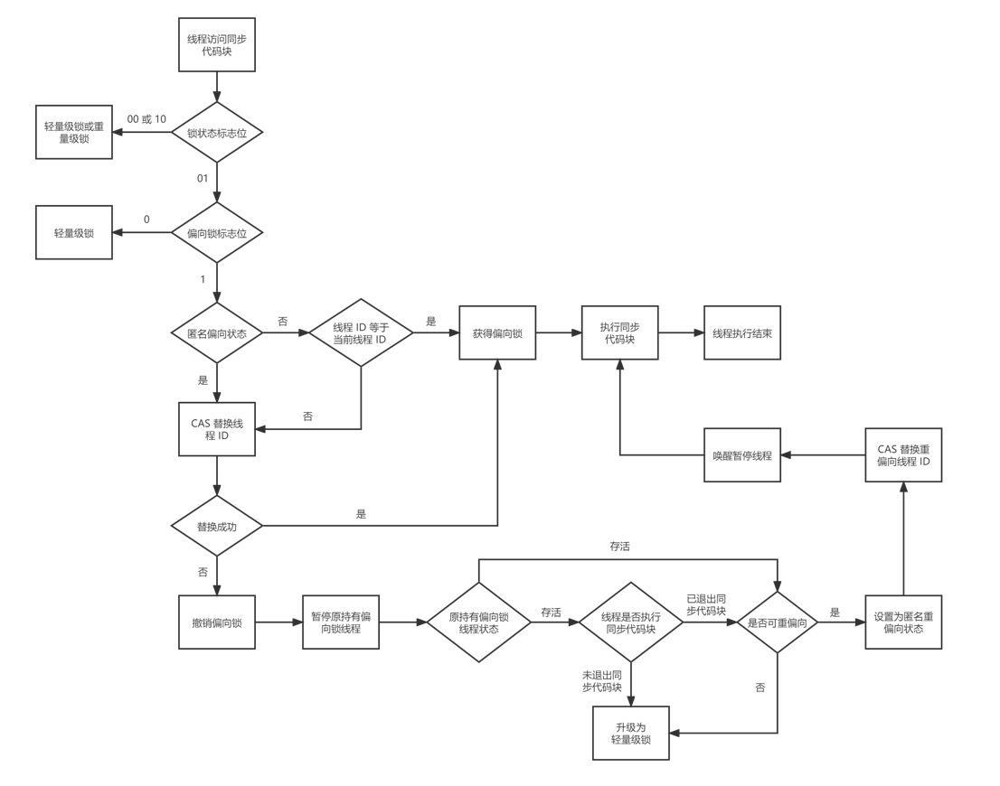
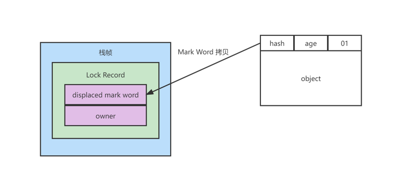
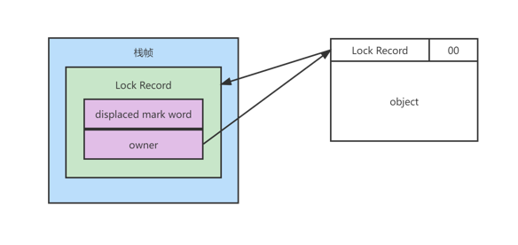
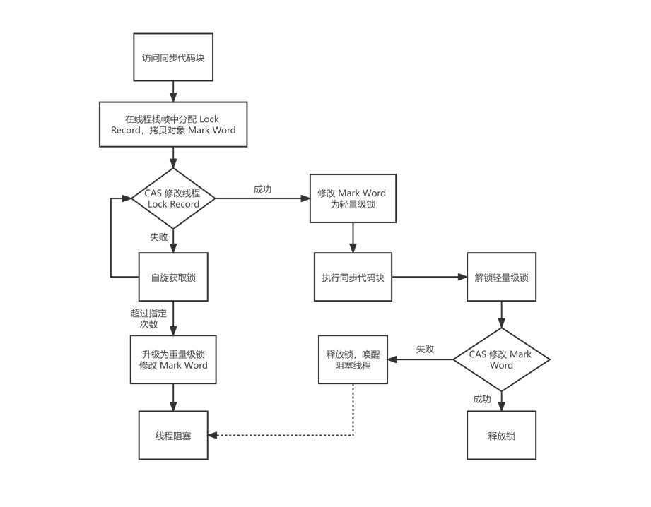
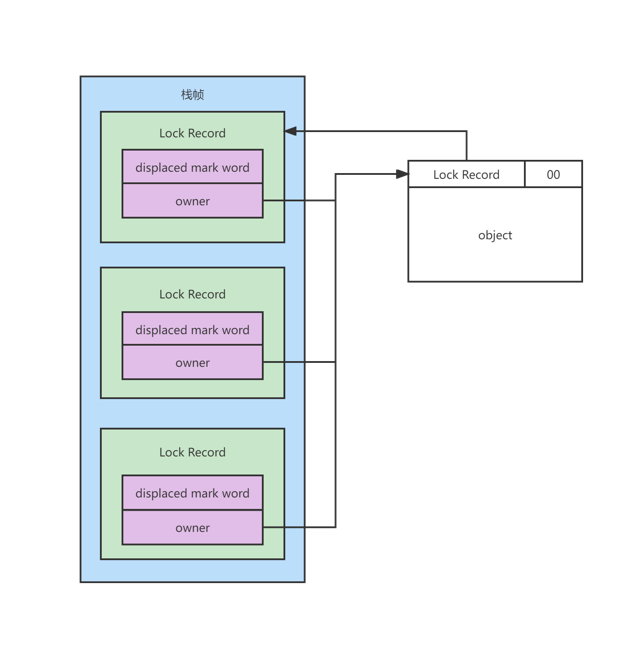
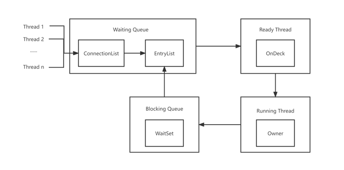

## synchronized

### 原理

对于 synchronized 关键字而言，在 javac 编译时，会生成 monitorenter 和 monitorexit 指令，分别对应 synchronized 同步块的进入和退出。同时 javac 为同步代码块添加了一个隐式的 try - finally，在 finally 中会调用 monitorexit 命令释放锁，保证抛异常的情况下也能释放锁。

而对于 synchronized 方法而言，javac 为其生成了一个 ACC_SYNCHRONIZED 关键字。在 JVM 进行方法调用，发现调用的方法被ACC_SYNCHRONIZED 修饰时，会先尝试获得锁。

### 锁的几种形式

传统的锁（也就是重量级锁）依赖于系统的同步函数，在 linux 上使用 mutex 互斥锁，最底层实现依赖于 futex，这些同步函数都涉及到用户态和内核态的切换以及进程的上下文切换，成本较高。JDK6 引入了两种新型锁机制：偏向锁和轻量级锁，它们的引入是为了解决在没有或基本没有多线程竞争的场景下使用传统锁机制带来的性能开销问题。JDK15 中已经默认禁用了偏向锁，并弃用所有相关的命令行选项。

#### 对象头

对象头是实现多种锁机制的基础，主要包含两部分，运行时元数据（Mark Word）和类型指针，如果对象是数组，还需要记录数组的长度。

|  锁状态  |       29 bit 或 61 bit       |    1 bit 是否是偏向锁？    | 2 bit 锁标志位 |
| :------: | :--------------------------: | :------------------------: | :------------: |
|   无锁   |                              |             0              |       01       |
|  偏向锁  |           线程 ID            |             1              |       01       |
| 轻量级锁 |     指向栈中锁记录的指针     | 此时这⼀位不用于标识偏向锁 |       00       |
| 重量级锁 | 指向互斥量（重量级锁）的指针 | 此时这⼀位不用于标识偏向锁 |       10       |
| GC 标记  |                              | 此时这⼀位不用于标识偏向锁 |       11       |

当对象状态为偏向锁（biasable）时，Mark Word 存储的是偏向的线程 ID；当状态为轻量级锁（lightweight locked）时，Mark Word 存储的是指向线程栈中 Lock Record 的指针；当状态为重量级锁（inflated）时，Mark Word 存储的是指向堆中的 monitor 对象的指针。

JVM 会有 4 秒的偏向锁开启的延迟时间，在这个延迟内对象处于为**无锁不可偏向状态**。如果关闭偏向锁启动延迟、或是经过 4 秒且没有线程竞争对象的锁，那么对象会进入无锁可偏向状态，也就是**匿名偏向状态**。此外，如果在 JVM 的参数中关闭偏向锁，那么直到有线程获取这个锁对象之前，也会一直处于**无锁不可偏向状态**。

- JVM 内部有很多地方也用到了 synchronized，如果明确在这些地方存在线程的竞争，还需要从偏向状态再逐步升级的话，会带来额外的性能损耗，所以 JVM 设置了一个偏向锁的启动延迟，来降低性能损耗。也就是说，在无锁不可偏向状态下，如果有线程试图获取锁，那么将跳过升级偏向锁的过程，直接使用轻量级锁。

- 在匿名偏向状态下，如果调用系统的 `hashCode()` 方法，会使对象回到无锁状态，并在 Mark Word 中写入 hashCode。在这个状态下，如果有线程尝试获取锁，会直接从无锁升级到轻量级锁，不会再升级为偏向锁。
- 在调用了对象的 `wait()` 方法后，直接从偏向锁升级成重量级锁。因为 `wait()` 方法调用过程中依赖于重量级锁中与对象关联的 monitor，在调用 `wait()` 方法后 monitor 会把线程变为 WAITING 状态，所以才会强制升级为重量级锁。

### 偏向锁

大多数情况下锁不仅不存在多线程竞争，而且总是由同⼀线程多次获得，由此 JDK6 引入了偏向锁。偏向锁在资源无竞争的情况下消除了同步语句，无需 CAS 操作，提高了程序的运行性能。

#### 加锁

匿名偏向状态是偏向锁的初始状态，在这个状态下第一个试图获取该对象的锁的线程，会使用 CAS 操作（汇编命令 `CMPXCHG`）尝试将自己的线程 ID 写入对象头的 Mark Word 中，使匿名偏向状态升级为**已偏向**（Biased）的偏向锁状态。

之后有线程再次尝试获取锁时，会检查 Mark Word 中存储的线程 ID 是否与自己相同。如果相同，则表示当前线程已经获得了对象的锁，不需要再使用 CAS 操作来进行加锁。如果不同，将执行 CAS 操作，试图替换 Mark Word 中的线程 ID。只有当对象处于下面两种状态中时，才可以执行成功：

- 匿名偏向状态
- **可重偏向**（Rebiasable）状态

如果对象不处于上面两个状态，说明锁存在线程竞争，在 CAS 替换失败后会执行**偏向锁撤销**操作。

#### 撤销

偏向锁的撤销需要等待到达全局安全点，在暂停所有线程后，会通过遍历当前 JVM 的所有线程的方式，检查持有偏向锁的线程是否存活：

- 如果线程存活，且线程正在执行同步代码块中的代码，则升级为轻量级锁。
- 如果线程未存活，或者未在执行同步代码块中的代码，则进行校验是否允许重偏向：
  - 允许重偏向，则设置为匿名偏向锁状态，CAS 将偏向锁重新指向新线程。
  - 不允许重偏向，则将 Mark Word 升级为轻量级锁，进行 CAS 竞争锁。

完成上面的操作后，唤醒被暂停的线程，从安全点继续执行代码。

#### 批量重偏向与批量撤销

在未禁用偏向锁的情况下，当一个线程建立了大量对象，并对它们执行完同步操作后，所有对象处于偏向锁状态，此时若再有另一个线程尝试获取这些对象的锁，就会导偏向锁的**批量重偏向**（Bulk Rebias）。当触发批量重偏向后，第一个线程结束同步操作后的锁对象当再被同步访问时会被重置为**可重偏向**状态，以便允许快速重偏向，能够减少撤销偏向锁再升级为轻量级锁的性能消耗。

批量重偏为每个 class 维护一个偏向锁的撤销计数器，每当该 class 的对象发生偏向锁的撤销时，计数器加一。当这个值达到默认阈值 20 时，JVM 就会认为这个锁对象不再适合原线程，因此进行批量重偏向。而距离上次批量重偏向的 25 秒内，如果撤销计数达到 40，就会发生**批量撤销**。如果超过 25 秒，那么就会重置在 [20, 40) 内的计数。

~~~java
private static Thread t1, t2;

    public static void main(String[] args) throws InterruptedException {
        TimeUnit.SECONDS.sleep(5);
        List<Object> list = new ArrayList<>();
        for (int i = 0; i < 40; i++) {
            list.add(new Object());
        }

        t1 = new Thread(() -> {
            for (int i = 0; i < list.size(); i++) {
                synchronized (list.get(i)) {
                }
            }
            LockSupport.unpark(t2);
        });
        t2 = new Thread(() -> {
            LockSupport.park();
            for (int i = 0; i < 30; i++) {
                Object o = list.get(i);
                synchronized (o) {
                    if (i == 18 || i == 19) {
                        System.out.println("THREAD-2 Object" + (i + 1) + ":" + ClassLayout.parseInstance(o).toPrintable());
                    }
                }
            }
        });
        t1.start();
        t2.start();
        t2.join();

        TimeUnit.SECONDS.sleep(3);
        System.out.println("Object19:" + ClassLayout.parseInstance(list.get(18)).toPrintable());
        System.out.println("Object20:" + ClassLayout.parseInstance(list.get(19)).toPrintable());
        System.out.println("Object30:" + ClassLayout.parseInstance(list.get(29)).toPrintable());
        System.out.println("Object31:" + ClassLayout.parseInstance(list.get(30)).toPrintable());
    }
~~~

当线程 t1 运行结束后，数组中所有对象的锁都偏向 t1，然后 t1 唤醒被挂起的线程 t2，线程 t2 在访问前 19 个对象时，对象的偏向锁会升级到轻量级锁，在访问后 11 个对象时，会触发批量重偏向，将锁的状态变为偏向线程 t2。

线程 t2 结束后，第 1 - 19 的对象释放轻量级锁变为无锁不可偏向状态，第 20 - 30 的对象状态为偏向 t2 的偏向锁，第 31 - 40 的对象因为没有被线程 t2 访问所以保持偏向线程 t1 不变。

~~~java
private static Thread t1, t2, t3;

    public static void main(String[] args) throws InterruptedException {
        TimeUnit.SECONDS.sleep(5);

        List<Object> list = new ArrayList<>();
        for (int i = 0; i < 40; i++) {
            list.add(new Object());
        }

        t1 = new Thread(() -> {
            for (int i = 0; i < list.size(); i++) {
                synchronized (list.get(i)) {
                }
            }
            LockSupport.unpark(t2);
        });
        t2 = new Thread(() -> {
            LockSupport.park();
            for (int i = 0; i < list.size(); i++) {
                Object o = list.get(i);
                synchronized (o) {
                    if (i == 18 || i == 19) {
                        System.out.println("THREAD-2 Object" + (i + 1) + ":" + ClassLayout.parseInstance(o).toPrintable());
                    }
                }
            }
            LockSupport.unpark(t3);
        });
        t3 = new Thread(() -> {
            LockSupport.park();
            for (int i = 0; i < list.size(); i++) {
                Object o = list.get(i);
                synchronized (o) {
                    System.out.println("THREAD-3 Object" + (i + 1) + ":" + ClassLayout.parseInstance(o).toPrintable());
                }
            }
        });

        t1.start();
        t2.start();
        t3.start();
        t3.join();
        System.out.println("New: " + ClassLayout.parseInstance(new Object()).toPrintable());
    }
~~~

- 线程 t1 中，第 1 - 40 的对象锁状态变为偏向锁。
- 线程 t2 中，第 1 - 19 的对象撤销偏向锁升级为轻量级锁，然后对第 20 - 40 的对象进行批量重偏向。
- 线程 t3 中，首先直接对第 1 - 19 个对象竞争轻量级锁，而从第 20 个对象开始往后的对象不会再次进行批量重偏向，因此第 20 - 39 的对象进行偏向锁撤销升级为轻量级锁。这时 t2 和 t3 线程一共执行了 40 次的锁撤销，触发锁的批量撤销机制，对偏向锁进行撤销升级为轻量级锁。
- 线程都结束后创建的新对象为无锁不可偏向状态，说明当类触发了批量撤销机制后，JVM 会禁用该类创建对象时的可偏向性，该类新创建的对象全部为无锁不可偏向状态。

#### 总结

偏向锁通过消除资源无竞争情况下的同步原语，提高了程序在**单线程**下访问同步资源的运行性能。但是当出现多个线程竞争时，就会撤销偏向锁升级为轻量级锁。如果系统中的同步资源一直是被多线程访问，那么应该禁用偏向锁来减少性能上的损耗。

### 轻量级锁

多个线程在不同时段获取同⼀把锁，即不存在锁竞争的情况，也就没有线程阻塞。 针对这种情况，JVM 采用轻量级锁来避免线程的阻塞与唤醒。

#### 加锁

1. 在代码访问同步资源时，如果对象处于无锁不可偏向状态，JVM 首先将在当前线程的栈帧中创建一条锁记录（Lock Record），用于存放：
   - displaced mark word（置换标记字）：存放锁对象当前的 Mark Word 的拷贝。
   - owner 指针：指向当前的锁对象的指针，在拷贝阶段暂时不会处理它。

2. 在拷贝 Mark Word 完成后，首先会挂起线程，JVM 使用 CAS 操作尝试将对象的 Mark Word 中的 Lock Record 指针指向栈帧中的锁记录，并将栈帧中锁记录中的 owner 指针指向锁对象的 Mark Word

   - 如果替换成功，表示竞争锁成功，将锁标志位设置成 00，表示对象处于轻量级锁状态，执行同步代码中的操作。

   - 如果替换失败，则判断对象的 Mark Word 是否指向当前线程的栈帧：

   - - 如果是，则表示当前线程已经持有对象的锁，执行的是 synchronized 的锁重入过程，可以直接执行同步代码块。
     - 如果不是，说明其他线程已经持有了该对象的锁。如果在自旋一定次数后仍未获得锁，那么轻量级锁需要升级为重量级锁，将锁标志位变成 10，后面等待的线程将会进入阻塞状态。

#### 解锁

使用 CAS 操作尝试将 displaced mark word 替换回 Mark Word（复制回去），这时需要检查锁对象的 Mark Word 中 Lock Record 指针是否指向当前线程的锁记录：

- 如果替换成功，则表示没有竞争发生，整个同步过程就完成了。
- 如果替换失败，则表示当前锁资源存在竞争，有可能其他线程在这段时间里尝试过获取锁但是失败，导致自身被挂起，并修改了锁对象的 Mark Word 升级为重量级锁，最后在执行重量级锁的解锁流程后唤醒被挂起的线程。

#### 锁重入

轻量级锁的每次重入，都会在栈中生成一个 Lock Record，但是保存的数据不同：

- 首次分配的 Lock Record，displaced mark word 复制了锁对象的 Mark Word，owner 指针指向锁对象。
- 之后重入时在栈中分配的 Lock Record 中的 displaced mark word 为 null，只存储了指向对象的 owner 指针。

重入的次数等于该锁对象在栈帧中 Lock Record 的数量，这个数量隐式地充当了锁重入机制的计数器。在释放锁的过程中，如果是重入则删除栈中的 Lock Record，没有重入时则使用 CAS 替换锁对象的 Mark Word。

#### 锁升级

在 JDK6 以前，默认轻量级锁自旋次数是 10 次，如果超过这个次数或自旋线程数超过 CPU 核数的一半，就会升级为重量级锁。JDK6 以后加入了**自适应自旋锁** （Adapative Self Spinning），由前一次在同一个锁上的自旋时间及锁的拥有者的状态来决定：线程如果自旋成功 了，则下次自旋的次数会更多；如果自旋失败了，则自旋的次数就会减少。

如果自旋到⼀定程度，依然没有获取到锁，则自旋失败，那么这个线程会阻塞，同时这个锁会升级成重量级锁。

#### 总结

轻量级锁与偏向锁功能类似，不同的是轻量级锁是通过 CAS 来避免开销较大的互斥操作，而偏向锁是在无资源竞争的情况下完全消除同步。当多个线程交替执行同步块时，JVM 使用轻量级锁来保证同步，不会造成用户态与内核态的切换。但如果过度自旋，会引起 CPU 资源的浪费，这种情况下轻量级锁消耗的资源可能反而会更多。

### 重量级锁

重量级锁是依赖对象内部的 monitor（监视器）来实现的，而 monitor 又依赖于操作系统底层的 Mutex Lock（互斥锁）实现。操作系统在实现线程之间的切换时，需要从用户态切换到内核态，成本非常高。

monitor 中的核心概念：

- Owner：标识拥有该 monitor 的线程，初始时和锁被释放后都为 null。
- cxq (ConnectionList)：竞争队列，所有竞争锁的线程都会首先被放入这个队列中。
- EntryList：候选者列表，当 owner 解锁时会将 cxq 队列中有资格成为候选人的线程移动到该队列中。
- OnDeck：在将线程从 cxq 移动到 EntryList 时，会指定某个线程为 Ready 状态（即 OnDeck ），表明它可以竞争锁，如果成功则称为 Owner 线程，如果失败则放回 EntryList中。
- WaitSet：因为调用 `wait()` 或 `wait(time)` 方法而被阻塞的线程会被放在该队列中。
- count：monitor 的计数器，数值加 1 表示当前对象的锁被一个线程获取，线程释放 monitor 对象时减 1。
- recursions：线程重入次数。

当⼀个线程尝试获得锁时，如果该锁已经被占用，则将该线程封装成⼀个 ObjectWaiter 对象插⼊到 ContentionList 队列的队⾸，然后调用 park 函数挂起当前线程。当线程释放锁时，会从 ContentionList 或 EntryList 中挑选⼀个线程唤醒，被选中的线程叫做假定继承人，假定继承人被唤醒后会尝试获得锁。

但 synchronized 是非公平的，所以假定继承人不⼀定能获得锁。这是因为线程会先自旋尝试获得锁，如果自旋不成功再进入等待队列。这样做的目的是为了减少执行操作系统同步操作带来的开销。

当线程调用 `wait()` 方法，将释放当前持有的 monitor，并将 Owner 置为 null，进入 WaitSet 集合中等待被唤醒。当有线程调用 `notify()` 或 `notifyAll()` 方法时，也会释放持有的 monitor，并唤醒 WaitSet 的线程重新参与 monitor 的竞争。

#### 总结

锁对象的 Mark Word 中的指针不再指向线程栈中的 Lock Record，而是指向堆中与锁对象关联的 monitor 对象。当线程访问同步代码块时，会尝试获取当前锁对象对应的 monitor 的所有权：

- 获取成功，判断当前线程是不是重入，如果是重入那么 recursions + 1。
- 获取失败，当前线程会被阻塞，等待其他线程解锁后被唤醒，再次竞争锁对象。
