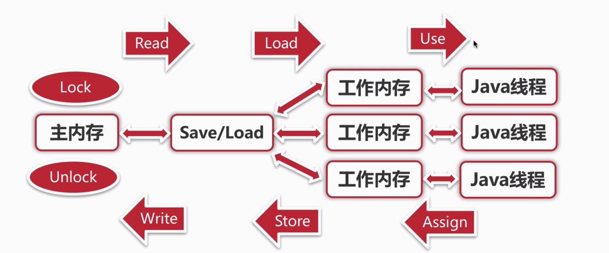

## Java 并发编程 — 基本概念

### 并发

同时拥有两个或多个线程，如果程序在单核处理器上运行，多个线程将交替地换入或者换出内存，这些线程是同时“存在”的，每个线程都处于执行过程中的某个状态。如果运行在多核处理器上，此时每个线程都将会分配到一个处理器核上，可以同时运行。

侧重：多个线程操作相同的资源，保证线程安全，合理使用资源。

### 高并发

High Concurrency 是互联网分布式系统架构设计中必须考虑的因素之一，它通常是指通过设计保证系统能够同时并行处理很多请求。

侧重：服务能够同时处理很多请求，提高程序性能。

### CPU 多级缓存

- CPU 的频率太快了，快到主存跟不上。在处理器时钟周期内，CPU 常常需要等待主存数据读取写入操作，浪费资源，所以 cache 的出现，是为了缓解 CPU 和内存之间速度的不匹配问题。
- 一般分为三级缓存，三种缓存的技术难度和制造成本是相对递减的，其容量也是相对递增的。
- 意义：1、时间局部性：如果某个数据被访问，那么在不久的将来很可能被再次访问；2、空间局部性：如果某个数据被访问，那么与之相邻的数据很快也可能被访问。

### 缓存一致性 MESI

- M：Modified 修改
- E：Exclusive 独占
- S：Shared 共享
- I：Invalid 无效

### Java 内存模型 — 同步八种操作

- lock（锁定）：作用于主内存的变量，把一个变量标识为一个线程独占状态。
- unlock（解锁）：作用于主内存的变量，释放被独占的变量。
- read（读取）：作用于主内存的变量，把一个变量值从主内存传输到线程的工作内存中，以便 load 动作使用。
- load（载入）：作用于工作内存的变量，将从主内存中获得的变量值放入工作内存的变量副本中。
- use（使用）：作用于工作内存的变量，把工作内存中的一个变量值传给执行引擎。
- assign（赋值）：作用于工作内存的变量，把执行引擎中收到的值赋值给工作内存的变量。
- store（存储）：作用于工作内存的变量，把工作内存中的一个变量值传送到主内存中，以便 write 操作。
- write（写入）：作用于主内存的变量，把 store 操作中的一个变量值传送到主内存中。

- Java 内存模型要求 read 和 load、store 和 write 操作必须按顺序执行，且不允许一组操作之一单独出现，但未保证必须是连续执行。
- 不允许一个线程丢弃它最近的 assign 操作，即变量在工作内存中改变了之后必须同步回主内存。
- 不允许一个线程无原因地（没有发生任何 assign 操作）把数据从工作内存中同不回主内存中。
- 一个新的变量只能在主内存中诞生，不允许在工作内存中直接使用一个未被初始化的变量。
- 如果对一个变量执行 lock 操作，将会清空工作内存中此变量的值，在执行引擎使用这个变量前要重新执行 load 或 assign 操作初始化变量。
- 对一个变量执行 unlock 操作前，必须先把此变量同步回主内存中。

### Thread 和线程池

#### new Thread 的弊端

- 每次 new Thrad() 创建新的对象，性能差。
- 线程缺乏统一的管理，可能无限制地创建新线程，相互竞争，有可能占用过多的系统资源导致死机或 OOM。
- 缺乏更多的功能，如更多执行、定期执行、线程中断。

#### 线程池的好处

- 重用存在的线程，减少对象创建、消亡的开销，性能好。
- 可以有效的控制最大并发线程数，提高系统资源利用率，同时可以避免过多的资源竞争，避免阻塞。
- 提供定时执行、定期执行、单线程、并发数控制等功能。