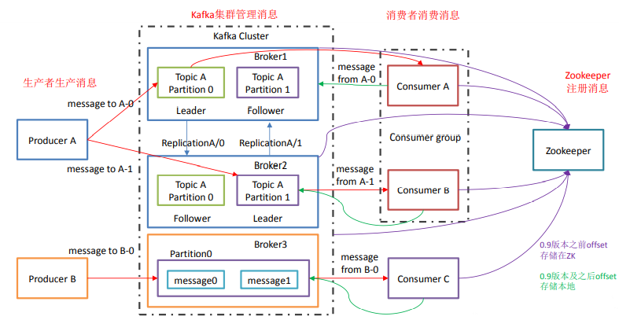
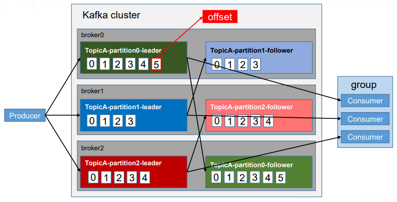
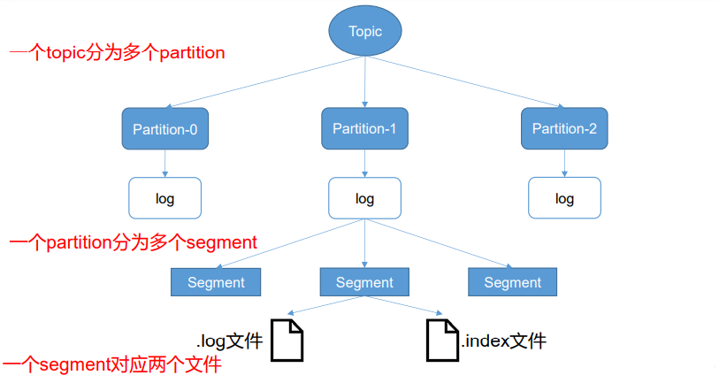
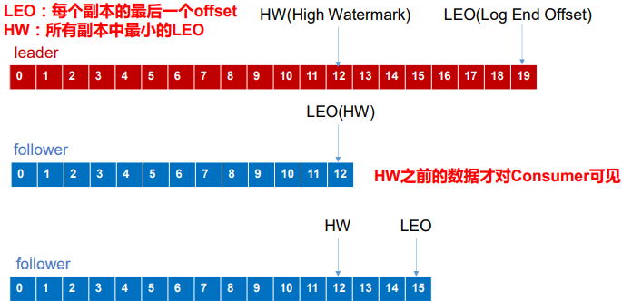
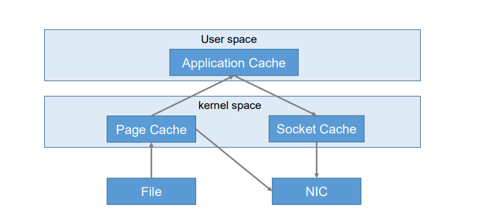
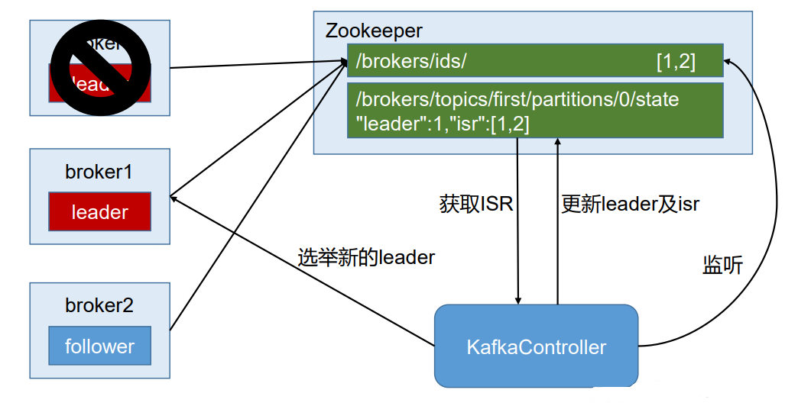
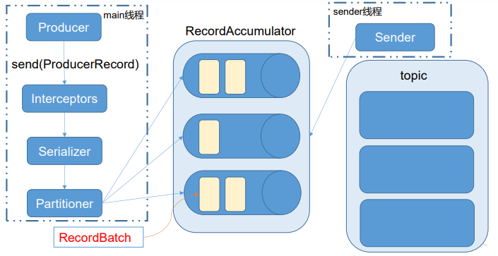

## Kafka 概述

Kafka 是一个开源的分布式事件流平台，主要应用于大数据实时处理领域。

### 消息队列

#### 作用

1. **解耦**：可以独立的扩展或修改两端的处理过程，只要确保它们遵守同样的接口约束。

2. **可恢复性**：系统的一部分组件失效时，不会影响到整个系统。消息队列降低了进程间的耦合度，即使一个处理消息的进程挂掉，加入队列中的消息仍然可以在系统恢复后被处理。
3. **缓冲**：有助于控制和优化数据流经过系统的速度，解决生产消息和消费消息的处理速度不一致的情况。
4. **灵活性 & 峰值处理能力**：消息队列能够使关键组件顶住突发的访问压力，而不会因为突发的超负荷的请求而完全崩溃。
5. **异步通讯**：消息队列提供了异步处理机制，允许用户把一个消息放入队列，但并不立即处理它。

#### 两种模式

1. **点对点模式**：消费者主动拉取数据，消费后清除消息。队列支持存在多个消费者，但是对一个消息而言，只会有一个消费者可以消费。
2. **发布 / 订阅模式**：可以有多个 topic，生产者发布到 topic 的消息会被所有订阅者消费。在该模式下消息有两种传递方式：
   - 消费者主动拉取数据（**Kafka 采取**），当队列中一直没有消息时，会造成消费者的资源浪费（一直轮询）。
   - 由队列主动推送给消费者，当消费者的消费能力参差不齐时，容易出现资源浪费（推送少了）或消费压力过大（推送多了）的问题。

### Kafka 架构

**Broker**：一台 Kafka 服务器就是一个 broker。一个集群由多个 broker 组成，一个 broker 可以容纳多个 topic。

**Topic**：可以理解为一个队列，生产者和消费者面向的都是一个 topic，为了实现扩展性，一个非常大的 topic 可以分布到多个 broker 上（分区）。

**Partition**： 一个 topic 可以分为多个 partition，每个 partition 是一个有序的队列。**可以提高 Kafka 的负载和并发能力**。

**Replication**：为保证集群中的某个节点发生故障时，该节点上的 partition 数据不丢失，且 Kafka 仍然能够继续工作，Kafka 提供了副本机制，一个 topic 的每个分区都有若干个副本，一个 leader 和若干个 follower。

**Leader**：生产者发送数据的对象以及消费者消费数据的对象都是 leader。

**Follower**：实时从 leader 中同步数据，保持和 leader 数据的一致。leader 发生故障时，某个 follower 会成为新的 follower。

**Consumer Group**（CG）：由多个消费者组成，**组内每个消费者负责消费不同分区的数据，一个分区只能由一个组内消费者消费**，组与组之间互不影响。所有的消费者都属于某个消费者组，即消费者组是逻辑上的一个订阅者。当组内的消费者数量大于 topic 的分区数量时会造成浪费。

#### 分区的优势

1. 可以把海量的数据按照分区存储在多台服务器上，最大程度的利用资源，便于集群的扩展。
2. 以分区为单位进行读写，提高了并行度；合理控制分区的任务，可以实现负载均衡。

### 偏移量

Kafka 中消息以 topic 进行分类，topic 是逻辑上的概念，而 partition 是物理上的概念。每个 partition 对应于一个 log 文件，存储的是生产者生产的数据。生产的数据会被不断追加到该 log 文件末端，每条数据都有自己的 offset。消费者组中的每个消费者，都会实时记录自己消费到了哪个 offset，以便出错时，从上次的位置继续消费。

每个 topic 并不能保证全局的消息有序性，只能保证每个 partition 中内部有序。

### 文件存储机制

由于生产者生产的消息会不断追加到 log 文件末尾，为防止 log 文件过大导致数据定位效率低下，Kafka 采取了分片和索引机制，将每个 partition 分为多个  segment。每个 segment 对应两个文件 .index 文件（索引信息，起始位置和数据大小）和 .log 文件（数据）。这些文件位于一个命名规则为：topic 名称 + 分区序号的文件夹下。

index 和 log 文件以当前 segment 的第一条消息的 offset 命名。index 中会记录相对于第一条消息的 offset 和 postition（消息的字节数，用于计算物理地址）。Kafka 不会每个消息都保存索引，Kafka 采用了**稀疏索引**的方式，记录一个基准的索引，然后通过计算去获得需要的 offset 所在的索引。

查找过程为：Kafka 先通过二分查找确定消息所处的 log 文件，再根据index 文件中的索引信息找到数据的起始位置，其中 index 文件中每个数据块的大小是固定的，因此能迅速定位 offset 在文件中的位置。

### 生产者

#### 分区策略

- 分区的原因：
  1. 方便在集群中扩展，每个 partition 可以通过调整以适应它所在的机器，而一个 topic 又可以有多个 partition，因此整个集群就可以适应任意大小的数据；
  2. 可以提高并发，因为可以以 Partition 为单位读写了。

- 分区的原则：

  我们需要将 producer 发送的数据封装成一个 ProducerRecord 对象。
  
  1. 指明 partition 的情况下，直接将指定的值作为 partiton 值；
  2. 没有指明 partition 值但有 key 的情况下，将 key 的 hash 值与 topic 的 partition 数进行取余得到 partition 值；
  3. 既没有 partition 值又没有 key 值的情况下，第一次调用时随机生成一个整数（后面每次调用在这个整数上自增），将这个值与 topic 可用的 partition 总数取余得到 partition 值，也就是常说的 round-robin 算法。

#### 数据可靠性保证

为保证数据能可靠的发送到指定的 topic 上，topic 的每个 partition 收到 producer 发送的数据后，都需要向 producer 发送 ack。如果 producer 收到 ack，就进行下一轮的发送，否则重新发送数据。

- 何时发送 ack?

| 方案                     | 优点                                                         | 缺点                                                         |
| ------------------------ | ------------------------------------------------------------ | ------------------------------------------------------------ |
| 半数以上完成同步，就发送 | 延迟低                                                       | 选举新的 leader 时，要容忍 n 台节点故障，就需要 2n + 1 个副本 |
| 全部完成同步，才发送     | 选举新的 leader 时，要容忍 n 台 节点的故障，只需要 n + 1 个副本 | 延迟高                                                       |

Kafka 选择了第二种方案，原因如下：

1. 第一种方案会造成大量数据的冗余
2. 虽然第二种方案的网络延迟会比较高，但网络延迟对 Kafka 的影响较小

采用方案二后，若某个 follower 因为某种故障，迟迟不能与 leader 进行同步，那 leader 就要一直等下去，直到它完成同步，才能发送 ack。

为了解决这个问题，leader 维护了一个动态的 in-sync replica set （ISR），意为和 leader 保持同步的 follower 集合。当 ISR 中的 follower 完成数据的同步之后，leader 就会发送 ack。如果 follower 长时间未从 leader 同步数据，则该 follower 将被踢出 ISR，该时间阈值由 replica.lag.time.max.ms 参数设定。当 leader 发生故障之后，就会从 ISR 中选举新的 leader。

注：0.9 版本之前 Kafka 将 follower 加入 ISR 由两个条件决定：同步时间和数据相差的条数，0.9 版本之后只由时间决定。原因：生产者往往是批量插入数据的，当插入的数据量大于设置的 ISR 相差条数时，所有的 follower 都会从 ISR 中移除，待同步完成后又加入到 ISR 中，但后续的批量插入又会造成这种现象的循环，导致频繁的操作内存，增加了性能消耗。

- ack 应答机制

Kafka 为用户提供了三种可靠性级别，用户根据对可靠性和延迟的要求进行权衡，选择以下的配置。

0：producer 不等待 broker 的 ack，这一操作提供了一个最低的延迟。broker 一接收到数据还没有写入磁盘就已经返回，当 broker 故障时有可能丢失数据；

1：producer 等待 broker 的 ack，partition 的 leader 落盘成功后返回 ack。如果在 follower 同步成功之前 leader 故障，那么将会丢失数据；

-1（all）：producer 等待 broker 的 ack，partition 的 leader 和 follower 全部落盘成功后才返回 ack。但是如果在 follower 同步完成后，broker 发送 ack 之前，leader 发生故障，那么会造成数据重复。极端情况下，当 ISR 中只有 leader 时，此时等同于 1，也可能会造成数据的丢失。

- HW 和 LEO

LEO：指的是每个副本最大的 offset；

HW：指的是消费者能见到的最大的 offset，ISR 队列中最小的 LEO。

1. follower 发生故障后会被临时踢出 ISR，待该 follower 恢复后，follower 会读取本地磁盘记录的上次的 HW，并将 log 文件高于 HW 的部分截取掉，从 HW 开始向 leader 进行同步。等该 follower 的 LEO 大于等于该 partition 的 HW，即 follower 追上 leader 之后，就可以重新加入 ISR 了。
2. leader 发生故障之后，会从 ISR 中选出一个新的 leader。为保证多个副本之间的数据一致性，其余的 follower 会先将各自的 log 文件高于 HW 的部分截掉，然后从新的 leader 同步数据。

注意：这只能保证**副本之间的数据一致性**，并不能保证数据不丢失或者不重复。

- Exactly Once 语义

将服务器的 ACK 级别设置为 -1，可以保证 producer 到 server 之间不会丢失数据，即 At Least Once 语义。相对的，将服务器 ACK 级别设置为 0，可以保证生产者每条消息只会被发送一次，即 At Most Once 语义。

At Least Once 可以保证数据不丢失，但是不能保证数据不重复；相对的，At Most Once 可以保证数据不重复，但是不能保证数据不丢失。但对于一些非常重要的信息，下游消费者要求数据既不重复也不丢失，即 Exactly Once 语义。在 0.11 版本以前的 Kafka，对此是无能为力的，只能保证数据不丢失，再在消费者对数据做全局去重。对于多个下游应用的情况，每个都需要单独做全局去重，这就对性能造成了很大影响。

0.11 版本的 Kafka，引入了一项重大特性：幂等性。所谓的幂等性就是指 producer 不论向 server 发送多少次重复数据，server 端都只会持久化一条。幂等性结合 At Least Once 语义，就构成了 Kafka 的 Exactly Once 语义。即：At Least Once + 幂等性 = Exactly Once。

要启用幂等性，只需要将 producer 的参数中 enable.idompotence 设置为 true 即可。开启幂等性的 producer 在初始化的时候会被分配一个 PID，发往同一 partition 的消息会附带 sequence number。而 broker 端会对 <PID, Partition, SeqNumber> 做缓存，当具有相同主键的消息提交时，broker 只会持久化一条。

但是 PID 重启就会变化，同时不同的 partition 也具有不同主键，所以幂等性无法保证跨分区跨会话的 Exactly Once。

### 消费者

#### 消费方式

consumer 采用 pull 模式从 broker 中读取数据。

push 模式很难适应消费速率不同的消费者，因为消息发送速率是由 broker 决定的。

pull 模式不足之处是，如果 Kafka 没有数据，消费者可能会陷入循环中，一直返回空数据。针对这一点，Kafka 的消费者在消费数据时会传入一个时长参数 timeout，如果当前没有数据可供消费，consumer 会等待一段时间之后再返回，这段时长即为 timeout。

#### 分区分配策略

消费者组里消费者数量变化的时候会触发分区策略，Kafka 有两种分配策略，一种是 round-robin，一种是 range。

round-robin：轮询，将消费者组里订阅的所有 topic 当作一个整体，将分区按照 hash 值排序，再按照轮询顺序分配给每个消费者。好处：消费者之间消费的分区数量最多相差一个。坏处：消费者可能会收到未订阅的主题消息。使用前提：当前消费者组里所有消费者订阅的主题是一致的。

range：范围（默认策略），按照单个 topic 划分，将 topic 下的 partition 均匀分配给每个消费者（同一组内均分）。坏处：随着消费者组订阅主题数量的增多，消费者消费分区数量差距增大，消费数据量不对等。

#### offset 的维护

由于 consumer 在消费过程中可能会出现断电宕机等故障，consumer 恢复后，需要从故障前的位置的继续消费，所以 consumer 需要实时记录自己消费到了哪个 offset。Kafka 通过 consumer group + topic + partition 三者唯一决定 offset。

Kafka 0.9 版本之前，consumer 默认将 offset 保存在 Zookeeper 中，从 0.9 版本开始， consumer 默认将 offset 保存在 Kafka 一个内置的 topic 中，该 topic 为 __consumer_offsets。

### 高效读写数据

#### 顺序写磁盘 

Kafka 的 producer 生产数据，要写入到 log 文件中，写的过程是一直追加到文件末端，为顺序写。官网有数据表明，同样的磁盘，顺序写能达到 600M/s，而随机写只有 100K/s，这与磁盘的机械机构有关。顺序写之所以快，是因为其省去了大量磁头寻址的时间。

#### 零复制技术

### Zookeeper 在 Kafka 中的作用

Kafka 集群中有一个 broker 会被选举为 Controller，负责管理集群 broker 的上下线，所有 topic 的分区副本分配和 leader 选举等工作。Controller 的管理工作都是依赖于 Zookeeper 的。

### 事务

Kafka 从 0.11 版本开始引入了事务支持。事务可以保证 Kafka 在 Exactly Once 语义的基础上，生产和消费可以跨分区和会话，要么全部成功，要么全部失败。

#### producer 事务

为了实现跨分区跨会话的事务，需要引入一个全局唯一的 Transaction ID，并将 producer 获得的 PID 和 Transaction ID 绑定。这样当 Producer 重启后就可以通过正在进行的 Transaction ID 获得原来的 PID。

为了管理 Transaction，Kafka 引入了一个新的组件 Transaction Coordinator。producer 就是通过和 Transaction Coordinator 交互获得 Transaction ID 对应的任务状态。Transaction Coordinator 还负责将事务写入 Kafka 的一个内部 Topic，这样即使整个服务重启，由于事务状态得到保存，进行中的事务状态可以得到恢复，从而继续进行。

#### consumer 事务

上述事务机制主要是从 producer 方面考虑，对于 consumer 而言，事务的保证就会相对较弱，尤其无法保证 commit 的信息被精确消费。这是由于 consumer 可以通过 offset 访问任意信息，而且不同的 Segment File 生命周期不同，同一事务的消息可能会出现重启后被 删除的情况。

### Kafka API

####  Producer API

##### 消息发送流程

Kafka 的 producer 发送消息采用的是异步发送的方式。在消息发送的过程中，涉及到了 main 线程和 sender 线程，以及一个线程共享变量 RecordAccumulator。main 线程将消息发送给 RecordAccumulator，sender 线程不断从 RecordAccumulator 中拉取消息发送到 Kafka broker。

相关参数： 

batch.size：只有数据积累到 batch.size 之后，sender 才会发送数据。 

linger.ms：如果数据迟迟未达到 batch.size，sender 等待 linger.time 之后就会发送数据。

