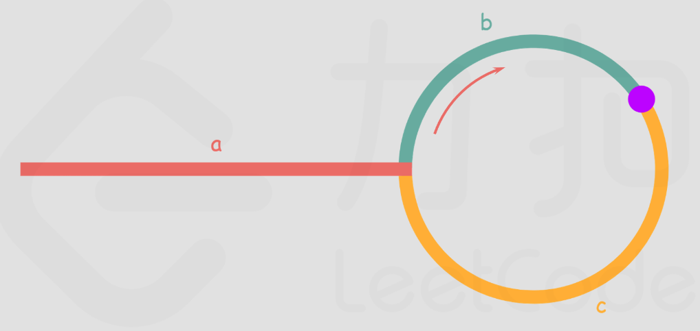

## 142. 环形链表 II

### 题目描述

给定一个链表的头节点 head，返回链表开始入环的第一个节点。如果链表无环，则返回 null。

如果链表中有某个节点，可以通过连续跟踪 next 指针再次到达，则链表中存在环。为了表示给定链表中的环，评测系统内部使用整数 pos 来表示链表尾连接到链表中的位置（索引从 0 开始）。如果 pos 是 -1，则在该链表中没有环。注意：pos 不作为参数进行传递，仅仅是为了标识链表的实际情况。

不允许修改 链表。

示例 1：

~~~
输入：head = [3,2,0,-4], pos = 1
输出：返回索引为 1 的链表节点
解释：链表中有一个环，其尾部连接到第二个节点。
~~~

示例 2：

~~~
输入：head = [1,2], pos = 0
输出：返回索引为 0 的链表节点
解释：链表中有一个环，其尾部连接到第一个节点。
~~~

示例 3：

~~~
输入：head = [1], pos = -1
输出：返回 null
解释：链表中没有环。
~~~

提示：

- 链表中节点的数目范围在范围 [0, 104] 内
- -105 <= Node.val <= 105
- pos 的值为 -1 或者链表中的一个有效索引

### 思路

快慢指针，慢指针每次向后移动一个位置，快指针向后移动两个位置。如果链表中存在环，则慢指针最终将再次与快指针在环中相遇。

设链表中环外部分的长度为 a。slow 指针进入环后，又走了 b 的距离与 fast 相遇。此时，fast 指针已经走完了环的 n 圈，它走过的总距离为：a + n(b + c) + b = (n + 1)b + nc。

任意时刻，fast 指针走过的距离都为 slow 指针的 2 倍，因此：a + (n + 1)b + nc = 2(a + b) => a = c + (n − 1)(b + c)。

从相遇点到入环点的距离加上 n-1 圈的环长，恰好等于从链表头部到入环点的距离。此时再用一个指针指向链表头部，随后它和 slow 每次向后移动一个位置，最终会在入环点相遇。

### 代码

~~~java
/**
 * Definition for singly-linked list.
 * class ListNode {
 *     int val;
 *     ListNode next;
 *     ListNode(int x) {
 *         val = x;
 *         next = null;
 *     }
 * }
 */
public class Solution {
    public ListNode detectCycle(ListNode head) {
        ListNode slow = head;
        ListNode fast = head;
        ListNode node = head;
        while (fast != null && fast.next != null) {
            slow = slow.next;
            fast = fast.next.next;
            if (slow == fast) {
                break;
            }
        }

        if (fast == null || fast.next == null) {
            return null;
        }

        while (node != slow) {
            node = node.next;
            slow = slow.next;
        }

        return node;
    }
}
~~~

### 复杂度

- 时间复杂度：O(N)，其中 N 为链表中节点的数目。在最初判断快慢指针是否相遇时，slow 指针走过的距离不会超过链表的总长度；随后寻找入环点时，走过的距离也不会超过链表的总长度。因此，总的执行时间为 O(N) + O(N) = O(N)。

- 空间复杂度：O(1)。
