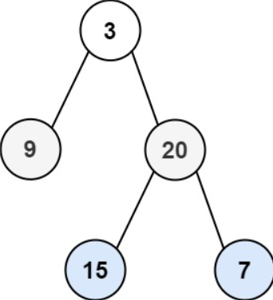

## 102. 二叉树的层序遍历

### 题目描述

给你二叉树的根节点 `root` ，返回其节点值的 **层序遍历**。 （即逐层地，从左到右访问所有节点）。

示例 1：

~~~
输入：root = [3,9,20,null,null,15,7]
输出：[[3],[9,20],[15,7]]
~~~

示例 2：

~~~
输入：root = []
输出：[]
~~~

提示：

- 树中节点数目在范围 [0, 2000] 内
- -1000 <= Node.val <= 1000

### 思路

使用广度优先搜索。维护一个队列，首先根元素入队，当队列不为空的时候，获取当前队列的长度 si，依次从队列中取 si 个元素进行拓展，然后进入下一次迭代。

### 代码

~~~java
/**
 * Definition for a binary tree node.
 * public class TreeNode {
 *     int val;
 *     TreeNode left;
 *     TreeNode right;
 *     TreeNode() {}
 *     TreeNode(int val) { this.val = val; }
 *     TreeNode(int val, TreeNode left, TreeNode right) {
 *         this.val = val;
 *         this.left = left;
 *         this.right = right;
 *     }
 * }
 */
class Solution {
    public List<List<Integer>> levelOrder(TreeNode root) {
        List<List<Integer>> res = new ArrayList<List<Integer>>();
        if (root == null) {
            return res;
        }

        Queue<TreeNode> queue = new LinkedList<TreeNode>();
        queue.offer(root);
        while (!queue.isEmpty()) {
            // 获取队列中元素的个数
            int currentSize = queue.size();
            // 记录本层级的节点
            List<Integer> levelList = new ArrayList<>();
            
            for (int i = 1; i <= currentSize; i++) {
                TreeNode node = queue.poll();
                levelList.offer(node.val);
                if (node.left != null) {
                    queue.offer(node.left);
                }
                if (node.right != null) {
                    queue.offer(node.right);
                }
            }
            res.add(levelList);
        }
        return res;
    }
}
~~~

### 复杂度

- 时间复杂度：O(n)，n 为二叉树节点数量。
- 空间复杂度：O(n)，队列中元素的个数不超过 n 个。
