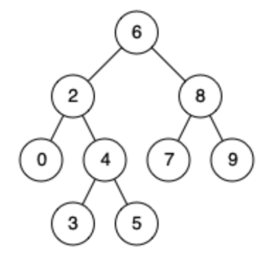

## 235. 二叉搜索树的最近公共祖先

### 题目描述

给定一个二叉搜索树，找到该树中两个指定节点的最近公共祖先。

百度百科中最近公共祖先的定义为：“对于有根树 T 的两个结点 p、q，最近公共祖先表示为一个结点 x，满足 x 是 p、q 的祖先且 x 的深度尽可能大（一个节点也可以是它自己的祖先）”。

例如，给定如下二叉搜索树:  root = [6, 2, 8, 0, 4, 7, 9, null, null, 3, 5]

示例 1：

~~~
输入: root = [6,2,8,0,4,7,9,null,null,3,5], p = 2, q = 8
输出: 6 
解释: 节点 2 和节点 8 的最近公共祖先是 6。
~~~

示例 2：

~~~
输入: root = [6,2,8,0,4,7,9,null,null,3,5], p = 2, q = 4
输出: 2
解释: 节点 2 和节点 4 的最近公共祖先是 2, 因为根据定义最近公共祖先节点可以为节点本身。
~~~

提示：

- 所有节点的值都是唯一的
- p、q 为不同节点且均存在于给定的二叉搜索树中

### 思路

#### 方法一

两次深度优先遍历，分别记录从根节点到 p 和 q 的路径，然后进行对比。路径上最后一个相同的节点即为这两个节点的最近公共祖先。

#### 代码一

~~~java
/**
 * Definition for a binary tree node.
 * public class TreeNode {
 *     int val;
 *     TreeNode left;
 *     TreeNode right;
 *     TreeNode(int x) { val = x; }
 * }
 */

class Solution {
    public TreeNode lowestCommonAncestor(TreeNode root, TreeNode p, TreeNode q) {
        List<TreeNode> path_p = getPath(root, p);
        List<TreeNode> path_q = getPath(root, q);
        TreeNode ancestor = null;
        for (int i = 0; i < path_p.size() && i < path_q.size(); ++i) {
            if (path_p.get(i) == path_q.get(i)) {
                ancestor = path_p.get(i);
            } else {
                break;
            }
        }
        return ancestor;
    }

    public List<TreeNode> getPath(TreeNode root, TreeNode target) {
        List<TreeNode> path = new ArrayList<TreeNode>();
        TreeNode node = root;
        while (node != target) {
            path.add(node);
            if (target.val < node.val) {
                node = node.left;
            } else {
                node = node.right;
            }
        }
        path.add(node);
        return path;
    }
}
~~~

#### 方法二

将方法一中的两次遍历结合起来，从根节点开始，具体操作如下：

- 如果当前节点的值大于 p 和 q 的值，说明 p 和 q 应该在当前节点的左子树，因此将当前节点移动到它的左子节点；
- 如果当前节点的值小于 p 和 q 的值，说明 p 和 q 应该在当前节点的右子树，因此将当前节点移动到它的右子节点；
- 如果当前节点的值不满足上述两条要求，p 和 q 要么在当前节点的不同的子树中，要么其中一个就是当前节点。

#### 代码二

~~~java
/**
 * Definition for a binary tree node.
 * public class TreeNode {
 *     int val;
 *     TreeNode left;
 *     TreeNode right;
 *     TreeNode(int x) { val = x; }
 * }
 */

class Solution {
    public TreeNode lowestCommonAncestor(TreeNode root, TreeNode p, TreeNode q) {
        TreeNode ancestor = root;
        while (true) {
            if (p.val < ancestor.val && q.val < ancestor.val) {
                ancestor = ancestor.left;
            } else if (p.val > ancestor.val && q.val > ancestor.val) {
                ancestor = ancestor.right;
            } else {
                break;
            }
        }
        return ancestor;
    }
}
~~~

### 复杂度

#### 方法一

- 时间复杂度：O(n)，其中 n 是给定的二叉搜索树中的节点个数。上述代码需要的时间与节点 p 和 q 在树中的深度线性相关，而在最坏的情况下，树呈现链式结构，p 和 q 一个是树的唯一叶子结点，一个是该叶子结点的父节点，此时时间复杂度为 O(n)。
- 空间复杂度：O(n)，我们需要存储根节点到 p 和 q 的路径。和上面的分析方法相同，在最坏的情况下，路径的长度为 O(n)。

#### 方法二

- 时间复杂度：O(n)，其中 n 是给定的二叉搜索树中的节点个数。分析思路与方法一相同。
- 空间复杂度：O(1)。