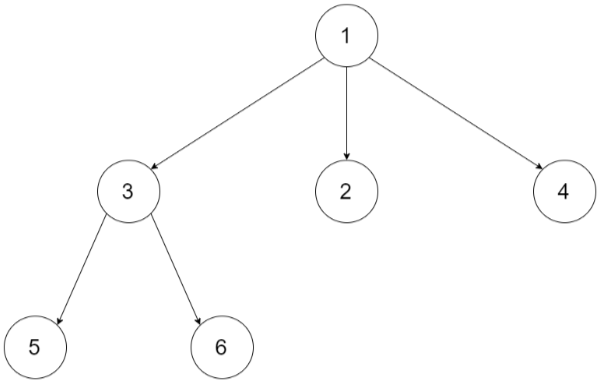
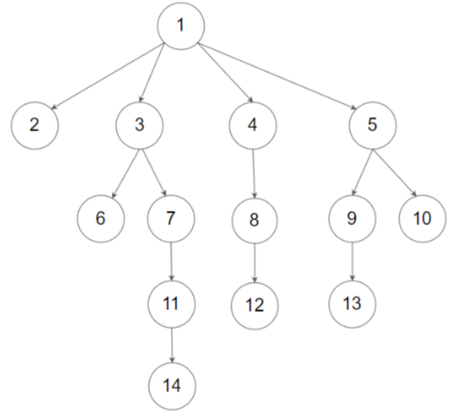

## 589. N 叉树的前序遍历

### 题目描述

给定一个 n 叉树的根节点  root ，返回 其节点值的 前序遍历。

n 叉树 在输入中按层序遍历进行序列化表示，每组子节点由空值 null 分隔（请参见示例）。

示例 1：

~~~
输入：root = [1,null,3,2,4,null,5,6]
输出：[1,3,5,6,2,4]
~~~

示例 2 ：

~~~
输入：root = [1,null,2,3,4,5,null,null,6,7,null,8,null,9,10,null,null,11,null,12,null,13,null,null,14]
输出：[1,2,3,6,7,11,14,4,8,12,5,9,13,10]
~~~

提示：

- 节点总数在范围 [0, 104] 内
- 0 <= Node.val <= 104
- n 叉树的高度小于或等于 1000

### 思路

使用深度优先搜索。

#### 方法一

递归，每次递归时，先访问根节点，然后依次递归每个子节点。

#### 代码一

~~~java
/*
// Definition for a Node.
class Node {
    public int val;
    public List<Node> children;

    public Node() {}

    public Node(int _val) {
        val = _val;
    }

    public Node(int _val, List<Node> _children) {
        val = _val;
        children = _children;
    }
};
*/

class Solution {
    public List<Integer> preorder(Node root) {
        List<Integer> res = new ArrayList<>();
        helper(root, res);
        return res;
    }

    public void helper(Node root, List<Integer> res) {
        if (root == null) {
            return;
        }
        res.add(root.val);
        for (Node ch : root.children) {
            helper(ch, res);
        }
    }
}
~~~

#### 方法二

使用栈来模拟递归，先遍历节点本身，然后从右到左依次将子节点压入栈。

#### 代码二

~~~java
/*
// Definition for a Node.
class Node {
    public int val;
    public List<Node> children;

    public Node() {}

    public Node(int _val) {
        val = _val;
    }

    public Node(int _val, List<Node> _children) {
        val = _val;
        children = _children;
    }
};
*/

class Solution {
    public List<Integer> preorder(Node root) {
        List<Integer> res = new ArrayList<>();
        if (root == null) {
            return res;
        }

        Deque<Node> stack = new ArrayDeque<Node>();
        stack.push(root);
        while (!stack.isEmpty()) {
            Node node = stack.pop();
            res.add(node.val);
            List<Node> children = node.children;
            if (children != null) {
                // 从右到左依次将子节点压入栈，保证出栈顺序的正确性
                for (int i = children.size() - 1; i >= 0; i--) {
                    stack.push(children.get(i));
                }
            }
        }
        return res;

    }
}
~~~

### 复杂度

#### 方法一

- 时间复杂度：O(m)，其中 m 为 N 叉树的节点。每个节点恰好被遍历一次。

- 空间复杂度：O(m)，递归过程中需要调用栈的开销，平均情况下为 O(log m)，最坏情况下树的深度为 m - 1，此时需要的空间复杂度为 O(m)。

#### 方法二

时间复杂度：O(m)，其中 m 为 N 叉树的节点。每个节点恰好被访问一次。

空间复杂度：O(m)，其中 m 为 N 叉树的节点。如果 N 叉树的深度为 1 则此时栈的空间为 O(m - 1)，如果 N 叉树的深度为 m - 1 则此时栈的空间为 O(1)，平均情况下栈的空间为 O(log m)，因此空间复杂度为 O(m)。
