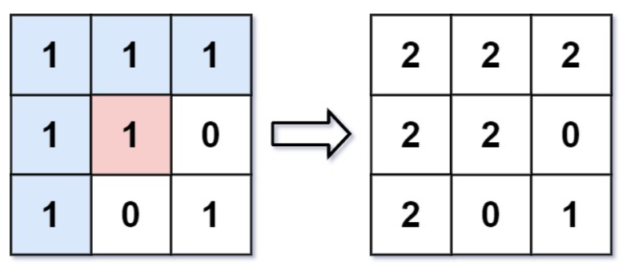

## 733. 图像渲染

### 题目描述

有一幅以 m x n 的二维整数数组表示的图画 image，其中 image[i] [j] 表示该图画的像素值大小。

你也被给予三个整数 sr ,  sc 和 newColor 。你应该从像素 image[sr] [sc] 开始对图像进行 上色填充。

为了完成 上色工作，从初始像素开始，记录初始坐标的 上下左右四个方向上 像素值与初始坐标相同的相连像素点，接着再记录这四个方向上符合条件的像素点与他们对应 四个方向上 像素值与初始坐标相同的相连像素点，……，重复该过程。将所有有记录的像素点的颜色值改为 newColor 。

最后返回 经过上色渲染后的图像 。

示例 1：

~~~
输入: image = [[1,1,1],[1,1,0],[1,0,1]]，sr = 1, sc = 1, newColor = 2
输出: [[2,2,2],[2,2,0],[2,0,1]]
解析: 在图像的正中间，（坐标 (sr,sc) = (1,1)）,在路径上所有符合条件的像素点的颜色都被更改成 2。
~~~

示例 2：

~~~
输入: image = [[0,0,0],[0,0,0]], sr = 0, sc = 0, newColor = 2
输出: [[2,2,2],[2,2,2]]
~~~

提示：

- m == image.length
- n == image[i].length
- 1 <= m, n <= 50
- 0 <= image[i] [j], newColor < 216
- 0 <= sr < m
- 0 <= sc < n

### 思路

#### 方法一

从起始点开始，进行广度优先搜索。每次搜索到一个方格时，如果其与初始位置的方格颜色相同，就将该方格加入队列，并将该方格的颜色更新，以防止重复入队。

#### 代码一

 ~~~java
 class Solution {
     public int[][] floodFill(int[][] image, int sr, int sc, int color) {
         int currColor = image[sr][sc];
         if (currColor == color) {
             return image;
         }
         int row = image.length;
         int col = image[0].length;
         // 构造上下左右四个方位
         int[] direction = new int[]{-1, 0, 1, 0, -1};
         Queue<int[]> queue = new LinkedList<>();
         int source = image[sr][sc];
         queue.offer(new int[]{sr, sc});
         while (!queue.isEmpty()) {
             int[] peek = queue.poll();
             int currentRow = peek[0];
             int currentCol = peek[1];
             image[currentRow][currentCol] = color;
             for (int i = 0; i < 4; i++) {
                 int x = currentRow + direction[i];
                 int y = currentCol + direction[i + 1];
                 // 判断周围元素是否满足条件
                 if (x < row && x >= 0 && y < col && y >= 0 && image[x][y] == source) {
                     queue.offer(new int[]{x, y});
                 }
             }
         }
         return image;
     }
 }
 ~~~

#### 方法二

从起始点开始，进行深度优先搜索。每次搜索到一个方格时，如果其与初始位置的方格颜色相同，就将该方格的颜色更新，以防止重复搜索；如果不相同，则进行回溯。

#### 代码二

~~~java
class Solution {
    public int[][] floodFill(int[][] image, int sr, int sc, int newColor) {
        int currColor = image[sr][sc];
        if (currColor != newColor) {
            dfs(image, sr, sc, newColor, currColor);
        }
        return image;
    }

    void dfs(int[][] image, int sr, int sc, int newColor, int oldColor) {

        if (sr < 0 || sc < 0 || sr >= image.length || sc >= image[0].length
                || image[sr][sc] != oldColor) {
            return;
        }

        image[sr][sc] = newColor;

        // 检查四个相邻的元素
        dfs(image, sr - 1, sc, newColor, oldColor);
        dfs(image, sr + 1, sc, newColor, oldColor);
        dfs(image, sr, sc - 1, newColor, oldColor);
        dfs(image, sr, sc + 1, newColor, oldColor);
    }
}
~~~

#### 复杂度

#### 方法一

时间复杂度：O(n × m)，其中 n 和 m 分别是二维数组的行数和列数。最坏情况下需要遍历所有的方格一次。

空间复杂度：O(n × m)，其中 n 和 m 分别是二维数组的行数和列数。主要为队列的开销。

#### 方法二

时间复杂度：O(n × m)。

空间复杂度：O(n × m)。
