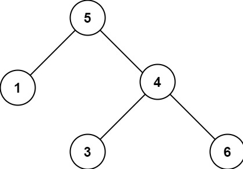

## 98. 验证二叉搜索树

### 题目描述

给你一个二叉树的根节点 root ，判断其是否是一个有效的二叉搜索树。

有效 二叉搜索树定义如下：

- 节点的左子树只包含 小于 当前节点的数。

- 节点的右子树只包含 大于 当前节点的数。

- 所有左子树和右子树自身必须也是二叉搜索树。

示例 1：

~~~
输入：root = [5,1,4,null,null,3,6]
输出：false
解释：根节点的值是 5，但是右子节点的值是 4。
~~~

示例 2：

~~~
输入：root = [2,1,3]
输出：true
~~~

提示：

- 树中节点数目范围在 [1, 104] 内
- -231 <= Node.val <= 231 - 1

### 思路

#### 方法一

使用递归，对每一个子树进行判断，具体判断如下：

- 递归函数包含三个参数，节点、最大值和最小值，用来判断节点的值是否在最大值和最小值之间。
- 如果节点值不满足条件，则直接返回，否则继续对该节点的子树进行判断。在递归调用左子树时，需要把最大值更改为节点的值；递归调用右子树时，需要把最小值更改为节点的值。
- 初始时，设置最小值为 -inf，最大值为 inf，inf 表示一个无穷大的值。

#### 代码一

~~~java
class Solution {
    public boolean isValidBST(TreeNode root) {
        return isValidBST(root, Long.MIN_VALUE, Long.MAX_VALUE);
    }

    public boolean isValidBST(TreeNode node, long lower, long upper) {
        if (node == null) {
            return true;
        }
        if (node.val <= lower || node.val >= upper) {
            return false;
        }
        return isValidBST(node.left, lower, node.val) && isValidBST(node.right, node.val, upper);
    }
}
~~~

#### 方法二

对二叉搜索树进行中序遍历，得到的序列一定是升序序列。因此，可以使用栈对二叉搜索树进行深度优先搜索。

#### 代码二

~~~java
/**
 * Definition for a binary tree node.
 * public class TreeNode {
 *     int val;
 *     TreeNode left;
 *     TreeNode right;
 *     TreeNode() {}
 *     TreeNode(int val) { this.val = val; }
 *     TreeNode(int val, TreeNode left, TreeNode right) {
 *         this.val = val;
 *         this.left = left;
 *         this.right = right;
 *     }
 * }
 */
 
class Solution {
    public boolean isValidBST(TreeNode root) {
        Deque<TreeNode> stack = new LinkedList<TreeNode>();
        // 记录上一个节点的值
        double inorder = -Double.MAX_VALUE;

        while (!stack.isEmpty() || root != null) {
            while (root != null) {
                stack.push(root);
                root = root.left;
            }
            root = stack.pop();
            if (root.val <= inorder) {
                return false;
            }
            inorder = root.val;
            root = root.right;
        }

        return true;
    }
}
~~~

### 复杂度

#### 方法一

- 时间复杂度：O(n)，其中 n 为二叉树的节点个数。
- 空间复杂度：O(n)，其中 n 为二叉树的节点个数。递归函数在递归过程中需要为每一层递归函数分配栈空间，所以这里需要额外的空间且该空间取决于递归的深度，即二叉树的高度。最坏情况下二叉树为一条链，树的高度为 n，递归最深达到 n 层，故最坏情况下空间复杂度为 O(n)。

#### 方法二

- 时间复杂度：O(n)，其中 n 为二叉树的节点个数。
- 空间复杂度：O(n)，其中 n 为二叉树的节点个数。栈最多存储 n 个节点。
