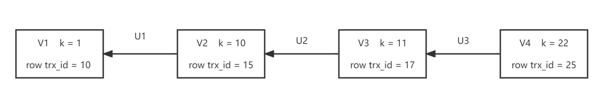
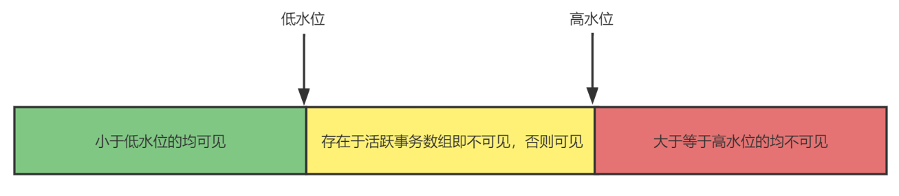

## MySQL 事务隔离

事务就是要保证一组数据库操作，要么全部成功，要么全部失败。在 MySQ L中，事务支持是在引擎层实现的。但并不是所有的引擎都支持事务，比如原生的 MyISAM 引擎，这也是 MyISAM 被 InnoDB 取代的重要原因之一。

### 隔离级别

隔离得越严实，效率就会越低。SQL 标准的事务隔离级别包括：

- **读未提交（read uncommitted）：**一个事务还没提交时，它做的变更就能被别的事务看到。
- **读提交（read committed）：**一个事务提交之后，它做的变更才会被其他事务看到。
- **可重复读（repeatable read）：**一个事务执行过程中看到的数据，总是跟这个事务在启动时看到的数据是一致的。在该隔离级别下，未提交的变更对其他事务也是不可见的。
- **串行化（serializable ）：**对于同一行记录，“写” 会加 “写锁”，“读” 会加 “读锁”。当出现读写锁冲突的时候，后访问的事务必须等前一个事务执行完成，才能继续执行。

|         事务 A         |    事务 B    |
| :--------------------: | :----------: |
| 启动事务，查询得到值 1 |   启动事务   |
|                        | 查询得到值 1 |
|                        | 将 1 改为 2  |
|    查询的得到值 V1     |              |
|                        |  提交事务 B  |
|    查询的得到值 V2     |              |
|       提交事务 A       |              |
|    查询的得到值 V3     |              |

- 若隔离级别是 “读未提交”， 则 V1、V2、V3 的值都是 2。
- 若隔离级别是 “读提交”，则 V1 是 1，V2、V3 的值是2。
- 若隔离级别是 “可重复读”，则 V1、V2 是 1，V3 是 2。事务在执行期间看到的数据前后必须是一致的。
- 若隔离级别是 “串行化”，则在事务 B 执行 “将1改成2” 的时候，会被锁住。直到事务 A 提交后，事务 B 才可以继续执行。所以 V1、V2值是 1，V3 的值是 2。

在实现上，数据库里面会创建一个视图，访问的时候以视图的逻辑结果为准。在 “可重复读” 隔离级别下，这个视图是在事务启动时创建的，整个事务存在期间都用这个视图。在 “读提交” 隔离级别下，这个视图是在每个 SQL 语句开始执行的时候创建的。“读未提交” 隔离级别下直接返回记录上的最新值，没有视图概念。而 “串行化” 隔离级别下直接用加锁的方式来避免并行访问。

- 在 MySQL 里，有两个 “视图” 的概念：
  - 一个是 view，它是一个用查询语句定义的虚拟表，在调用的时候执行查询语句并生成结果。创建视图的语法是 create view ... ，查询方法与表一样。
  - 另一个是 InnoDB 在实现 MVCC 时用到的一致性读视图，即 consistent read view，用于支持 RC 和 RR 隔离级别的实现。它没有物理结构，作用是事务执行期间用来定义 “能看到什么数据”。

可以通过 transaction-isolation 参数来设置隔离级别。

### 事务隔离的实现

每条记录在更新的时候都会同时记录一条回滚操作，同一条记录在系统中可以存在多个版本，这就是数据库的多版本并发控制（MVCC）。当没有事务再需要用到这些回滚日志时，也就是没有比这个回滚日志更早的视图的时候，回滚日志会被删除。

尽量不要使用长事务，长事务意味着系统里面会存在很老的事务视图。由于这些事务随时可能访问数据库里面的任何数据，所以这个事务提交之前，数据库里面它可能用到的回滚记录都必须保留，这就会导致大量占用存储空间。除此之外，长事务还占用锁资源，可能会拖垮库。

### 事务的启动方式

1. 显式启动事务语句，begin 或 start transaction，配套的提交语句是 commit，回滚语句是 rollback。
2. set autocommit = 0，该命令会把这个线程的自动提交关掉，需要动执行 commit 或 rollback 或断开连接。

begin / start transaction 命令并不是一个事务的起点，在执行到它们之后的第一个操作 InnoDB 表的语句（第一个快照读语句），事务才真正启动。如果想要马上启动一个事务，可以使用 `start transaction with consistent snapshot` 这个命令。

建议使用 set autocommit = 1，通过显式语句的方式来启动事务。在这种情况下，如果考虑多一次交互问题，可以使用 commit work and chain 语法，提交事务并自动启动下一个事务。

可以在 information_schema 库的 innodb_trx 这个表中查询长事务：

~~~mysql
select * from information_schema.innodb_trx where TIME_TO_SEC(timediff(now(), trx_started)) > 60
~~~

如何避免长事务对业务的影响？

- 应用端：
  1. 确认是否使用了 set autocommit = 0，通过查询 MySQL 的 general_log 来得知。
  2. 确认是否有不必要的只读事务。
  3. 根据业务的预估，通过 set max_execution_time 命令，来控制每个语句执行的最长时间，避免单个语句意外执行太长时间。

- 数据库端：
  1. 监控 information_schema.Innodb_trx 表，设置长事务阈值，超过就报警或者 kill 进程。
  2. 使用 Percona 的 pt-kill 工具。
  3. 在业务功能测试阶段要求输出所有的 general_log，分析日志行为提前发现问题。
  4. 若使用的是 MySQL 5.6 及更高版本，把 innodb_undo_tablespaces 设置成 2（或更大的值）。如果真的出现大事务导致回滚段过大，这样设置后清理起来更方便。

### 一致性读、当前读和行锁

#### 事务 ID

InnoDB 里面每个事务有一个唯一的事务 ID，叫作 transaction id。它是在事务开始的时候向 InnoDB 的事务系统申请的，按申请顺序严格递增。

而每行数据也都是有多个版本的，每次事务更新数据时，都会生成一个新的数据版本，并且把 transaction id 赋值给这个数据版本的事务 ID，记为 row trx_id。同时，旧的数据版本要保留，并且在新的数据版本中，能够有信息可以直接拿到它。

图中的三个箭头，就是 undo log。而 V1、V2、V3 并不是物理上真实存在的，而是每次需要的时候根据当前版本和 undo log 计算出来。

#### 一致性视图

在可重复读隔离级别下，事务在启动的时候产生了一个快照，这个快照是基于整库的。

在实现上， InnoDB 为每个事务构造了一个数组，用来保存这个事务启动瞬间，当前正在 “活跃” 的所有事务 ID。“活跃” 指的就是，启动了但还没提交。数组里面事务 ID 的最小值记为低水位，当前系统里面已经创建过的事务 ID 的最大值加 1 记为高水位。这个视图数组和高水位，就组成了当前事务的**一致性视图（read-view）**。

**InnoDB 利用了 “所有数据都有多个版本” 的这个特性，实现了 “秒级创建快照” 的能力。**

|                   事务 A                    |                            事务 B                            |                事务 C                |
| :-----------------------------------------: | :----------------------------------------------------------: | :----------------------------------: |
| start transaction with consistent snapshot; |                                                              |                                      |
|                                             |         start transaction with consistent snapshot;          |                                      |
|                                             |                                                              | update t set k = k + 1 where id = 1; |
|                                             | update t set k = k + 1 where id = 1; select k from t where id = 1; |                                      |
| select k from t where id = 1; commit;  |                                                              |                                      |
|                                             |                           commit;                            |                                      |

事务 C 没有显式地使用 begin / commit，表示这个 update 语句本身就是一个事务，语句完成的时候会自动提交。假设事务 A 开始前，系统里面只有一个活跃事务 ID 是 99；事务 A、B、C 的版本号分别是 100、101、102，且当前系统里只有这四个事务；三个事务开始前，(1, 1）这一行数据的 row trx_id 是 90。

|  事务 A   |     事务 B     |       事务 C        |    行数据    |
| :-------: | :------------: | :-----------------: | :----------: |
|           |                |                     | （1, 1） 90  |
| [99, 100] |                |                     |              |
|           | [99, 100, 101] |                     |              |
|           |                | [99, 100, 101, 102] |              |
|           |                |    set k = k + 1    | （1, 2） 102 |
|           | set k = k + 1  |                     | （1, 3） 101 |
|   get k   |                |                     |              |

由上表得知，事务 A 通过对 row trx_id 的不断对比最终查询到的数据为 1。虽然期间这一行数据被修改过，但是事务 A 不论在什么时候查询，看到这行数据的结果都是一致的，称之为一致性读。一个数据版本，对于一个事务视图来说，除了自己的更新总是可见以外，有三种情况：

1. 版本未提交，不可见；
2. 版本已提交，但是是在视图创建后提交的，不可见；
3. 版本已提交，而且是在视图创建前提交的，可见。

**更新数据都是先读后写的，而这个读，只能读当前的值，称为 “当前读”（current read）。**所以事务 B 在更新的时候先拿到 k 的当前值再进行更新。除了 update语句外，如果对 select 语句加锁，也是当前读。

~~~mysql
-- 读锁（S 锁，共享锁）
select k from t where id = 1 lock in share mode;
-- 写锁（X 锁，排他锁）
select k from t where id = 1 for update;
~~~

倘若事务 C 变更一下：

|                   事务 A                    |                            事务 B                            |                           事务 C’                            |
| :-----------------------------------------: | :----------------------------------------------------------: | :----------------------------------------------------------: |
| start transaction with consistent snapshot; |                                                              |                                                              |
|                                             |         start transaction with consistent snapshot;          |                                                              |
|                                             |                                                              | start transaction with consistent snapshot; update t set k = k + 1 where id = 1; |
|                                             | update t set k = k + 1 where id = 1; select k from t where id = 1; |                                                              |
| select k from t where id = 1; commit;  |                                                              |                           commit;                            |
|                                             |                           commit;                            |                                                              |
