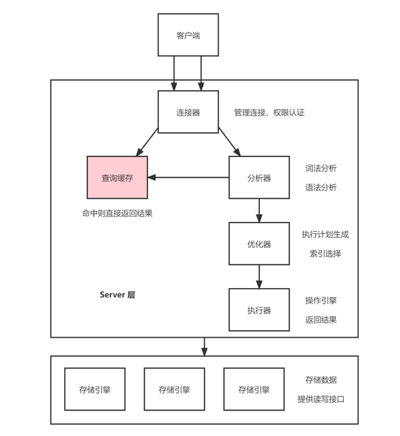

## MySQL 基础架构

MySQL 可以分为 Server 层和存储引擎层。

### Server 层

Server 层包括连接器、查询缓存、分析器、优化器、执行器等，涵盖 MySQL 的大多数核心服务功能，以及所有的内置函数（如日期、时间、数学和加密函数等），所有跨存储引擎的功能都在这一层实现，比如存储过程、触发器、视图等。

- **连接器：**负责跟客户端建立连接、获取权限、维持和管理连接。

  - 用户名密码认证通过后，连接器会到权限表里面查出该用户拥有的权限。之后，这个连接里面的权限判断逻辑，都将依赖于此时读到的权限。这就意味着，一个用户成功建立连接后，即使对这个用户的权限进行了修改，也不会影响已存在连接的权限。

  - 客户端如果太长时间没动静，连接器就会自动将它断开。这个时间由参数 wait_timeout 控制，默认值是 8 小时。

  - 尽量使用长连接，若长连接太多，占用内存太大，可以考虑：

    1. 定期断开长连接。

    2. MySQL 5.7 或更高版本，可以在每次执行一个比较大的操作后，通过执行 mysql_reset_connection 来重新初始化连接资源。这个过程不需要重连和重新做权限验证，但是会将连接恢复到刚刚创建完时的状态。

- **查询缓存：**MySQL 会将执行过的语句及其结果以 key-value 的形式，直接缓存在内存中。**查询缓存往往弊大于利：**失效非常频繁，只要有对一个表的更新，这个表上所有的查询缓存都会被清空。MySQL 8.0 版本直接将查询缓存的整块功能删掉了。

- **分析器：**对输入的 SQL 语句进行词法分析与语法分析。该阶段会判断语句是否正确，表是否存在，列是否存在等。

- **优化器：**选择执行计划与索引。

- **执行器：**操作引擎，执行语句，返回结果。开始执行时需要判断用户有没有执行的权限。

  - 有些时候，SQL 语句要操作的表不只是 SQL 字面上那些。比如如果有个触发器，得在执行器阶段（过程中）才能确定。

  - 慢查询日志中有一个 rows_examined 的字段，表示这个语句执行过程中扫描了多少行，**但引擎扫描行数跟 rows_examined 并不是完全相同的。**

### 存储引擎层

存储引擎层负责数据的存储和提取。其架构模式是插件式的，支持 InnoDB、MyISAM、Memory 等多个存储引擎。

