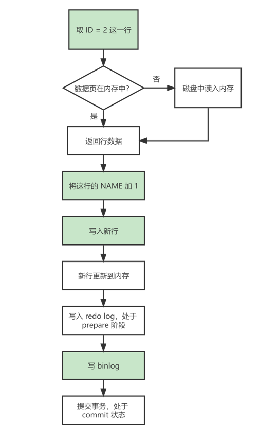

## MySQL 日志

MySQL 里经常说到的 WAL（Write-Ahead Logging）技术，它的关键点就是先写日志，再写磁盘。

### redo log

当有一条记录需要更新的时候，InnoDB 引擎就会先把记录写到 redo log 里面并更新内存，这时更新就算完成了。之后，InnoDB 引擎会在适当的时候，将这个操作记录更新到磁盘里面，往往是在系统比较空闲的时候做。

InnoDB 的 redo log 是固定大小的，比如可以配置为一组 4 个文件，每个文件的大小是 1 GB。从头开始写，写到末尾就又回到开头循环写。innodb_flush_log_at_trx_commit 这个参数设置成1的时候，表示每次事务的 redo log 都直接持久化到磁盘。

有了 redo log，InnoDB 就可以保证即使数据库发生异常重启，之前提交的记录都不会丢失，这个能力称为 **crash-safe**。

### binlog

binlog 日志只能用于归档，没有 crash-safe 能力。它与 redo log 的区别在于：

- redo log 是 InnoDB 引擎特有的；binlog 是 MySQL 的 Server 层实现的，所有引擎都可以使用。
- redo log 是物理日志，记录的是 “在某个数据页上做了什么修改”；binlog 是逻辑日志，记录的是这个语句的原始逻辑。
- redo log 是循环写的，空间固定会用完；binlog 是可以追加写入的。

binlog  有两种模式，statement 格式下记 SQL 语句，row 格式下会记录行的内容，每次更新记两条（前和后都有）。

sync_binlog 这个参数设置成1的时候，表示每次事务的 binlog 都持久化到磁盘。

### 两阶段提交

~~~mysql
update T set NAME = NAME + 1 where ID = 2;
~~~

该更新语句的大致执行流程如下，其中有颜色的表示在执行器中执行：

将 redo log 的写入拆成了两个步骤：prepare 和 commit，这就是两阶段提交，是为了让两份日志之间的逻辑一致，避免从两份日志中恢复的数据不一致的情况。
