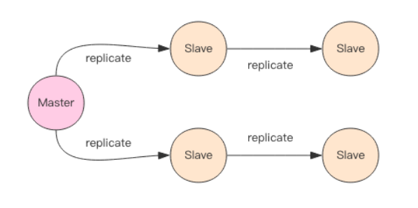
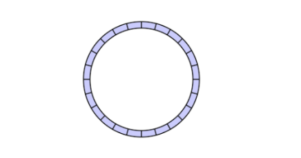

## Redis 主从复制

主从复制，是指将一台 Redis 服务的数据，复制到其他 Redis 服务器上。前者称为主节点（Master），后者称为从节点（Slave），从节点只能读，不能进行写操作。

Redis 支持主从同步和从从同步，有效减轻主库的同步负担。主从复制的过程对于主节点和从节点来说都是非阻塞的。

### 主从复制的作用

1. 数据冗余：主从复制实现了数据的热备份，是持久化之外的一种数据冗余方式。
2. 故障恢复：当主节点出现问题时，可以由从节点提供服务，实现快速的故障恢复，实际上是一种服务的冗余。
3. 负载均衡：在主从复制的基础上，配合读写分离，分担服务器负载。尤其是在写少读多的场景下，可以大大提高 Redis 的并发量。
4. 高可用的基石：主从复制是哨兵和集群模式能够实施的基础。

### 复制原理

主从刚刚连接的时候，进行全量同步；全同步结束后，进行增量同步。如果有需要，Slave 在任何时候都可以发起全量同步。Redis 策略是，无论如何，首先会尝试进行增量同步，如不成功，再进行全量同步。

1. Slave 连接到 Master 后会发送一个 sync 命令；
2. Master 接收到 sync 命名后，启动存盘进程并使用缓冲区记录此后执行的所有写命令；
3. 在存盘进程执行完毕之后，Master 将传送整个数据文件到 Slave；
4. Slave 收到快照文件后丢弃所有旧数据，载入收到的快照；
5. Master 快照发送完毕后开始向 Slave 发送缓冲区中的写命令，Slave 执行来自 Master 缓冲区的写命令；

#### 增量同步

Redis 同步的是指令流，主节点会将那些对自己的状态产生修改性影响的指令记录在本地的内存 buffer 中，然后异步将 buffer 中的指令同步到从节点。从节点一边执行同步的指令流来达到和主节点一样的状态，一遍向主节点反馈自己同步到哪里了（偏移量）。

Redis 的复制内存 buffer 是一个定长的环形数组，如果数组内容满了，就会从头开始覆盖前面的内容。

#### 快照同步

主节点使用 bgsave 生成内存数据的快照并发送给从节点执行。从节点接受到文件后，先清空原有内存，再执行一次全量加载。加载完成后通知主节点继续进行增量同步。

如果快照同步的时间过长或者复制 buffer 太小，都会导致同步期间的增量指令在复制 buffer 中被覆盖，这样就会导致快照同步完成后无法进行增量复制，然后会再次发起快照同步，如此极有可能会陷入快照同步的死循环。因此需要配置一个合适 buffer 大小。

**无磁盘复制**，Redis 从 2.8.18 版本开始尝试支持无磁盘的复制。使用这种设置时，子进程直接将 RDB 通过网络发送给从服务器，不使用磁盘作为中间存储。

