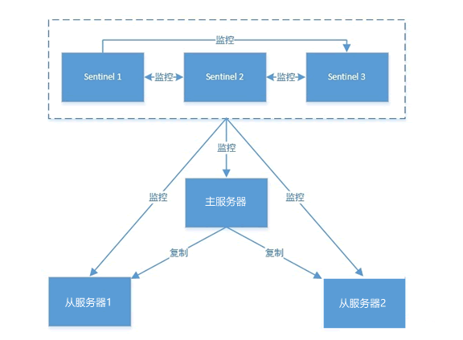

## Redis 哨兵模式

在 Redis 主从复制模式中，系统不具备自动恢复的功能。当主服务器宕机后，需要手动把一台从服务器切换为主服务器。因此主从模式的可用性较低，不适用于线上生产环境。

Redis Sentinel 哨兵模式，弥补了主从模式的不足。Sentinel 监控主机的工作状态是否正常，当主机发生故障时，Sentinel 会自动将其监控的从机提升为主服务器，从而保证了系统的高可用性。

### 原理

哨兵主要有两个重要作用：

- Sentinel 节点会以每秒一次的频率对每个 Redis 节点发送 PING 命令，并通过节点的回复来判断其运行状态。
- 当 Sentinel 监测到主服务器发生故障时，会自动在从节点中选择一台将其提升为主服务器。然后使用发布订阅模式，通知其他的从节点修改配置文件，更换新的主服务器。

在实际生产情况中，为避免 Sentinel 发生意外，一般是由 3 ~ 5 个节点组成，多个哨兵之间也存在互相监控。

#### 主观下线

如果在规定的时间内（down-after-milliseconds），Sentinel 节点没有收到目标服务器的有效回复，则判定该服务器为 “主观下线”。

#### 客观下线

某个 Sentinel 节点发现主服务器出现了故障，它会通过相应的命令，询问其它 Sentinel 节点对主服务器的状态判断。如果超过半数以上的 Sentinel 节点认为主服务器 down 掉，则该节点判定主服务为 “客观下线”。

#### 投票选举

所有的 Sentinel 节点会通过投票机制，选举出一个 Sentinel 节点为领头节点去进行 Failover（故障转移）操作：按照一定的规则在所有从节点中选择一个最优的作为主服务器，规则依次为：

1. 选择优先级最高的从节点
2. 选择复制偏移量最大的从节点（拥有最多数据）
3. 选择 runId 最小的从节点（启动最早的节点）

选择好主节点后，通过发布订功能通知其余的从节点更改配置文件，至此就完成了主从切换的操作。当原来的主服务器上线时，会变成从节点。
