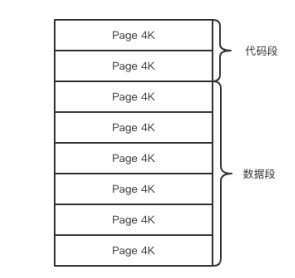
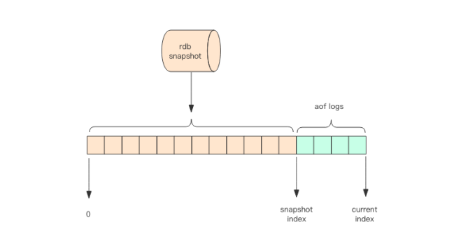

## Redis 持久化

### RDB

RDB（Redis DataBase），在指定的时间间隔内将内存中的数据集快照写入磁盘，一次全量备份。快照是内存数据的二进制序列化形式，在存储上非常紧凑。

#### 快照原理

Redis 是单线程程序，这个线程要同时负责多个客户端套接字的并发读写操作和内存数据结构的逻辑读写。内存快照要求 Redis 必须进行文件 IO 操作，可文件 IO 操作不能使用多路复用 API。为了不拖垮服务器性能并且不阻塞线上的业务，Redis 使用操作系统的多进程  COW（Copy On Write）机制来实现快照持久化。

Redis 在持久化时会调用 glibc 的函数 fork 产生一个子进程，快照持久化完全交给子进程来处理，父进程继续处理客户端请求。子进程会先将数据写入到一个临时文件中，待持久化过程都结束了，再用这个临时文件替换上次持久化好的文件。

子进程刚刚产生时，它和父进程共享内存里面的代码段和数据段。这是 Linux 系统为了节约内存资源，所以尽可能让它们共享起来。在进程分离的一瞬间，内存的增长几乎没有明显变化。

在子进程执行数据持久化的过程中，父进程可能对内存数据结构不间断的修改。这个时候就会使用操作系统的 COW 机制来进行数据段页面的分离。数据段是由很多操作系统的页面组合而成，当父进程对其中一个页面的数据进行修改时，会将被共享的页面复制一份分离出来，然后对这个复制的页面进行修改。这时子进程相应的页面是没有变化的，还是进程产生时那一瞬间的数据。

随着父进程修改操作的持续进行，越来越多的共享页面被分离出来，内存就会持续增长。但是也不会超过原有数据内存的 2 倍大小。另外一个 Redis 实例里冷数据占的比例往往是比较高的，所以很少会出现所有的页面都会被分离。

#### 触发条件

1. 配置文件中满足 save 配置项的条件。
2. 手动执行 save 或者 bgsave 指令，区别在于 save 指令会阻塞其他操作，bgsave 会在后台异步进行快照操作。
3. 执行 flushall 命令，但是产生的 RDB 文件是空的，没有意义。

#### 优缺点

优点：

- 适合大规模的数据恢复
- 适合对数据完整性和一致性要求不高的场景
- 节省磁盘空间
- 恢复速度快

缺点：

- fork 和 COW 产生的性能消耗
- 可能会丢失最后一次快照后的所有修改

### AOF

AOF（Append Only File），存储的是 Redis 服务器的顺序指令序列，AOF 日志只记录对内存进行修改的指令，**只许追加文件但不可以改写文件**。

Redis 在收到客户端修改指令后，先进行参数校验，如果没问题，就立即将该指令文本存储到 AOF 日志中。也就是先存到磁盘，然后再执行指令。这样即使遇到突发宕机，已经存储到 AOF 日志的指令进行重放一下就可以恢复到宕机前的状态。

注意：当RDB 和 AOF 同时开启时，Redis 会优先加载 AOF 文件来恢复原始数据，因为通常情况下 AOF 保存的数据集比较完整。

#### AOF 重写

Redis 在长期运行的过程中，AOF 的日志会越变越长。如果实例宕机重启，重放整个 AOF 日志会非常耗时，导致 Redis 长时间无法对外提供服务。

因此 Redis 提供了 bgrewriteaof 指令用于对 AOF 日志进行瘦身。其原理就是开辟一个子进程对内存进行遍历转换成一系列 Redis 的操作指令，序列化到一个新的 AOF 日志文件中。序列化完毕后再将操作期间发生的增量 AOF 日志追加到这个新的 AOF 日志文件中，追加完毕后就立即替代旧的 AOF 日志文件。

大致流程：

1. bgrewriteaof 触发重写，判断当前是否有 bgsave 或 bgrewriteaof 在运行，如果有，则等待该命令结束后再继续执行。
2. 主进程 fork 出子进程执行重写操作，保证主进程不会阻塞。
3. 子进程遍历 Redis 内存中数据到临时文件，客户端的写请求同时写入 aof_buf 缓冲区和 aof_rewrite_buf 重写缓冲区，保证原 AOF 文件完整以及新 AOF 文件生成期间的新的数据修改动作不会丢失。
4. 子进程完成新的 AOF 文件后，主进程将 aof_rewrite_buf 中的数据写入到新的 AOF 文件中。
5. 使用新的 AOF 文件覆盖旧的 AOF 文件，完成 AOF 重写。

##### 触发条件

Redis 会记录上次重写时的 AOF 文件大小，默认配置是当 AOF 文件大小是上次 rewrite 后大小的一倍且文件大于 64M 时触发。可以通过  auto-aof-rewrite-percentage 和 auto-aof-rewrite-min-size 配置项进行配置。

#### fsync

AOF 日志文件要经过从内核缓存刷新回磁盘的过程，在此期间，如果服务器突然宕机，会出现日志丢失的情况。Linux 的 glibc 提供了 `fsync(int fd)` 函数可以将指定文件的内容强制从内核缓存刷到磁盘，该指令是一个磁盘 IO 操作，会造成性能消耗。在生产环境的服务器中，Redis 通常是每隔 1s 左右执行一次 fsync 操作，在数据安全性和性能上做了一个折中。

#### 优缺点

优点：

- 备份机制更稳健，丢失数据概率更低
- 可读的日志文本，通过操作 AOF 文件，可以处理误操作

缺点：

- 比起 RDB 占用更多的磁盘空间
- 恢复备份速度要慢
- 每次读写都同步的话，有一定的性能压力
- 潜在 bug，可能影响恢复

### 混合持久化

Redis 4.0 之后新增了一个持久化选项 — 混合持久化，通过 aof-use-rdb-preamble 配置项开启。将 RDB 文件的内容和增量的 AOF 日志文件存在一起。AOF 日志不再是全量的日志，而是自持久化开始到持久化结束的这段时间发生的增量 AOF 日志，通常这部分 AOF 日志很小。重写时，子进程会把内存中的数据以 RDB 的方式写入到 AOF 文件中。

在 Redis 重启的时候，可以先加载 RDB 的内容，然后再重放增量 AOF 日志就可以替代之前的 AOF 全量文件重放，重启效率因此大幅得到提升。

### 运维

通常 Redis 的主节点不会进行持久化操作，持久化操作主要在从节点进行。从节点是备份节点，没有来自客户端请求的压力，它的操作系统资源往往比较充沛。

但是如果出现网络分区，从节点长期连不上主节点，就会出现数据不一致的问题，特别是在网络分区出现的情况下主节点宕机了，那么数据就会丢失，所以在生产环境要做好实时监控工作，保证网络畅通或者能快速修复。另外还应该再增加一个从节点以降低网络分区的概率，只要有一个从节点数据同步正常，数据也就不会轻易丢失。
