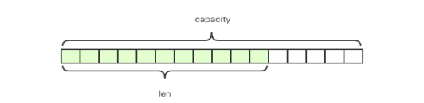
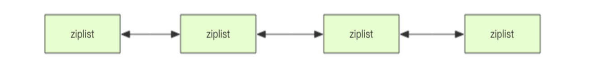
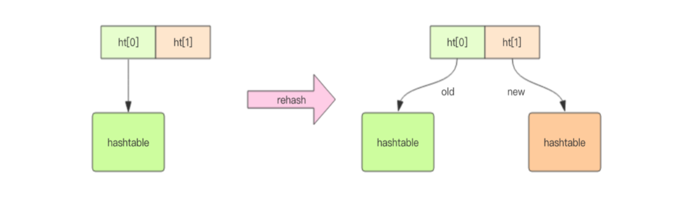
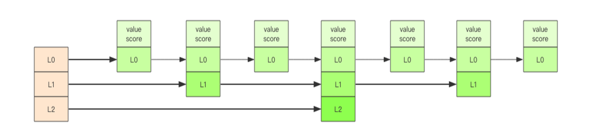
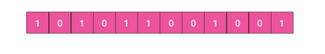

## Redis 数据结构

Redis 所有的数据结构都是以唯一的字符串 key 作为名称，然后通过这个唯一 key 来获取相应的 value 数据。不同类型的数据结构的差异就在于 value 的结构不一样。List、Set、Hash、Zset 这四种数据结构是容器型数据结构，它们共享下面两条通用规则：

1. 如果容器不存在，就创建一个，再进行操作。
2. 如果容器里元素没有了，那么立即删除容器，释放内存。

### String 字符串

Redis 的字符串是动态的，并且可以修改，内部结构实现上类似 Java 的 ArrayList，采用预分配冗余空间的方式来减少内存的频繁分配。

当字符串长度小于 1M 时，扩容都是加倍现有的空间。如果超过 1M，扩容时一次只会多扩 1M 的空间。**字符串最大长度为 512M**。 

### List 列表

Redis 的列表相当于 Java 里面的 LinkedList，是链表而不是数组。这就导致部分指令执行的代价会随着列表的长度变化而变化，例如慢操作：lindex、ltrim、lrange。

Redis 底层存储使用的是称之为快速链表 quicklist 的一个结构。

- 首先在列表元素较少的情况下会使用一块连续的内存存储，这个结构是 ziplist，即压缩列表。它将所有的元素紧挨着一起存储，分配的是一块连续的内存。当数据量比较多的时候才会改成 quicklist。

- 因为普通的链表需要的附加指针空间太大，会比较浪费空间，而且会加重内存的碎片化。所以 Redis 将链表和 ziplist 结合起来组成了 quicklist。也就是将多个 ziplist 使用双向指针串起来使用。这样既满足了快速的插入删除性能，又不会出现太大的空间冗余。 

应用：常用来做异步队列使用。将需要延后处理的任务结构体序列化成字符串存进 Redis 的列表，另一个线程从这个列表中轮询数据进行处理。

### Hash 字典

Redis 的字典相当于 Java 里面的 HashMap，是数组 + 链表二维结构，值只能是字符串。

HashMap 在数据量很大时，rehash 是个耗时的操作，需要一次性全部 rehash。而 Redis 为了高性能，不能堵塞服务，采用了渐进式 rehash 策略。

渐进式 rehash 会在 rehash 的同时，保留新旧两个 hash 结构，查询时会同时查询两个 hash 结构，然后在后续的定时任务中以及 hash 的子指令中，循序渐进地将旧 hash 的内容一点点迁移到新的 hash 结构中。另外，在渐进式 rehash 执行期间，新添加到字典的键值对一律会被保存到 ht[1] 里面，而 ht[0] 则不再进行任何添加操作。这一措施保证了 ht[0] 包含的键值对数量会只减不增，并随着 rehash 操作的执行而最终变成空表。

### Set 集合

Redis 的集合相当于 Java 里面的 HashSet，内部的键值对是无序并且唯一的。所以添加、删除、查找的复杂度都是 O(1)。内部实现相当于一个特殊的字典，字典中所有的 value 都为同一个值 NULL。

### Zset 有序列表

Redis 的有序列表相当于 Java 里面的 SortedSet 和 HashMap 的结合体，一方面它是一个 set，保证了内部 value 的唯一性。另一方面它可以给每个 value 赋予一个 score，代表这个 value 的排序权重。

其内部的排序功能是通过**跳跃列表**这一数据结构来实现的。跳跃列表类似于上图这种层级制，最底层所有的元素都会串起来，每隔几个元素挑选出一个代表，然后将这几个代表使用另外一级指针串起来。再在这些代表里挑出二级代表串起来，最终就形成了金字塔结构。 

新元素插入时，首先一层一层的定位插入点，找到最底层合适的位置，将新元素插入进去。随后采用随机的策略来决定元素是否跃迁升级，L1 层只有 50% 的概率，L2 层只有 25% 的概率，L3  层只有 12.5% 的概率，一直随机直到最顶层。

### 过期时间

过期是以对象为单位，比如一个 hash 结构的过期是整个 hash 对象的过期， 而不是其中的某个子 key。

需要特别注意的地方是如果一个字符串已经设置了过期时间，然后调用了 set 方法修改该字符串，则过期时间会消失。 

### Bitmaps 位图

位图不是特殊的数据结构，它的内容其实就是普通的字符串，也就是 byte 数组，数组的每个单元只能存储 0 和 1。

应用：记录用户每年的签到记录，如果使用普通的 key / value，每个用户要记录 365 个，当用户量达到上亿时，需要的存储空间巨大。如果使用位图结构，每天的签到记录只占据一个位，365 天就是 365 个位，46 个字节就可以完全容纳下，这就大大节约了存储空间。

### HyperLogLog

统计网站 PV（PageView 页面访问量），可以使用 Redis 的 incr、incrby 实现。但像 UV（UniqueVisitor 独立访客）、独立 IP 数、搜索记录数等，需要去重后计数，这类问题统称为基数问题。有多种解决方案：

1. 数据库 distinct 去重计数。
2. 使用 Redis 提供的 Hash、Set、Bitmaps 等数据结构来处理。

但随着数据量的上升，上述方案占用的空间会越来越大。Redis 推出了 HyperLogLog 这种结构，提供不精确的去重计数方案。虽然不精确但标准误差也能达到 0.81%。在输入元素的数量或者体积非常大时，HyperLogLog 计算基数所需的空间总是固定的，并且是很小的。

Redis 对 HyperLogLog 的存储进行了优化，在计数比较小时，采用稀疏矩阵存储，空间占用很小。当计数慢慢变大，稀疏矩阵占用空间渐渐超过了阈值时才会一次性转变成稠密矩阵，占用 12 KB 的空间，可以计算接近 264 个不同元素的基数。

### GeoHash

Redis 在 3.2 版本以后增加了地理位置 GEO 模块，使用 GeoHash 算法，提供了经纬度设置、查询、范围查询、距离查询、经纬度 Hash 等常见操作。

在一个地图应用中，车的数据、餐馆的数据、人的数据可能会有百万千万条，如果使用 Redis 的 Geo 数据结构，它们将全部放在一个 Zset 集合中。在 Redis 的集群环境中，集合可能会从一个节点迁移到另一个节点。如果单个 key 的数据过大，会对集群的迁移工作造成较大的影响。在集群环境中单个 key 对应的数据量不宜超过 1M，否则会导致集群迁移出现卡顿现象，影响线上服务的正常运行。所以，建议 Geo 的数据使用单独的 Redis 实例部署，不使用集群环境。

如果数据量过亿甚至更大，就需要对 Geo 数据进行拆分，按国家、省、市拆分，在人口特大城市甚至可以按区拆分。这样就可以显著降低单个 Zset 集合的大小。