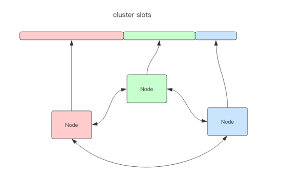
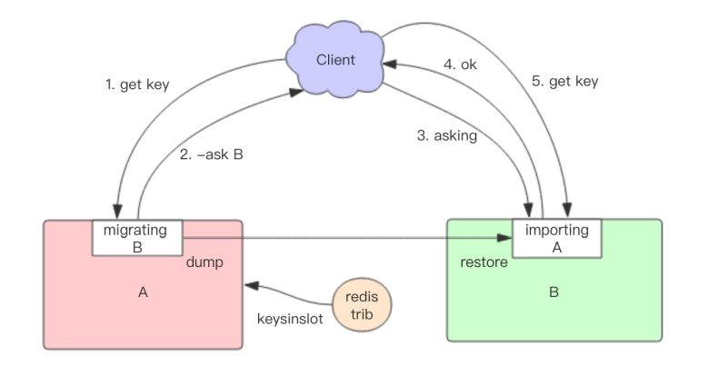

## Redis 集群

Redis 的哨兵模式基本已经可以实现高可用，读写分离 。但是每台服务器都存储相同的数据，很浪费内存，容量到达上限后扩容会变得很复杂。而且主从模式并未分担并发写的压力，不是十分适合某些读写压力都很大的场景。因此，Redis 加入了 Cluster 集群模式，实现了 Redis 的分布式存储。

### 数据分片

Redis Cluster 包含 16384 个插槽（hash slot），每个 key 通过 CRC16 校验后对 16384 取模来决定放置哪个槽。不在一个 slot 下的键值，不能使用 mget、mset 等多键操作。可以通过 {} 来定义组的概念，key 中 {} 内相同内容的键值对都会放到同一个 slot 中。

集群中的每个节点负责一部分 slot，默认是均分的，可以通过配置来进行调整。

#### 迁移

Redis Cluster 提供了工具 redis-trib，可以让运维人员手动调整槽位的分配情况。迁移的单位是 slot，当一个 slot 正在迁移时，这个 slot 就处于中间过渡状态。这个槽在原节点的状态为 migrating，在目标节点的状态为 importing，表示数据正在从源流向目标。迁移的大致流程为：从源节点获取内容 => 存到目标节点 => 从源节点删除内容。

迁移过程是同步的，在目标节点执行 restore 指令到原节点删除 key 之间，原节点的主线程会处于阻塞状态，直到 key 被成功删除。如果 key 的内容很大，会同时导致原节点和目标节点卡顿，影响集群的稳定性。所以在集群环境下业务逻辑要尽可能避免大 key 的产生。

如果迁移过程中突然出现网络故障，整个 slot 的迁移只进行了一半。这时两个节点依旧处于中间过渡状态。待下次迁移工具重新连上时，会提示用户继续进行迁移。

#### 客户端访问流程

在迁移过程中，新旧两个节点对应的槽位都存在部分 key 数据，客户端访问的流程会有很大的变化。

1. 客户端先尝试访问旧节点，如果数据还在旧节点里面，那么正常处理。

2. 如果数据不在旧节点里面，那么有两种可能，要么该数据在新节点里，要么根本就不存在。旧节点不知道是哪种情况，所以它会向客户端返回一个 -ASK targetNodeAddr 的重定向指令。

3. 客户端收到这个重定向指令后，先去目标节点执行一个不带任何参数的 asking 指令，然后在目标节点再重新执行原先的操作指令。

为什么需要执行一个不带参数的 asking 指令？ 在迁移没有完成之前，这个槽位还不归新节点管理。如果这个时候向目标节点发送该槽位的指令，节点是不认的，它会向客户端返回一个 -MOVED 重定向指令告诉它去源节点执行。如此就会形成重定向循环。asking 指令的目标就是打开目标节点的选项，告诉它下一条指令必须处理，而且要当成自己的槽位来处理。 

从以上过程可以看出，迁移会影响服务效率，同样的指令在正常情况下一个 ttl 就 能完成，而在迁移中得 3 个 ttl 才能搞定。

### 高可用

Redis Cluster 可以为每个主节点设置若干个从节点，主节点故障时，集群会自动将其中某个从节点提升为主节点。如果某一段插槽的主从都挂掉，并且配置参数 cluster-require-full-coverage 为 yes ，那么整个集群都无法继续提供服务。

当其它主节点 ping 一个主节点 A 时，如果半数以上的节点与 A 通信超时，那么集群认为主节点 A 宕机了。

Redis Cluster 要求至少需要 3 个主节点才能组成一个集群，同时每个主节点至少需要一个从节点，可以通过 cluster-replicas 指定从节点数量。尽量保证每个主节点运行在不同的 IP 地址上，每个从节点和主节点不在同一个 IP 地址上。

#### 网络抖动

为解决网络抖动导致主从频繁切换的问题，Redis Cluster 提供了一个选项 cluster-node-timeout，当某个节点持续 timeout 的时间失联时，才可以认定该节点出现故障。

#### 可能下线与确定下线

Redis 集群节点采用 Gossip 协议来广播自己的状态以及自己对整个集群认知的改变。如一个节点发现某个节点失联了，它会将这条信息向整个集群广播。如果一个节点收到了某个节点失联的数量已经达到了集群的大多数，就可以标记该节点为确定下线状态，然后向整个集群广播，强迫其它节点也接收该节点已经下线的事实，并立即对该失联节点进行主从切换。

### 优缺点

优点：

- 方便扩容
- 分摊读写压力
- 配置相对简单

缺点：

- 当多个 key 分布于不同的节点上时无法使用事务以及多键操作功能
- lua 脚本不被支持