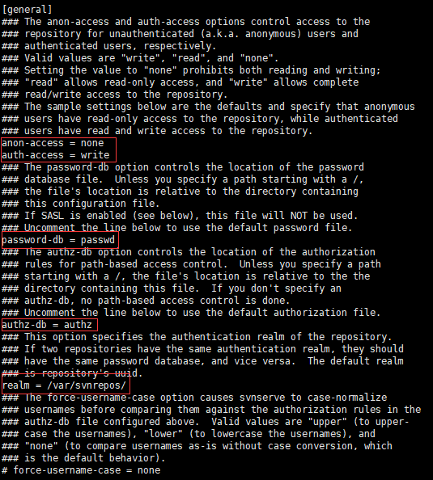

## SVN 笔记（一）— CentOS7 下安装 SVN

### 1. 安装 SVN 服务器

~~~shell
yum -y install subversion
~~~

- 查看 SVN 安装位置

~~~shell
rpm -ql subversion
~~~

- 查看 SVN 版本

~~~shell
svnserve --version
~~~

### 2. 创建版本库

- 创建目录

~~~shell
mkdir /var/svnrepos
~~~

- 切换到刚创建好的目录，创建版本库（svnrepos 为预期的版本库名称，可自定义）

~~~shell
cd /var/svnrepos/
svnadmin create /var/svnrepos/slj_2019_001_oa
~~~

- 查看自动生成的版本库文件

~~~shell
cd slj_2019_001_oa/
ll
# 结果
total 8
drwxr-xr-x. 2 root root  54 Aug  8 10:50 conf
drwxr-sr-x. 6 root root 233 Aug  8 10:50 db
-r--r--r--. 1 root root   2 Aug  8 10:50 format
drwxr-xr-x. 2 root root 231 Aug  8 10:50 hooks
drwxr-xr-x. 2 root root  41 Aug  8 10:50 locks
-rw-r--r--. 1 root root 229 Aug  8 10:50 README.txt
~~~

​        Subversion 目录说明：

​        db：所有版本控制的数据存储目录（文件存储位置）。

​        hooks 目录：放置hook脚本文件的目录。

​        lock 目录：用来追踪存取文件库的客户端。

​        format 文件：是一个文本文件，里面只放了一个整数，表示当前文件库配置的版本号。

​        conf 目录：是这个仓库的配置文件（仓库的用户访问账号，权限等）。

### 3. 修改配置文件

- 进入 conf 目录查看

~~~shell
cd conf/
ll
# 结果
total 12
-rw-r--r--. 1 root root 1080 Aug  8 10:50 authz
-rw-r--r--. 1 root root  309 Aug  8 10:50 passwd
-rw-r--r--. 1 root root 3090 Aug  8 10:50 svnserve.conf
~~~

​	   authz：负责账号权限的管理，控制账号是否有读写权限。

​       passwd：负责账号和密码的用户名单管理。

​       svnserve.conf：svn 服务器配置文件。

- 创建账号密码，格式：账号 = 密码

~~~shell
vi passwd

[users]
# harry = harryssecret
# sally = sallyssecret
admin = slj@123456
~~~

- 设置用户权限

~~~shell
vi authz

[/]
admin = rw
~~~

​       [/]：表示根目录，即 /var/svnrepos。

​       admin = rw：表示用户 admin 对根目录具有读写权限。

- 编辑 svnserve.conf 文件

​       anon-access = none：表示禁止匿名用户访问。

​       auth-access = write：表示授权用户拥有读写权限。

​       password-db = passswd：指定用户名口令文件，即 passwd 文件。

​       authz-db = authz：指定权限配置文件，即 authz 文件。

​       realm = /var/svnrepos：指定认证域，即 /var/svnrepos目录。

### 4. 修改防火墙配置

- 添加 SVN 端口

~~~shell
firewall-cmd --zone=public --permanent --add-port=3690/tcp
firewall-cmd --reload
~~~

### 5. 启动 SVN 服务

~~~shell
svnserve -d -r /var/svnrepos
# 查看是否启动成功
ps -ef | grep 'svnserve' 
~~~