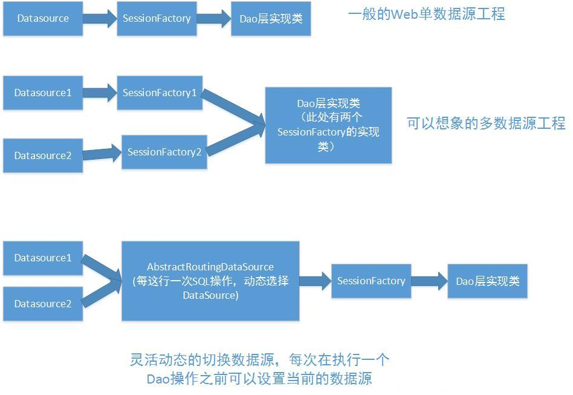

## Spring-boot 笔记（二）— 使用 AOP 的方式配置多数据源



### 1. 添加相关依赖

```xml
    <druid.version>1.1.17</druid.version>
    <!-- druid -->
    <dependency>
        <groupId>com.alibaba</groupId>
        <artifactId>druid-spring-boot-starter</artifactId>
        <version>${druid.version}</version>
    </dependency>
```


### 2. 编写 yml 配置文件

```yml
spring:
  datasource:
    db1:
      username: root
      password: 123456
      url: jdbc:mysql://127.0.0.1:3306/demo?characterEncoding=UTF-8&useUnicode=true&useSSL=false&allowPublicKeyRetrieval=true&serverTimezone=Asia/Shanghai
    db2:
      username: root
      password: 123456
      url: jdbc:mysql://127.0.0.1:3306/demo_slave?characterEncoding=UTF-8&useUnicode=true&useSSL=false&allowPublicKeyRetrieval=true&serverTimezone=Asia/Shanghai

mybatis-plus:
  # 如果是放在 src/main/java 目录下 classpath:/com/yourpackage/*/mapper/*Mapper.xml
  # 如果是放在 resource 目录 classpath:/mapper/*Mapper.xml
  mapper-locations: classpath*:com/example/springbootdemo/persistence/**/mapper/*Mapper.xml
  # 实体扫描，多个 package 用逗号或者分号分隔，通过该属性可以给包中的类注册别名，注册后在 Mapper 对应的 XML 文件中可以直接使用类名，而不用使用全限定的类名（即 XML 中调用的时候不用包含包名）
  typeAliasesPackage: com.example.springbootdemo.entity
  global-config:
    db-config:
      # 主键类型
      id-type: AUTO
      # 表名、是否使用下划线命名，默认数据库表使用下划线命名
      table-underline: false
  configuration:
    # 是否开启自动驼峰命名规则（camel case）映射，即从经典数据库列名 A_COLUMN（下划线命名） 到经典 Java 属性名 aColumn（驼峰命名） 的类似映射，自动匹配无需 as（没开启这个，SQL需要写as： select user_id as userId）
    map-underscore-to-camel-case: true
    # 全局地开启或关闭配置文件中的所有映射器已经配置的任何缓存
    cache-enabled: false
    # 配置 JdbcTypeForNull, Oracle 数据库必须配置
    jdbc-type-for-null: 'null'
    # 延时加载的开关（true/false）
    lazy-loading-enabled: true
    # 开启的话，延时加载一个属性时会加载该对象全部属性，否则按需加载属性（true/false）
    multiple-result-sets-enabled: true
```


### 3. 新建 DataSourceContextHolder

```java
/**
 * 根据当前线程来选择具体的数据源
 *
 * @author Ding RD
 * @date 2019/6/20
 */
public class DataSourceContextHolder {

    private static final ThreadLocal<String> contextHolder = new InheritableThreadLocal<>();

    /**
     * 提供给 AOP 去设置当前的线程的数据源的信息
     *
     * @param dataSource 数据源名称
     */
    public static void setDataSource(String dataSource) {
        contextHolder.set(dataSource);
    }

    /**
     * 提供给 AbstractRoutingDataSource 的实现类，通过 key 选择数据源
     */
    public static String getDataSource() {
        return contextHolder.get();
    }

    /**
     * 清除上下文数据，使用默认的数据源
     */
    public static void clear() {
        contextHolder.remove();
    }
}

```


### 4. 新建 MultipleDataSource

```java
/**
 * 多数据源的选择
 *
 * @author Ding RD
 * @date 2019/6/20
 */
public class MultipleDataSource extends AbstractRoutingDataSource {

    /**
     * 根据 Key 获取数据源的信息
     */
    @Override
    protected Object determineCurrentLookupKey() {
        return DataSourceContextHolder.getDataSource();
    }
}

```


### 5. 新建 DataSourceEnum

```java
/**
 * 数据源枚举
 *
 * @author Ding RD
 * @date 2019/6/20
 */
public enum DataSourceEnum {

    DB1("db1", "主库"), DB2("db2", "副库");

    private String id;
    private String desc;

    DataSourceEnum(String id, String desc) {
        this.id = id;
        this.desc = desc;
    }

    public String id() {
        return id;
    }

    public String desc() {
        return desc;
    }

    @Override
    public String toString() {
        return "{" + id() + "=" + desc() + "}";
    }

    // 获取指定 ID 的枚举描述
    public static String getDesc(String id) {
        // 所有的枚举值
        DataSourceEnum[] values = values();
        // 遍历查找
        for (DataSourceEnum t : values) {
            if (t.id().equals(id)) {
                return t.desc();
            }
        }
        return "";
    }

    // 是否包含枚举代码
    public static boolean isExist(String id) {
        // 所有的枚举值
        DataSourceEnum[] values = values();
        // 遍历查找
        for (DataSourceEnum t : values) {
            if (t.id().equals(id)) {
                return true;
            }
        }
        return false;
    }
}

```


### 6. 新建注解 DataSource

```java
/**
 * 多数据源标识
 *
 * @author Ding RD
 * @date 2019/6/20
 */
@Target({ElementType.METHOD, ElementType.TYPE})
@Retention(RetentionPolicy.RUNTIME)
@Documented
public @interface DataSource {

    DataSourceEnum value() default DataSourceEnum.DB1;
}

```


### 7. 新建切面 DataSourceAspect

```java
/**
 * 使用 AOP 拦截特定的注解去动态的切换数据源
 *
 * @author Ding RD
 * @date 2019/6/20
 */
@Component
@Aspect
@Order(1)
public class DataSourceAspect {

    private Logger log = LoggerFactory.getLogger(DataSourceAspect.class);

    /**
     * within 在类上设置
     * annotation 在方法上进行设置
     */
    @Pointcut("@annotation(com.example.springbootdemo.utils.annotation.DataSource)")
    public void pointcut() {
    }

    @Before("pointcut()")
    public void doBefore(JoinPoint joinPoint) {
//        Method method = ((MethodSignature) joinPoint.getSignature()).getMethod();
//        DataSource datasource = method.getAnnotation(DataSource.class);
//        if (datasource == null) {
//            // 获取类上面的注解
//            datasource = joinPoint.getTarget().getClass().getAnnotation(DataSource.class);
//        }
        Signature signature = joinPoint.getSignature();
        MethodSignature methodSignature;
        if (!(signature instanceof MethodSignature)) {
            throw new IllegalArgumentException("该注解只能用于方法");
        }
        methodSignature = (MethodSignature) signature;

        Object target = joinPoint.getTarget();
        Method currentMethod;
        try {
            currentMethod = target.getClass().getMethod(methodSignature.getName(), methodSignature.getParameterTypes());
            DataSource datasource = currentMethod.getAnnotation(DataSource.class);
            // 获取注解上的数据源的值的信息
            if (datasource != null) {
                DataSourceContextHolder.setDataSource(datasource.value().id());
                log.info("设置数据源为：{}", datasource.value().desc());
            } else {
                DataSourceContextHolder.setDataSource(DataSourceEnum.DB1.id());
                log.info("设置数据源为：{}", DataSourceEnum.DB1.desc());
            }
        } catch (NoSuchMethodException e) {
            e.printStackTrace();
        }
    }

    @After("pointcut()")
    public void doAfter() {
        // 清理掉当前设置的数据源，让默认的数据源不受影响
        log.info("清空数据源信息！");
        DataSourceContextHolder.clear();
    }
}

```


### 8. 新建并配置 MybatisplusConfig

```java
/**
 * MybatisPlus 配置类
 *
 * @author Ding RD
 * @date 2019/6/20
 *
 * 切换数据源和开启事务管理是分先后的，spring 事务管理是跟数据库事务绑定一起的，
 * 开启一个事务就已经和数据源绑定在一起，再切换数据源时，会造成切换数据源失效。
 * 所以切换数据源 aop 要在开启事务 aop 之前，切换数据源 aop 的 order 是 1，事务的是 2。
 */
@Configuration
@EnableTransactionManagement(order = 2)
@MapperScan(basePackages = {"com.example.springbootdemo.mapper"})
public class MybatisPlusConfig {
    private Logger logger = LoggerFactory.getLogger(this.getClass());

    private BaseDataSourceProperties baseDataSourceProperties;

    private Db1DataSourceProperties db1DataSourceProperties;

    private Db2SourceProperties db2SourceProperties;

    @Autowired
    public void setBaseDataSourceProperties(BaseDataSourceProperties baseDataSourceProperties) {
        this.baseDataSourceProperties = baseDataSourceProperties;
    }

    @Autowired
    public void setDb1DataSourceProperties(Db1DataSourceProperties db1DataSourceProperties) {
        this.db1DataSourceProperties = db1DataSourceProperties;
    }

    @Autowired
    public void setDb2SourceProperties(Db2SourceProperties db2SourceProperties) {
        this.db2SourceProperties = db2SourceProperties;
    }

    /**
     * 数据源一
     */
    private DruidDataSource db1DataSource() throws SQLException {
        DruidDataSource dataSource = new DruidDataSource();
        baseDataSourceProperties.config(dataSource);
        db1DataSourceProperties.config(dataSource);
        return dataSource;
    }

    /**
     * 数据源二
     */
    private DruidDataSource db2DataSource() throws SQLException {
        DruidDataSource dataSource = new DruidDataSource();
        baseDataSourceProperties.config(dataSource);
        db2SourceProperties.config(dataSource);
        return dataSource;
    }

    /**
     * 多数据源连接池配置
     */
    @Bean
    public MultipleDataSource multipleDataSource() {
        try {
            MultipleDataSource multipleDataSource = new MultipleDataSource();
            HashMap<Object, Object> hashMap = new HashMap<>(2);
            DruidDataSource db1DataSource = db1DataSource();
            db1DataSource.init();
            logger.info("数据库一初始化完成！");
            DruidDataSource db2DataSource = db2DataSource();
            db2DataSource.init();
            logger.info("数据库二初始化完成！");
            hashMap.put(DataSourceEnum.DB1.id(), db1DataSource);
            hashMap.put(DataSourceEnum.DB2.id(), db2DataSource);
            multipleDataSource.setTargetDataSources(hashMap);
            multipleDataSource.setDefaultTargetDataSource(db1DataSource);
            return multipleDataSource;
        } catch (SQLException ex) {
            logger.error("加载数据源过程中出现异常：", ex);
            throw new RuntimeException(ex);
        }
    }
}

```

```java
/**
 * 基础数据源配置
 *
 * @author Ding RD
 * @date 2019/6/20
 */
@Data
@Component
public class BaseDataSourceProperties {

    private String driverClassName = "";

    private Integer initialSize = 2;

    private Integer minIdle = 1;

    private Integer maxActive = 20;

    private Integer maxWait = 60000;

    private Integer timeBetweenEvictionRunsMillis = 60000;

    private Integer minEvictableIdleTimeMillis = 300000;

    private String validationQuery = "SELECT 'x'";

    private Boolean testWhileIdle = true;

    private Boolean testOnBorrow = false;

    private Boolean testOnReturn = false;

    private Boolean poolPreparedStatements = true;

    private Integer maxPoolPreparedStatementPerConnectionSize = 20;

    private String filters = "stat";

    public void config(DruidDataSource dataSource) {
        // 定义初始连接数
        dataSource.setInitialSize(initialSize);
        // 最小空闲
        dataSource.setMinIdle(minIdle);
        // 定义最大连接数
        dataSource.setMaxActive(maxActive);
        // 最长等待时间
        dataSource.setMaxWait(maxWait);

        // 配置间隔多久才进行一次检测，检测需要关闭的空闲连接，单位是毫秒
        dataSource.setTimeBetweenEvictionRunsMillis(timeBetweenEvictionRunsMillis);

        // 配置一个连接在池中最小生存的时间，单位是毫秒
        dataSource.setMinEvictableIdleTimeMillis(minEvictableIdleTimeMillis);
        // 验证数据库连接
        dataSource.setValidationQuery(validationQuery);
        // 申请连接的时候检测，如果空闲时间大于timeBetweenEvictionRunsMillis，执行validationQuery检测连接是否有效。
        dataSource.setTestWhileIdle(testWhileIdle);
        // 申请连接时执行validationQuery检测连接是否有效
        dataSource.setTestOnBorrow(testOnBorrow);
        // 归还连接时执行validationQuery检测连接是否有效
        dataSource.setTestOnReturn(testOnReturn);

        // 打开PSCache，并且指定每个连接上PSCache的大小
        dataSource.setPoolPreparedStatements(poolPreparedStatements);
        dataSource.setMaxPoolPreparedStatementPerConnectionSize(maxPoolPreparedStatementPerConnectionSize);
        try {
            // 通过别名的方式配置扩展插件，常用的插件有：
            // 监控统计用的filter:stat日志用的filter:log4j防御sql注入的filter:wall
            dataSource.setFilters(filters);
            // 同时配置了filters和proxyFilters，是组合关系，并非替换关系
            dataSource.setProxyFilters(customFilter());
        } catch (SQLException e) {
            e.printStackTrace();
        }
    }

    /**
     * 自定义过滤器设置
     *
     * @return 自定义过滤器列表
     */
    private List<Filter> customFilter() {
        List<Filter> filters = new ArrayList<>();
        filters.add(slf4jLogFilter());
        filters.add(statFilter());
        filters.add(wallFilter());
        return filters;
    }

    /**
     * 日志记录过滤器
     *
     * @return Slf4jLogFilter
     */
    private Slf4jLogFilter slf4jLogFilter() {
        Slf4jLogFilter slf4jLogFilter = new Slf4jLogFilter();
        // 禁用数据源日志
        slf4jLogFilter.setDataSourceLogEnabled(false);
        // 禁用连接日志
        slf4jLogFilter.setConnectionLogEnabled(false);
        // 禁用预执行语句日志
        slf4jLogFilter.setStatementLogEnabled(false);
        // 禁用结果集日志
        slf4jLogFilter.setResultSetLogEnabled(false);
        // 输出可执行的SQL
        slf4jLogFilter.setStatementExecutableSqlLogEnable(true);
        return slf4jLogFilter;
    }

    /**
     * 统计过滤器设置
     *
     * @return StatFilter
     */
    private StatFilter statFilter() {
        StatFilter statFilter = new StatFilter();
        //SQL合并配置
        statFilter.setMergeSql(true);
        //启用慢SQL记录功能
        statFilter.setLogSlowSql(true);
        //慢SQL时间（10秒）
        statFilter.setSlowSqlMillis(10000);
        return statFilter;
    }

    /**
     * SQL防御
     *
     * @return WallFilter
     */
    private WallFilter wallFilter() {
        WallFilter wallFilter = new WallFilter();
        wallFilter.setDbType(JdbcUtils.MYSQL);
        return wallFilter;
    }
}

```

```java
/**
 * 数据源一配置
 *
 * @author Ding RD
 * @date 2019/6/20
 */
@Data
@Component
@ConfigurationProperties(prefix = Db1DataSourceProperties.PREFIX)
public class Db1DataSourceProperties {

    public static final String PREFIX = "spring.datasource.db1";

    private String url = "";

    private String username = "";

    private String password = "";

    /**
     * 默认只启用SQL防火墙过滤器
     */
    private String filters = "wall";

    public void config(DruidDataSource dataSource) throws SQLException {
        dataSource.setUrl(url);
        dataSource.setUsername(username);
        dataSource.setPassword(password);
        dataSource.setFilters(filters);
    }
}

```

```java
/**
 * 数据源二配置
 *
 * @author Ding RD
 * @date 2019/6/20
 */
@Data
@Component
@ConfigurationProperties(prefix = Db2SourceProperties.PREFIX)
public class Db2SourceProperties {

    public static final String PREFIX = "spring.datasource.db2";

    private String url = "";

    private String username = "";

    private String password = "";

    /**
     * 默认只启用SQL防火墙过滤器
     */
    private String filters = "wall";

    public void config(DruidDataSource dataSource) throws SQLException {
        dataSource.setUrl(url);
        dataSource.setUsername(username);
        dataSource.setPassword(password);
        dataSource.setFilters(filters);
    }
}

```

