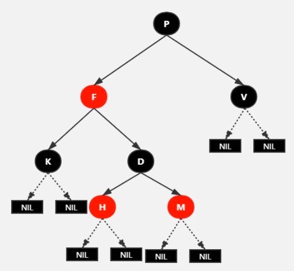
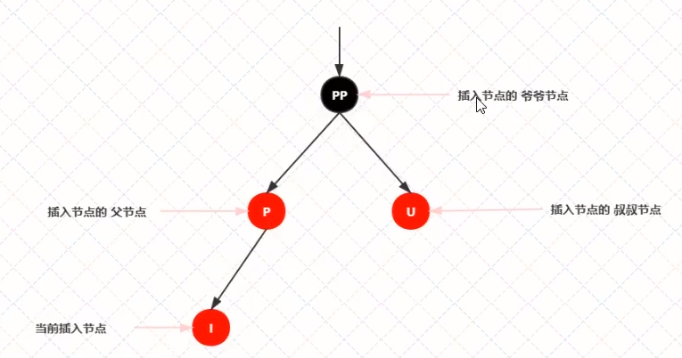
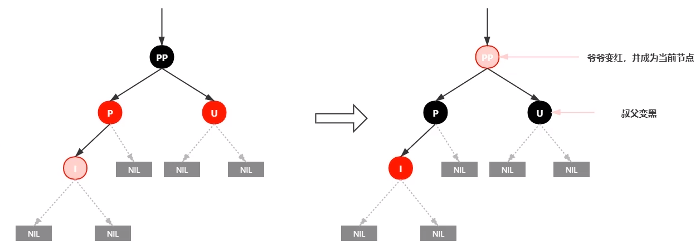
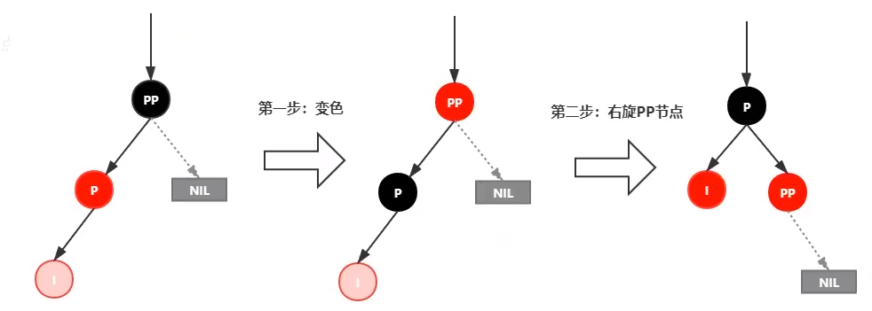
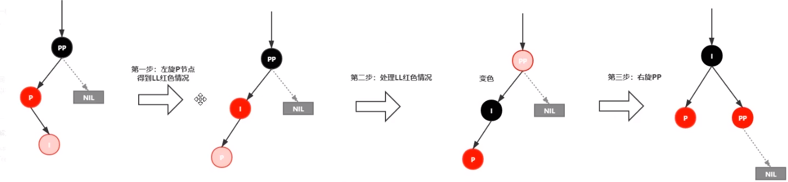
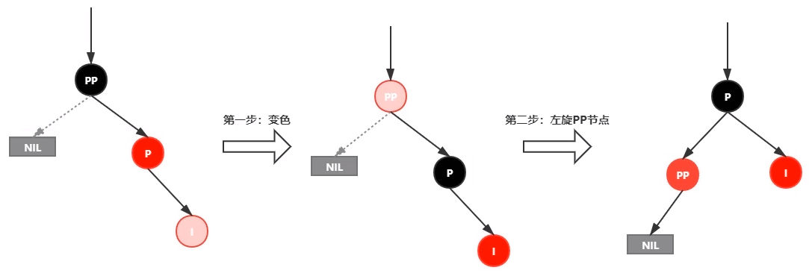
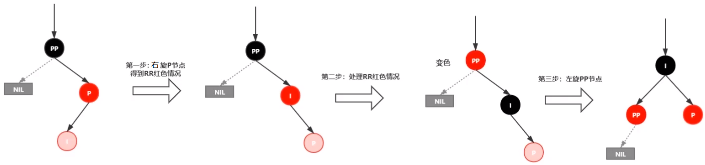

红黑树

#### 特点

1. 每个结点要么是黑色要么是红色。

2. 根结点是黑色。

3. 每个叶子结点（NIL）是黑色。

4. 每个红色结点的两个子结点一定是黑色，不能有两个红色结点相连。

5. 任意一结点到每个叶子结点的路劲都包含数量相同的黑色结点。俗称：黑高。

6. 如果一个结点存在一个黑子结点，那么该结点肯定有两个子结点。

   

红黑树并不是一个完美的平衡二叉树，但左子树和右子树的黑结点的层数是相等的，所以称为黑色完美平衡。

#### 自平衡

1. 变色：结点的颜色由红变黑或由黑边红。
2. 左旋：以某个结点作为指点（旋转结点），其右子结点成为旋转结点父结点，右子结点的左子结点变成旋转结点的右子结点。
3. 右旋：以某个结点作为指点（旋转结点），其左子结点成为旋转结点父结点，左子结点的右子结点变成旋转结点的左子结点。

#### 插入

1. 查找插入的位置。
2. 插入自平衡。

插入的结点必须为红色，在父结点为黑色时，黑色平衡没有被破坏，不需要做自平衡操作。但如果插入的结点为黑色，那么插入位置所在子树的黑色结点总是多 1，必须做自平衡。

当红黑树为空树，直接将插入结点转为黑色；当插入结点的 key 已存在，直接将值替换；当插入结点的父结点为黑色时，并不会影响黑色平衡，直接插入即可；当插入结点的父结点为红色时：

1. 叔叔结点存在且为红结点，依性质 4 可知，祖父结点肯定为黑结点。处理：将 P 和 U 结点变为黑色，将 pp 结点变为红色，设置 pp 结点为当前结点，进行后续处理。

2. 叔叔结点不存在或者为黑色结点，并且插入结点的父结点为祖父结点的左子结点：

   （1）新插入的结点为其父结点的左子结点（LL 红）：将 P 设置为黑色，PP 设置为红色，对 PP 进行右旋。

   

   （2）新插入的结点为其父结点的右子结点（LR 红）：对 P 进行左旋，将 P 设置为当前结点，得到 LL 红情况，再进行处理。

3. 叔叔结点不存在或者为黑色结点，并且插入结点的父结点为祖父结点的右子结点：

   （1）新插入的结点为其父结点的右子结点（RR 红）：将 P 设置为黑色，PP 设置为红色，对 PP 进行左旋。

   （2）新插入的结点为其父结点的左子结点（RL 红）：对 P 进行右旋，将 P 设置为当前结点，得到 RR 红情况，再进行处理。

